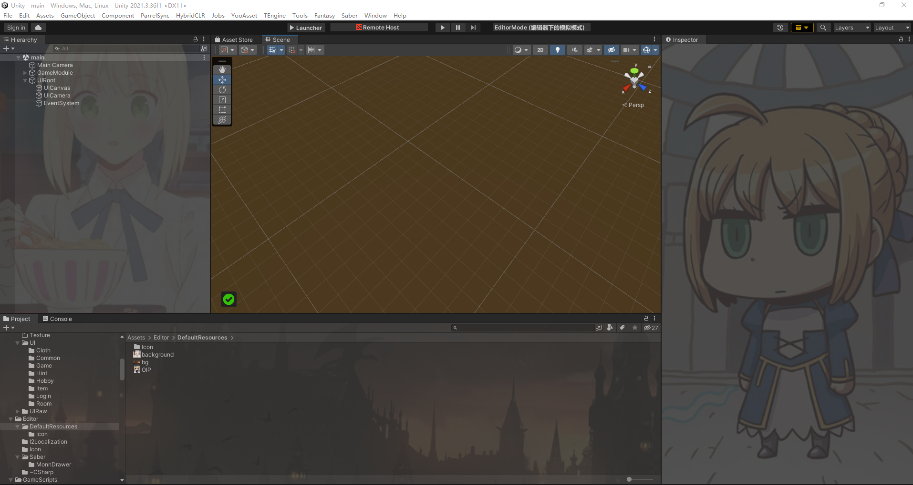
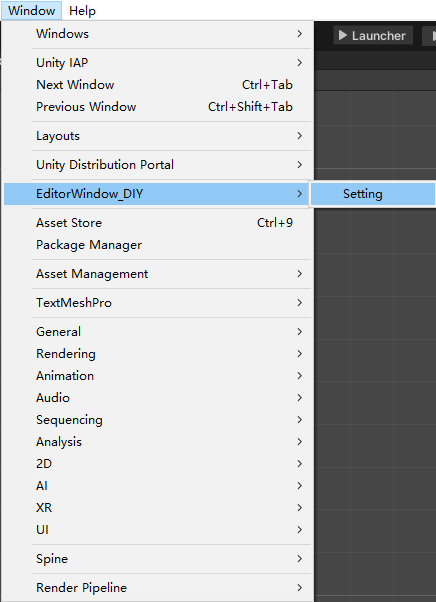
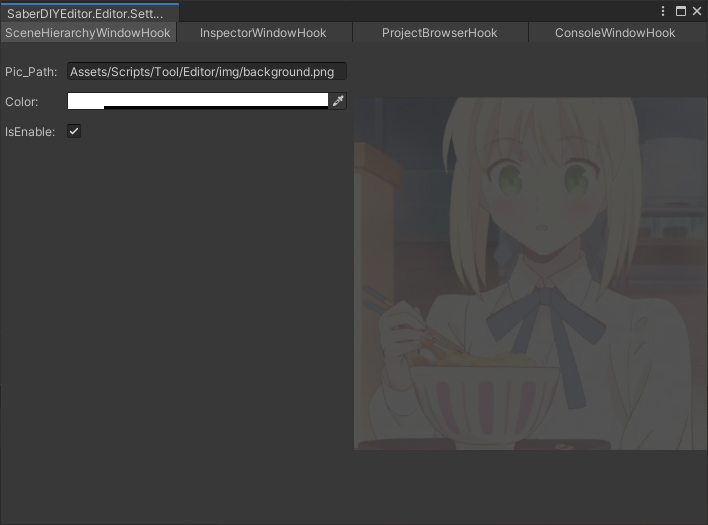

# **UnityEditorWindowDIY**

**2025年了，你还在用传统黑白编辑器界面吗？**  
**It's 2025, and you're still using the old black-and-white editor UI?**  

让我们用更酷、更灵活的方式，重新定义Unity编辑器的界面！通过这款工具，你可以轻松修改Unity编辑器，定制出属于你自己的独特界面体验！  
Let's redefine the Unity editor with a cooler and more flexible approach! With this tool, you can easily modify and customize the Unity editor to create a unique UI experience tailored to you!

**Principle**: Replacing function pointers via hooks to modify Unity Editor UI (MonoHook)

---

## ✨ Effect Demonstration
Here's a preview of how this modification will look after applying the hooks:

---

## 🛠️ Setup Instructions:

To set up and use this tool, follow the steps below:

1. **Step 1**  
   Download the repository and open it in your Unity project.

   

2. **Step 2**  
   Set the images and colors you desire!

   

---

## 🔧 Compatibility

This codebase is based on Unity version 6000.1.0b2, tested with Unity 2021. In theory, this repository should support any Unity version compatible with **MonoHook**

---

## 🔮 Future Plans
i aim to enhance the tool to support additional editor UI modifications, including:

- More hooks for advanced customization.
- Enhanced compatibility with newer Unity versions.

---

## 💡 Credits

- **MonoHook**: An excellent hooking library.  
  [MonoHook GitHub](https://github.com/Misaka-Mikoto-Tech/MonoHook?tab=MIT-1-ov-file)

- **Unity Source**:  
  [Unity CsReference GitHub](https://github.com/Unity-Technologies/UnityCsReference)

---

