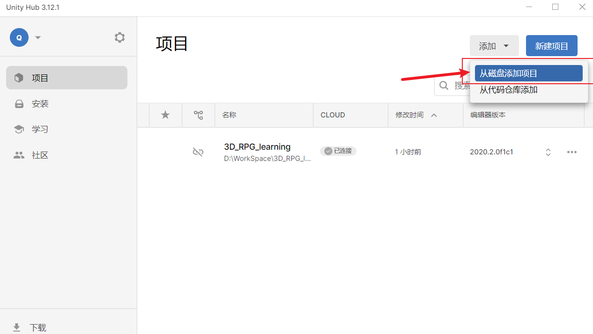

# Doggy Knight 

完成自己的第一个3D RPG游戏——“Doggy Knight”.


## 🌠基础说明

**学习&参考视频**：

- [3D RPG Course | Core 核心功能 | Unity 中文课堂](https://learn.u3d.cn/tutorial/3drpg-core)
- [Unity2020 3DRPG游戏开发教程](https://www.bilibili.com/video/BV1rf4y1k7vE/)
- [3D RPG Course ｜背包 & 对话 & 任务 高级教程 | Unity 中文课堂](https://learn.u3d.cn/tutorial/3drpg-advanced)


**优化编辑器 参考网址**：[GitHub - SaberArtoriaFan/UnityEditorWindowDIY](https://github.com/SaberArtoriaFan/UnityEditorWindowDIY)

**笔记可参考 博客**：[3D RPG 核心功能 (学习笔记 全) (M_Studio教程)_3d rpg course CSDN博客](https://blog.csdn.net/weixin_42264818/article/details/127396275)


**Unity版本**：2020.2.0f1c1（同视频里的版本）

**Unity脚本手册**：[Unity 脚本 API](https://docs.unity.cn/cn/2020.2/ScriptReference/RectTransformUtility.html)


✨ 过程学习记录见 [学习过程记录.md](./learning_record/学习过程记录.md) ，git记录 参考视频采用增量开发的方法，也希望能帮助使用本仓库的你~。


## 🔮 游戏效果展示

如果不考虑进一步开发，可以**直接下载仓库里的`Play-3D RPG Knight 2.0.zip`，解压后即可开始游戏**。

### 玩法说明

目前是Windows全屏游戏

- 按“A""D"左右移动视角，鼠标滚轮调整俯视程度，鼠标左键点击要去的地方/攻击的敌人，鼠标右键触发NPC对话

- 传送门按”E"键开始**传送**，按“B"调出/关闭**装备栏与人物栏**，按“Q"调出/关闭**任务栏**，按住"G"进行**盾反**
- 数字键（非小键盘上的）1~6对应使用快捷栏上的物品
- 按"ESC"返回主菜单


- 内测使用
  - 按F11进行升级，按F12切换无敌模式
  - ”S“键进行存档，”L"键加载存档
  


### 游戏效果视频

<video src="./Assets/Qbdl.mp4" controls width="700"></video>

见[./Assets/Qbdl.mp4](./Assets/Qbdl.mp4)，github无法显示太大的视频文件，所以放在文件夹中了。


## 🛠️ 使用说明(开发)

```powershell
git clone https://github.com/qbdl/3D_RPG_learning.git
```

- 大致5.4GB左右（素材有点多）

- 代码格式：UTF-8（不同的格式会影响中文备注的显示）

- 从Unity Hub导入本地的项目，然后加入后点击Scene里的对应场景，即可进行修改或者开始游戏。

  


### DialogueData_SO的扩展编辑器说明

如果不需要最后部分加入的编辑器扩展功能，即针对DialogueData_SO的扩展编辑，可以删除`Assets/Scripts/Editor`文件夹，这不会影响游戏的使用。

如需使用，解注释其中的代码即可。


## :star2: 致谢

感谢Michael老师的课程，感谢小琨与老王的测试以及小琨的视频制作剪辑！
