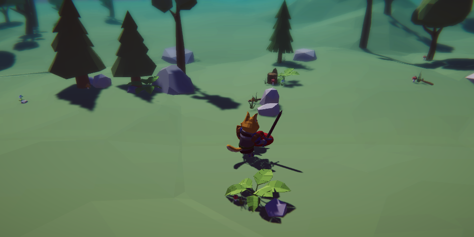
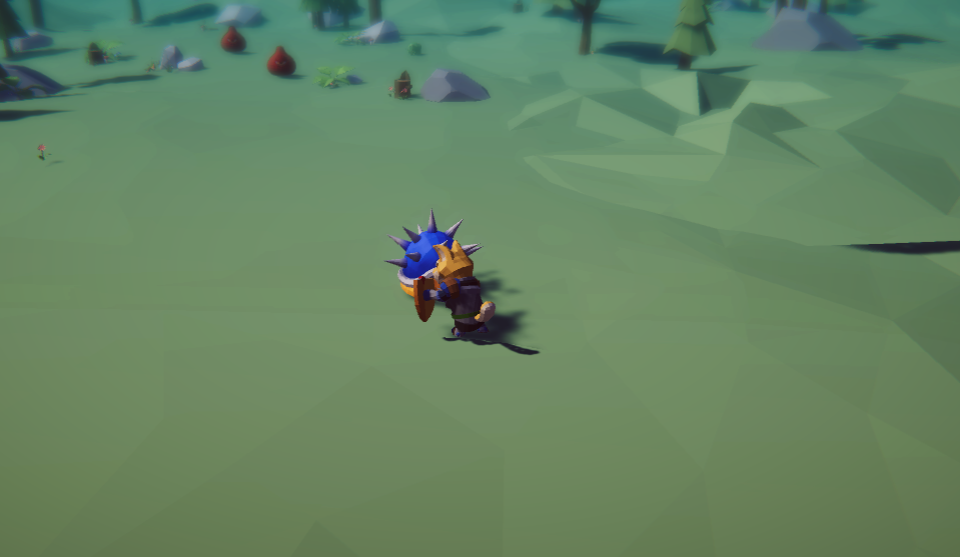

# 学习过程记录

https://github.com/qbdl/3D_RPG_learning.git 仓库的开发学习记录~.

[TOC]

## 3D RPG Course | Core 核心功能

### 01: Create Project 创建项目导入素材

安装 Universal RP 并将整个项目升级到URP

### 02: Build Level 尝试熟悉基本工具

**自动吸附顶点**：按住V键不松手，右键点击物体的想要位置并移动方块，来自动吸附顶点。

- q/w/e/r/t的快捷键来快捷操作

**切换相机视角**：选中对应的camera,右击并按住对应视角不松手，按住ctrl+shift+F来自动设置相机为当前视角。

### 03: PolyBrush 发挥创意构建场景

PolyBrush使用：

- 第1个：改变地形（这里我这里一般是改变竖直方向，所以选择Brush Mirroring的Y轴），点击物体，然后选择第一个图标，按住是上升，按住ctrl再按住是下降
- 第2个：羽化，用于柔和边缘
- 第3个：将物体刷上不同颜色，用于分区（需要创建material导入到对应物体）
- 第4个：将prefab预制体刷到场景中
- 第5个：刷材质

### 04: Navigation 智能导航地图烘焙

### 05: MouseManager 鼠标控制人物移动

已经可以控制人物进行移动了.

### 06: SetCursor 设置鼠标指针

- 实现 MouseManager 单例模式
- event Action 的用法
- PlayerController 函数方法
- 订阅 MouseManager 的事件
- 修改鼠标指针

### 07: Cinemachine & Post Processing 摄像机跟踪和后处理

- 添加虚拟相机实现跟踪人物移动
- 添加 Fog 迷雾效果
- 添加 Post Processing 后处理让场景看起来更好看

### 08: Animator 动画控制器

- 浏览动画片段 (idle,walk,run)
- 创建 Player 的 Animator Controller
- 创建变量以及 Blend Tree 混合树动画
- 通过代码实现移动配合动画切换

### 09: Shader Graph 遮挡剔除

- Unity 2020.2 版本 Shader Graph 介绍
- 创建新的材质作为遮挡剔除显示的材质
- URP Asset 当中添加 Render Feature 实现前后遮挡选择

### 10: Enemy Set States 设置敌人的基本属性和状态

- 导入敌人素材
- 创建 EnemyController 脚本并通过脚本添加 Agent
- 设置 Agent 参数
- 枚举变量设置敌人状态
- 修改鼠标指针到攻击图标

### 11: Player Attack 实现攻击动画

- 通过协程实现移动到敌人面前并采取攻击
- agent 是否停止的切换控制
- 打断攻击停止协程方法
- Attack 动画设置
- 修改鼠标指针到攻击图标

### 12: FoundPlayer 找到Player追击

- 使用 Physics.OverLapSphere 检测周围是否有 Player
- 函数判断切换到追击模式
- 添加 FreeLook 的 Cinemachine 实现自由移动的第三人称镜头

小Tips:如果滚轮操作没有明显反应，调大滚轮里的Speed即可。

​		似乎unity系统在这一步会自动提示API update, 选择更新即可。

### 13: Enemy Animator设置敌人的动画控制器

- 设定一些列参数配合代码切换动画
- 创建多个 Animator Layer 管理动画的状态
- 实现追击玩家切换动画 / 脱战返回 idle

### 14: Patrol Randomly 随机巡逻点

- 设置参数生成随机巡逻点
- 利用 OnDrawGizmosSelected 画出可视范围
- 使用 NavMesh.SamplePosition 获得一个可行的随机点
- 实现到巡逻点等候时间
- 脱战后返回上一个状态

### 15: CharacterStats 人物基本属性和数值

- 介绍了解 ScriptableObject 的功能
- 创建 CharacterData_SO 和 CharacterStats 代码脚本
- 设置基本的人物属性
- Properties 属性的用法 get set 实现读取数据

### 16: AttackData 攻击属性

- 创建 AttackData_SO 添加基本攻击属性
- CharacterStats 中读取数据
- EnemyController 中加入攻击范围判定 / CD时间判定 / 暴击率计算
- 添加 Slime Animator 中的两种动画 

### 17: Execute Attack 实现攻击数值计算

- 为 Player 添加攻击和暴击的动画和参数

- CharacterStats 代码添加 TakeDamage 函数计算伤害

- 添加 Animation Event 在攻击的时候执行函数方法 Hit

- 解决FBX导入动画无法编辑的问题

  

p.s. 注意每次试玩后，Script Object里的数据需要恢复到原有内容。

### 18: Guard & Dead 守卫状态和死亡状态

- 添加 Enemy 和 Player 的受伤动画和死亡动画
- 设置守卫的角度实现脱离战斗归为后缓慢转回初始角度
- 添加暴击伤害触发防御者的受伤动画
- 实现敌人死亡后销毁

### 19: 泛型单例模式 Singleton

- 泛型类的写法
- GameManager 获得 PlayerStats 的注册
- 修改 MouseManager 继承泛型单例基类

### 20: Observer Pattern 接口实现观察者模式的订阅和广播

- 创建 IEndGameObserver 接口
- 在 GameManager 中用来管理所有订阅者并且广播
- 实现 Player 死亡敌人集体欢呼胜利

### 21: More Enemies 制作更多的敌人

- 解决复制出来的敌人公用同一个数据的问题
- 解决 Player 死亡后仍然可以移动的问题
- 解决编辑器窗口的报错问题
- 使用 Animator override controller 制作 乌龟 敌人
- 添加 兽人 和 石头人 的素材简单摆放

### 22: Setup Grunt 设置兽人士兵

- 添加独立的 Animator
- 编写 Animator Behavior 控制动画播放期间的 Agent
- 创建单独的脚本继承 EnemyController
- 设置单独的击飞函数
- Player 添加击晕动画

### 23: Extension Method 扩展方法

- 创建 Transform 的扩展方法判断攻击目标是否在面前
- Vector3.Dot 的用法说明

Tips:VSCode中界面“OUTLINE“来快速查找函数。

### 24: Setup Golem 设置石头人Boss

- 设置 Animator override controller 调整动画片段
- 创建单独的脚本继承 EnemyController
- 设置单独的击飞函数在 Animation Event 中调用

### 25: Throw Rocks 设置可以扔出的石头

- Player 添加 StopingDistance 的切换控制
- 创建 Rock 并编辑代码可以飞向 Player
- 设置为 Prefab 让石头人可以在动画里生成并投掷这个 Rock

### 26: Kick it Back 反击石头人

- 实现击飞 Player 并产生伤害
- 设置 Rock 的不同状态，既能攻击 Player 也可以用来反击石头人
- 创建 Particle System 实现石头碎裂效果

### 27: Health Bar 设置血条显示

- 创建 UI 制作血条 Prefab
- 创建 HealthBarUI 代码挂载每一个敌人身上
- 获得血条显示的 HealthBarPoint 坐标
- 使用 Event Action 的方法在每次攻击的时候更新血量

p.s. 之前乌龟的攻击Hit动画没有加在animation中，我在这里发现并补上了。

### 28: Player LevelUp 玩家升级系统

- 修改 CharacterData 添加等级相关变量
- 创建升级函数方法
- 杀怪获得经验升级属性

### 29: Player UI 添加玩家信息显示

- 制作 PlayerHealth UI
- Canvas 渲染模式设置
- 实时更新血量和经验值

小Tips: Ctrl+D 用于复制

### 30: Create Portal 创建传送门

- 利用 Shader Graph 创建传送门
- 创建 TransitionPoint 和 TransitionDestination 脚本控制传送和终点

### 31: Transition 实现同场景内传送

- 创建协程实现同场景传送点传送

### 32: Different Scene 跨场景传送

- 所有的控制类单例代码添加 DontDestroyOnLoad
- 实现跨场景异步加载并生成 Player
- 设置 Game Manager 为 FreeLook 摄像机添加 Follow 和 LookAt 的目标
- PlayerController 添加 OnDisable 取消订阅

小Tips : 创建arch的时候使用Probuilder的时候可以使用这个Face Selection然后拖动进行生成完整Arch。

使用下一个场景的Wall，使用后在Navigation中设置Wall&Arch成Navigation Static,并设置成“Not Walkable",再进行Bake。

新场景如果使用demo，Ground等内容进行Navigation的设置，Bake。

​				

### 33: Save Data 保存数据

- 了解 JsonUtility 的用法
- 了解 PlayerPrefs 的用法
- 创建 SaveManager 实现保存玩家数据

### 34: Main Menu 制作主菜单

- 制作 Main 场景
- 添加 Canvas 熟悉 Render Mode
- 创建 MainMenu 实现按钮 AddListener 添加对应函数方法
- SceneController 添加新的协程配合场景转换

小Tips : 

- 进入游戏 再退出游戏返回主菜单界面 主菜单的场景就会变得十分暗
  - 打开Auto Generate Lighting(切换后场景不会自动烘培灯光，所以会很暗)。

- NullReferenceException: Object reference not set to an instance of an object
  - 这个是该版本Unity自带的bug，重启unity即可。

Fix a Problem : 

- 怪物的死亡和destroy都很正常，但是玩家却在怪物死亡之后继续攻击，随后unity就会报错`MissingReferenceException: The object of type 'GameObject' has been destroyed but you are still trying to access it.`——解决方法：攻击动画的animation里有一个自动循环的选项，关闭就好了。

  

### 35: SceneFader 场景转换的渐入渐出

- 添加 Timeline 了解基本用法

- 利用 Canvas Group 制作 SceneFader

- 协程套协程的用法

- 实现 Player 死亡返回主菜单

  

  

小Tips : 

- player死亡一次后，再开始游戏，再次死亡就不会自动返回主菜单
  - 原因是再次开始游戏后，fadeFinished这个布尔值还是false。在LoadLevel()这个协程里加上`yield return fadeFinished = true;`这样再次进入游戏时，fadeFinished变成了true，玩家死亡时就可以执行LoadMain()了。
- player第一次死亡重新回到主菜单，但是点击按钮不会进入新游戏
  - 把CanvasGroup里的blockRaycast关掉即可。

### 36: Build & Run打包及运行

- Build Settings 的相关设置
- Player Settings 的相关设置
- 如果添加各种平台的支持

### 效果视频

## 3D RPG Course ｜高级教程