# 学习过程记录

https://github.com/qbdl/3D_RPG_learning.git 仓库的开发学习记录~.

[TOC]

## 3D RPG Course | Core 核心功能

### 01: Create Project 创建项目导入素材

安装 Universal RP 并将整个项目升级到URP


### 02: Build Level 尝试熟悉基本工具

**自动吸附顶点**：按住V键不松手，右键点击物体的想要位置并移动方块，来自动吸附顶点。

- q/w/e/r/t的快捷键来快捷操作

**切换相机视角**：选中对应的camera,右击并按住对应视角不松手，按住ctrl+shift+F来自动设置相机为当前视角。

**移动视角**：按住鼠标右键，点击“Q"/”E"进行上下移动，“A”/"D"进行左右移动，“W”"S"进行前后（远近）移动。


视角出现类似镂空的情况：将右侧"iso"点击一下，修改为“perspective”即可。

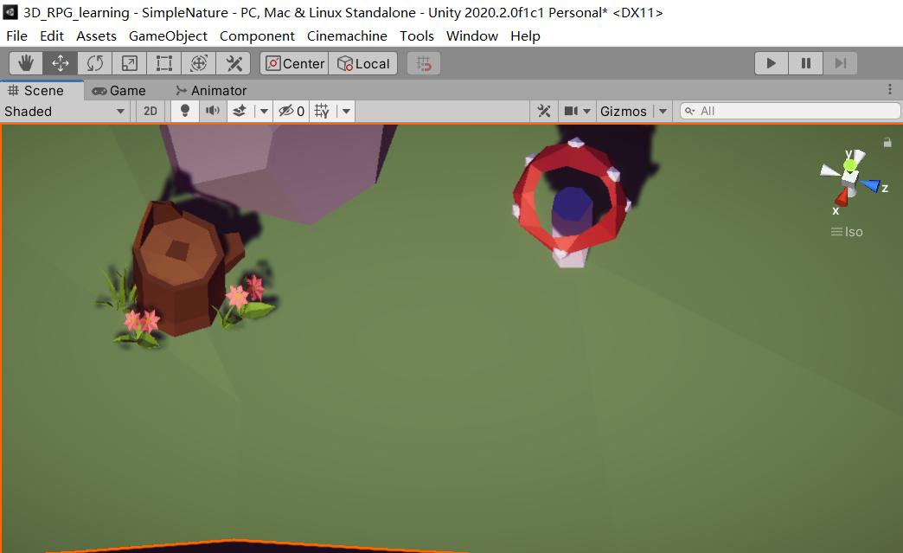


### 03: PolyBrush 发挥创意构建场景

PolyBrush使用：

- 第1个：改变地形（这里我这里一般是改变竖直方向，所以选择Brush Mirroring的Y轴），点击物体，然后选择第一个图标，按住是上升，按住ctrl再按住是下降
- 第2个：羽化，用于柔和边缘
- 第3个：将物体刷上不同颜色，用于分区（需要创建material导入到对应物体）
- 第4个：将prefab预制体刷到场景中
- 第5个：刷材质


### 04: Navigation 智能导航地图烘焙


### 05: MouseManager 鼠标控制人物移动

已经可以控制人物进行移动了.


### 06: SetCursor 设置鼠标指针

- 实现 MouseManager 单例模式
- event Action 的用法
- PlayerController 函数方法
- 订阅 MouseManager 的事件
- 修改鼠标指针


### 07: Cinemachine & Post Processing 摄像机跟踪和后处理

- 添加虚拟相机实现跟踪人物移动
- 添加 Fog 迷雾效果
- 添加 Post Processing 后处理让场景看起来更好看


### 08: Animator 动画控制器

- 浏览动画片段 (idle,walk,run)
- 创建 Player 的 Animator Controller
- 创建变量以及 Blend Tree 混合树动画
- 通过代码实现移动配合动画切换


### 09: Shader Graph 遮挡剔除

- Unity 2020.2 版本 Shader Graph 介绍
- 创建新的材质作为遮挡剔除显示的材质
- URP Asset 当中添加 Render Feature 实现前后遮挡选择


### 10: Enemy Set States 设置敌人的基本属性和状态

- 导入敌人素材
- 创建 EnemyController 脚本并通过脚本添加 Agent
- 设置 Agent 参数
- 枚举变量设置敌人状态
- 修改鼠标指针到攻击图标


### 11: Player Attack 实现攻击动画

- 通过协程实现移动到敌人面前并采取攻击
- agent 是否停止的切换控制
- 打断攻击停止协程方法
- Attack 动画设置
- 修改鼠标指针到攻击图标


### 12: FoundPlayer 找到Player追击

- 使用 Physics.OverLapSphere 检测周围是否有 Player
- 函数判断切换到追击模式
- 添加 FreeLook 的 Cinemachine 实现自由移动的第三人称镜头


小Tips:如果滚轮操作没有明显反应，调大滚轮里的Speed即可。


​		似乎unity系统在这一步会自动提示API update, 选择更新即可。


### 13: Enemy Animator设置敌人的动画控制器

- 设定一些列参数配合代码切换动画
- 创建多个 Animator Layer 管理动画的状态
- 实现追击玩家切换动画 / 脱战返回 idle

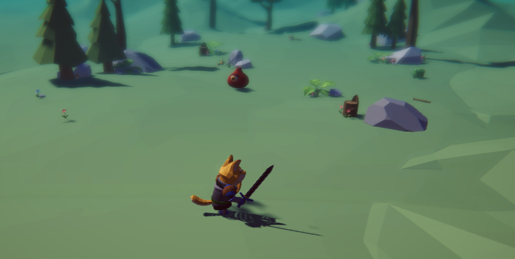


### 14: Patrol Randomly 随机巡逻点

- 设置参数生成随机巡逻点
- 利用 OnDrawGizmosSelected 画出可视范围
- 使用 NavMesh.SamplePosition 获得一个可行的随机点
- 实现到巡逻点等候时间
- 脱战后返回上一个状态


### 15: CharacterStats 人物基本属性和数值

- 介绍了解 ScriptableObject 的功能
- 创建 CharacterData_SO 和 CharacterStats 代码脚本
- 设置基本的人物属性
- Properties 属性的用法 get set 实现读取数据


### 16: AttackData 攻击属性

- 创建 AttackData_SO 添加基本攻击属性
- CharacterStats 中读取数据
- EnemyController 中加入攻击范围判定 / CD时间判定 / 暴击率计算
- 添加 Slime Animator 中的两种动画 


### 17: Execute Attack 实现攻击数值计算

- 为 Player 添加攻击和暴击的动画和参数

- CharacterStats 代码添加 TakeDamage 函数计算伤害

- 添加 Animation Event 在攻击的时候执行函数方法 Hit

- 解决FBX导入动画无法编辑的问题

  

p.s. 注意每次试玩后，Script Object里的数据需要恢复到原有内容。


### 18: Guard & Dead 守卫状态和死亡状态

- 添加 Enemy 和 Player 的受伤动画和死亡动画
- 设置守卫的角度实现脱离战斗归为后缓慢转回初始角度
- 添加暴击伤害触发防御者的受伤动画
- 实现敌人死亡后销毁


### 19: 泛型单例模式 Singleton

- 泛型类的写法
- GameManager 获得 PlayerStats 的注册
- 修改 MouseManager 继承泛型单例基类


### 20: Observer Pattern 接口实现观察者模式的订阅和广播

- 创建 IEndGameObserver 接口
- 在 GameManager 中用来管理所有订阅者并且广播
- 实现 Player 死亡敌人集体欢呼胜利

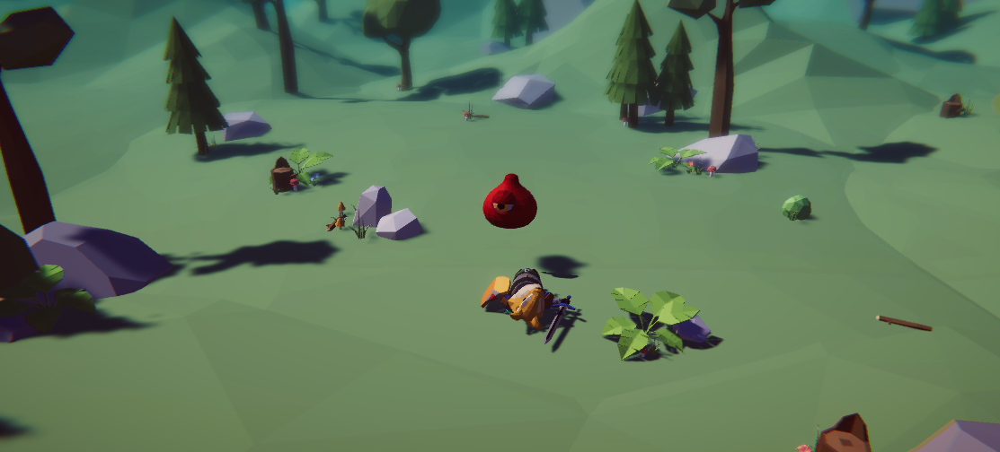


### 21: More Enemies 制作更多的敌人

- 解决复制出来的敌人公用同一个数据的问题
- 解决 Player 死亡后仍然可以移动的问题
- 解决编辑器窗口的报错问题
- 使用 Animator override controller 制作 乌龟 敌人
- 添加 兽人 和 石头人 的素材简单摆放


### 22: Setup Grunt 设置兽人士兵

- 添加独立的 Animator
- 编写 Animator Behavior 控制动画播放期间的 Agent
- 创建单独的脚本继承 EnemyController
- 设置单独的击飞函数
- Player 添加击晕动画


### 23: Extension Method 扩展方法

- 创建 Transform 的扩展方法判断攻击目标是否在面前
- Vector3.Dot 的用法说明


Tips:VSCode中界面“OUTLINE“来快速查找函数。


### 24: Setup Golem 设置石头人Boss

- 设置 Animator override controller 调整动画片段
- 创建单独的脚本继承 EnemyController
- 设置单独的击飞函数在 Animation Event 中调用


### 25: Throw Rocks 设置可以扔出的石头

- Player 添加 StopingDistance 的切换控制
- 创建 Rock 并编辑代码可以飞向 Player
- 设置为 Prefab 让石头人可以在动画里生成并投掷这个 Rock


### 26: Kick it Back 反击石头人

- 实现击飞 Player 并产生伤害
- 设置 Rock 的不同状态，既能攻击 Player 也可以用来反击石头人
- 创建 Particle System 实现石头碎裂效果


### 27: Health Bar 设置血条显示

- 创建 UI 制作血条 Prefab
- 创建 HealthBarUI 代码挂载每一个敌人身上
- 获得血条显示的 HealthBarPoint 坐标
- 使用 Event Action 的方法在每次攻击的时候更新血量


p.s. 之前乌龟的攻击Hit动画没有加在animation中，我在这里发现并补上了。


### 28: Player LevelUp 玩家升级系统

- 修改 CharacterData 添加等级相关变量
- 创建升级函数方法
- 杀怪获得经验升级属性


### 29: Player UI 添加玩家信息显示

- 制作 PlayerHealth UI
- Canvas 渲染模式设置
- 实时更新血量和经验值


小Tips: Ctrl+D 用于复制


### 30: Create Portal 创建传送门

- 利用 Shader Graph 创建传送门
- 创建 TransitionPoint 和 TransitionDestination 脚本控制传送和终点


### 31: Transition 实现同场景内传送

- 创建协程实现同场景传送点传送


### 32: Different Scene 跨场景传送

- 所有的控制类单例代码添加 DontDestroyOnLoad
- 实现跨场景异步加载并生成 Player
- 设置 Game Manager 为 FreeLook 摄像机添加 Follow 和 LookAt 的目标
- PlayerController 添加 OnDisable 取消订阅


小Tips : 创建arch的时候使用Probuilder的时候可以使用这个Face Selection然后拖动进行生成完整Arch。


使用下一个场景的Wall，使用后在Navigation中设置Wall&Arch成Navigation Static,并设置成“Not Walkable",再进行Bake。


新场景如果使用demo，Ground等内容进行Navigation的设置，Bake。

​				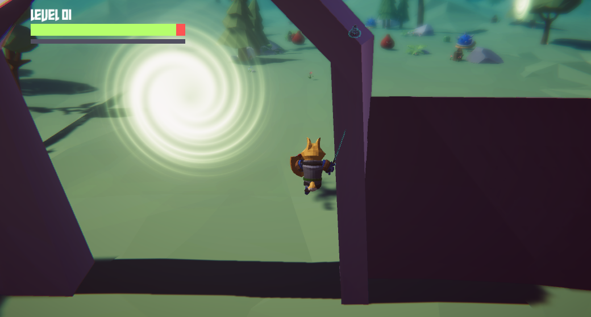

p.s. 之前直接用第一场景的freelook camera生成prefab拖到第二场景——这样似乎无法起到效果，于是重新创建freelook camera后即可。

扩建场景：


### 33: Save Data 保存数据

- 了解 JsonUtility 的用法
- 了解 PlayerPrefs 的用法
- 创建 SaveManager 实现保存玩家数据


### 34: Main Menu 制作主菜单

- 制作 Main 场景
- 添加 Canvas 熟悉 Render Mode
- 创建 MainMenu 实现按钮 AddListener 添加对应函数方法
- SceneController 添加新的协程配合场景转换


小Tips : 

- 进入游戏 再退出游戏返回主菜单界面 主菜单的场景就会变得十分暗
  - 打开Auto Generate Lighting(切换后场景不会自动烘培灯光，所以会很暗)。

- NullReferenceException: Object reference not set to an instance of an object
  - 这个是该版本Unity自带的bug，重启unity即可。

- 解决标题很糊的问题

  - 这个是因为portal摆放在了“The Knight"与”New Game"的中间，将portal移到它们的同一侧即可。

    

- Copyright部分如果想要跟button一样消失

  - 同样设置screen space-camera,调整plane距离至可见位置，然后再设置成world space即可。

  

  


Fix a Problem : 

- 怪物的死亡和destroy都很正常，但是玩家却在怪物死亡之后继续攻击，随后unity就会报错`MissingReferenceException: The object of type 'GameObject' has been destroyed but you are still trying to access it.`——解决方法：攻击动画的animation里有一个自动循环的选项，关闭就好了。

  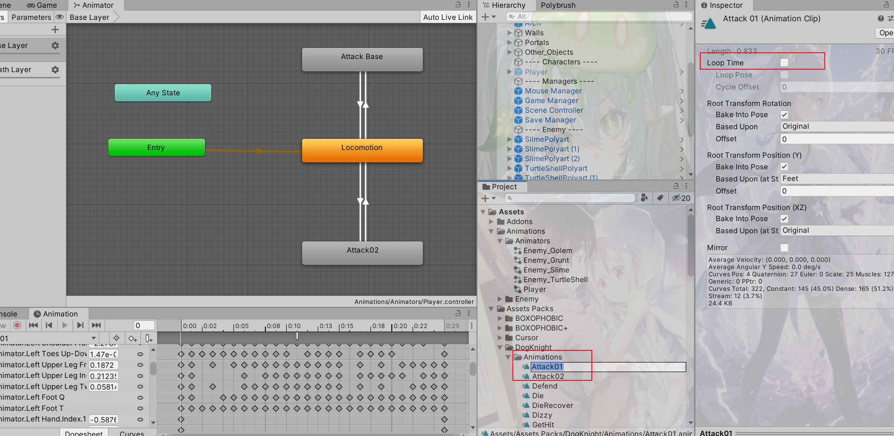


### 35: SceneFader 场景转换的渐入渐出

- 添加 Timeline 了解基本用法

- 利用 Canvas Group 制作 SceneFader

- 协程套协程的用法

- 实现 Player 死亡返回主菜单

  

  

小Tips : 

- player死亡一次后，再开始游戏，再次死亡就不会自动返回主菜单
  - 原因是再次开始游戏后，fadeFinished这个布尔值还是false。在LoadLevel()这个协程里加上`yield return fadeFinished = true;`这样再次进入游戏时，fadeFinished变成了true，玩家死亡时就可以执行LoadMain()了。
- player第一次死亡重新回到主菜单，但是点击按钮不会进入新游戏
  - 把CanvasGroup里的blockRaycast关掉即可。


### 36: Build & Run打包及运行

- Build Settings 的相关设置
- Player Settings 的相关设置
- 如果添加各种平台的支持


### MileStone

#### 效果图片合集

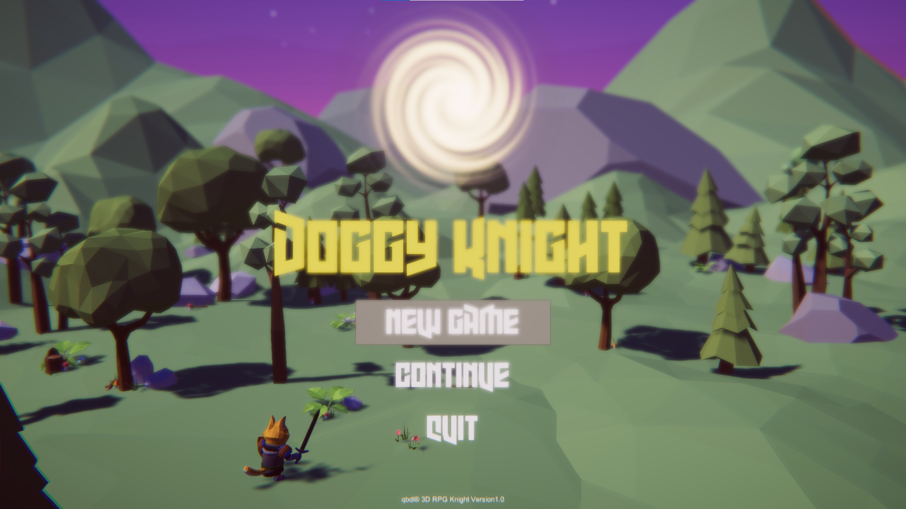

​			

​			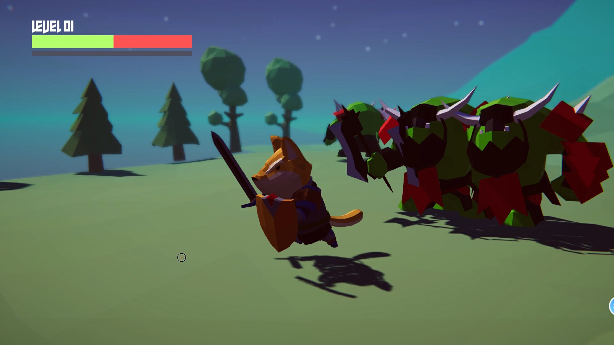

​			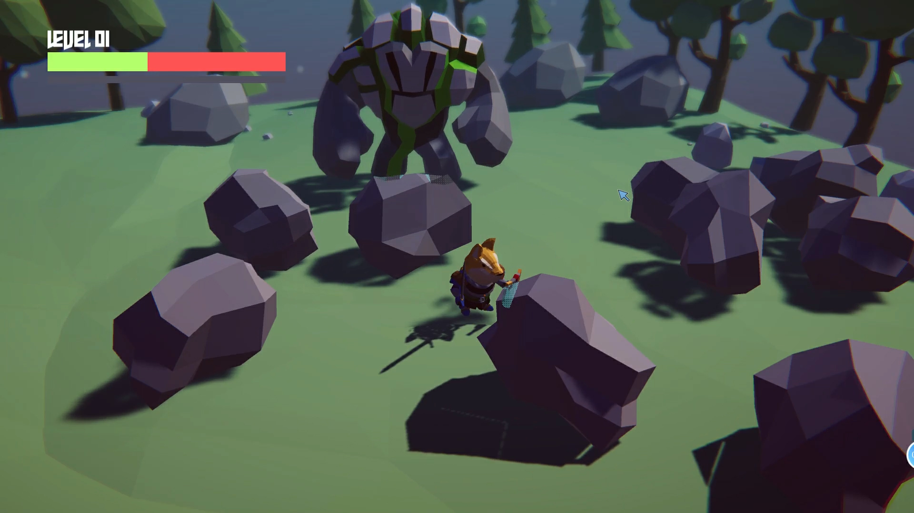


#### 可以改进的点

##### Bugs

- 石头的攻击力要能破掉石头人的防御

##### Improvements


- 加入敏捷值，移动速度调整


- 怪在身前也经常打不到，卡自己的模型


- 拉怪拉到传送门那，会卡攻击，因为很容易误触到传送门


- 人物移动wasd,鼠标控制视角


- 其他颜色的传送门传送到不同位置（同个颜色进行相互传送）


- 加入音效


#### 目前总用时

46h 45min 37s.


## 3D RPG Course ｜高级教程

### 章节1 背包系统

#### 1.项目介绍

背包系统简单来说就是 UI 和 逻辑代码 的组合。**这就意味着 2D 和 3D 游戏都是完全通用的**。


#### 2.Inventory UI 制作背包的基本UI

- 导入素材设置画布布局
- 使用 Grid Layout Group 进行网格化控制
- 保存 Slot Holder 为 Prefab

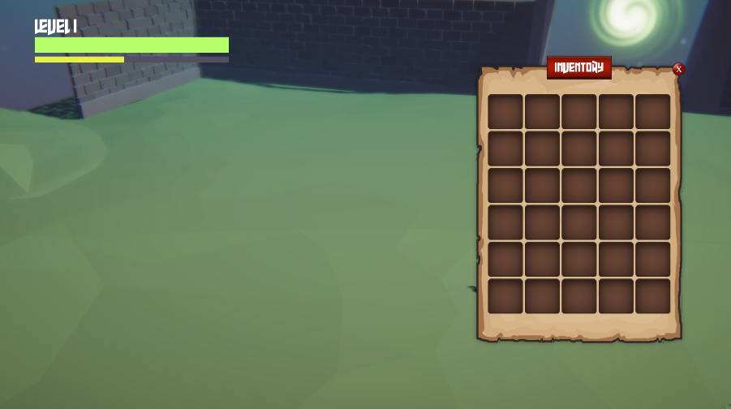


#### 3.Item OnWorld 创建世界地图上的物品

- 制作世界地图物品的 prefab
- 创建 ItemPickUp 脚本判断碰撞
- 创建 ItemData_SO 制作物品信息的模版
- 在 MouseManager 中添加对物品互动的指针切换和移动

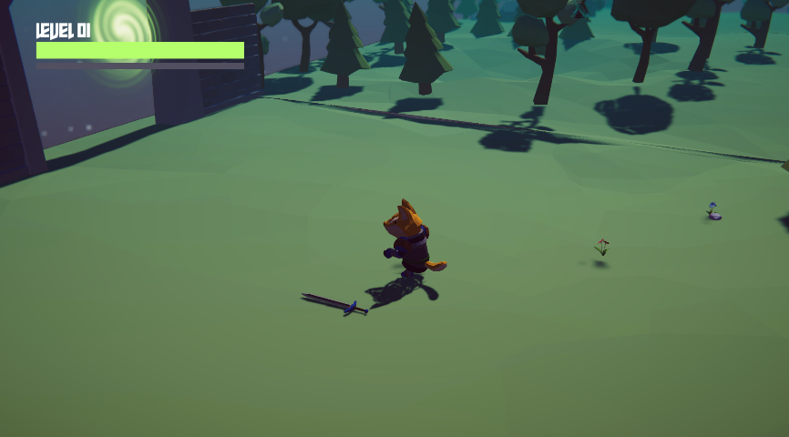


#### 4.Equip Weapon 装备武器

- 在世界地图上创建武器 添加必要对 Component 
- 创建武器本身的 Attack Data 攻击属性
- 调整世界物品的碰撞器和触发器
- 调整生成物品的 Prefab 的坐标，特别是武器和装备
- CharacterStats 代码中加入 EquipWeapon 实现装备武器
- 添加武器的 Attack Data
- AttackData_SO 里添加更新属性的函数


#### 5.Inventory Data 创建背包的数据库

- 创建 InventoryData_SO 作为不同背包的数据库
- 创建单独的 class InventoryItem 用来记录背包里的物品和现有数量
- 添加 AddItem 方法将物品信息传递到 List 列表当中
- 修改 ItemPickUp 实现碰撞物体 拾取到背包里

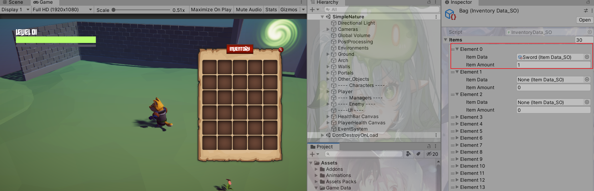


#### 6.Inventory UI 让背包显示物品

- 梳理逻辑并创建代码 ContainerUI / SlotHolder / ItemUI
- 修改 SlotHolder 的 Prefab 添加空物体 ItemSlot
- 逐层完成代码实现背包里正确显示物品图片和数量


p.s. 关闭prefab中的网格Tips：


#### 7.Action Bar / Stats 设置快捷栏和信息面板的UI

- 创建快捷栏 Action Bar 的按钮 UI
- 创建人物信息面板 UI

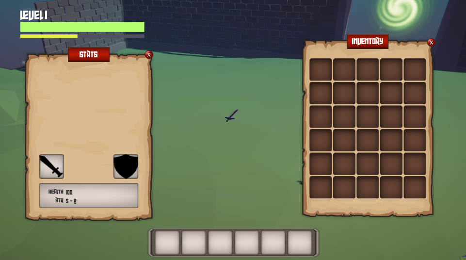


#### 8.Begin Drag 实现拖拽物品

- 创建 DragItem 实现拖拽功能
- 介绍 EventSystems 里的接口
- 实现拖拽跟随鼠标指针
- 创建 DragData 用来记录每一个 UI 物品原始数据


p.s. 同样类型里列表越后面的东西渲染的越迟，结果就是呈现在更前面，覆盖掉前面的。


#### 9.Swap Item 交换物品

- 使用 EventSystem 判断指针位置
- 利用 RectTransformUtility.RectangleContainsScreenPoint 判断鼠标位置是否包含在每一个格子范围内
- 交换图片的同时要交换真是的数据列表排序
- 调整 RectTransform 的 offset 确保图片在正确位置显示


#### 10.Change Weapon 实现切换武器

- 在 MouseManager 添加函数方法 避免 UI 互动时影响人物控制
- 在 CharacterStats 中加入 ChangeWeapon 的方法
- 在 SlotHolder 中切换所属背包的数据库
- DragItem 中添加物品属性和 SlotType 的匹配


- 增加shield相关的内容

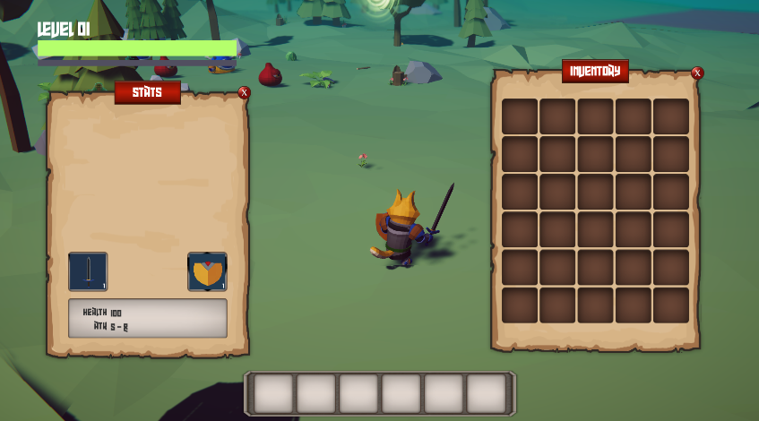

P.S. 

- 注意，这部分开始玩的时候最好从主菜单进入，否则会报错：`NullReferenceException: Object reference not set to an instance of an object DragItem.SwapItem () (at Assets/Scripts/Inventory/UI/DragItem.cs:89)`

  - 原因：直接从当前场景进入，由于没有初始化背包会报错（所以要从主菜单进入游戏），可以通过图示代码里的Debug部分定位该问题。

    ```c#
    public void SwapItem()
        {
            //如果直接从当前场景进入，由于没有初始化背包会报错（所以要从主菜单进入游戏）
            // if (targetSlotHolder.itemUI.Bag == null || currentSlotHolder.itemUI.Bag == null)
            // {
            //     Debug.LogError("My Debug SwapItem: Bag is null in targetSlotHolder or currentSlotHolder!");
            //     return;
            // }
    
            //改变数据库
            var targetItem = targetSlotHolder.itemUI.Bag.items[targetSlotHolder.itemUI.Index];
            var tempItem = currentSlotHolder.itemUI.Bag.items[currentSlotHolder.itemUI.Index];
    
            bool isSameItem = (tempItem.itemData == targetItem.itemData);
            if (isSameItem && targetItem.itemData.itemStackable)//叠加
            {
                targetItem.itemAmount += tempItem.itemAmount;
                tempItem.itemData = null;
                tempItem.itemAmount = 0;
            }
            else//交换物品数据
            {
                currentSlotHolder.itemUI.Bag.items[currentSlotHolder.itemUI.Index] = targetItem;
                targetSlotHolder.itemUI.Bag.items[targetSlotHolder.itemUI.Index] = tempItem;
            }
        }
    ```

    

- 注意当剑/盾牌从装备栏移回到背包里原有盾牌/剑的格子时候会发生报错（原来代码）: 

  - 会导致的结果：将两者交换位置，使得武器装备到了盔甲的格子里。

    

  - 原因：当把物品换到背包时会无条件地调用`SwapItem()`，而如果目标槽位中已有物品（如剑或盾牌），`SwapItem()`后在 `SlotHolder.UpdateItem` 会调用 `ChangeArmor`，导致非盔甲类型的物品被错误地传递给 `EquipArmor` 方法。

    ```c#
    switch (targetSlotHolder.slotType)
                    {
                        case SlotType.BAG:
                            SwapItem();
                            break;
                        case SlotType.WEAPON:
                            if (currentItemUI.Bag.items[currentItemUI.Index].itemData.itemType == ItemType.Weapon)
                                SwapItem();
                            break;
                        case SlotType.ARMOR:
                            if (currentItemUI.Bag.items[currentItemUI.Index].itemData.itemType == ItemType.Armor)
                                SwapItem();
                            break;
                        case SlotType.ACTION:
                            if (currentItemUI.Bag.items[currentItemUI.Index].itemData.itemType == ItemType.Useable)
                                SwapItem();
                            break;
                    }
    ```

  - 解决方法：在`case SlotType.BAG:`中加入条件( 目标槽位为空 或者 目标槽位与当前槽位物品类型相同 )。

    ```c#
    case SlotType.BAG:
                            // 检查目标槽位是否已有物品
                            var targetItem = targetSlotHolder.itemUI.Bag.items[targetSlotHolder.itemUI.Index];
                            bool canSwap = targetItem.itemData == null || //目标槽位为空
                                           targetItem.itemData.itemType == currentItemUI.Bag.items[currentItemUI.Index].itemData.itemType;//目标槽位与当前槽位物品类型相同
                            if (canSwap)
                                SwapItem();
                            break;
    ```


#### 11.Useable Item 可使用的物品

- 创建大蘑菇 并添加必要的组件
- 创建 UseableItemData_SO 制作可使用物品的属性模版
- 利用 IPointerClickHandler 接口实现双击使用物品
- 在 CharacterStats 中添加 ApplyHealth（我这里面是ApplyUseableEffect） 实现血量变化

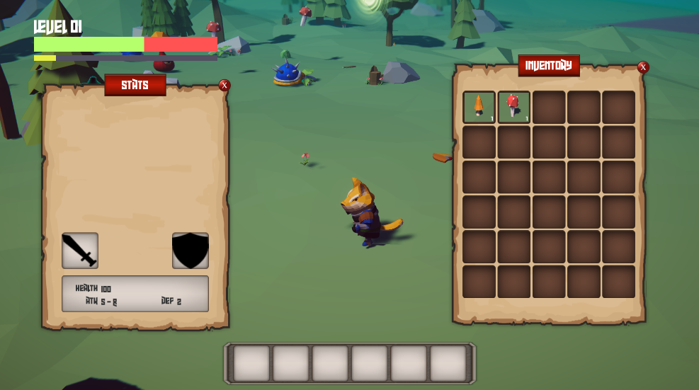


#### 12.Action Button 快捷栏按键

- 添加实现 CloseBtn 关闭当前 UI 面板
- 添加按键控制打开关闭 UI 面板
- 创建 ActionButton 脚本设置独立按键使用快捷栏物品
- 修正双击空 SlotHolder 的报错


#### 13.Stats Info 显示 Player 相关信息

- 创建 RawImage 和 独立 Camera 实现映射 Player 的模型
- 获得 Text 的面板信息
- 创建函数方法实时更新面板信息


小Tips

- 加入camera用于生成raw image后，游戏时可能画面变得很模糊

  

  - 原因：不确定是什么问题。
  
  - 解决方法：就在人物面板打开时启用camera，关闭时关闭camera。
  
    ```c#
    //InventoryManager.cs中
    void Update()
        {
            if (Input.GetKeyDown(KeyCode.B)) // 按下B键打开或关闭背包栏
            {
                isOpen = !isOpen;
                inventoryPanel.SetActive(isOpen); // 切换背包栏UI面板的显示状态
                statsPanel.SetActive(isOpen); // 切换装备栏UI面板的显示状态
            }
    
            // 控制人物面板的相机开关
            if (GameManager.Instance.characterPanelCamera != null)
                GameManager.Instance.characterPanelCamera.gameObject.SetActive(isOpen);
            else
                Debug.LogWarning("My_Debug : Character panel camera is not assigned in GameManager.");
    
    
            // 更新角色人物栏属性文本
            UpdateStatsText(
                GameManager.Instance.playerStats.CurrentHealth,
                GameManager.Instance.playerStats.attackData.minDamage,
                GameManager.Instance.playerStats.attackData.maxDamage,
                GameManager.Instance.playerStats.CurrentDefence
            );
        }
    ```
  
    ```c#
    //GameManager.cs中
    public Camera characterPanelCamera; // 用于人物面板的相机
    
        List<IEndGameObserver> endGameObservers = new List<IEndGameObserver>();
    
        protected override void Awake()
        {
            base.Awake();
            DontDestroyOnLoad(gameObject); // 确保GameManager在场景切换时不会被销毁
        }
    
        public void RigisterPlayer(CharacterStats player)
        {
            playerStats = player;
            characterPanelCamera = playerStats.transform.Find("Camera").GetComponent<Camera>(); // 获取角色的Camera组件
    ```
  
    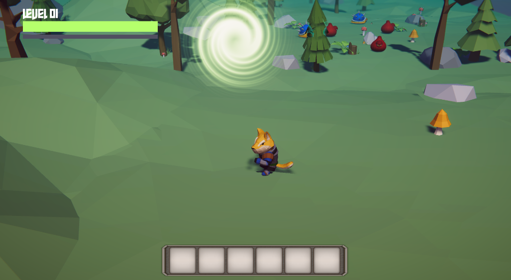
  
    

#### 14.Change Animator 切换动画控制器

- 使用更多动画来创建 Animator override controller
- ItemData_SO 中添加武器配套动画控制器
- 在 EquipWeapon 和 UnEquipment 中添加代码切换武器伴随动画

参考素材：

- RPG Character Animation Pack Free ：[点击跳转](https://assetstore.unity.com/packages/3d/animations/rpg-character-mecanim-animation-pack-free-65284)

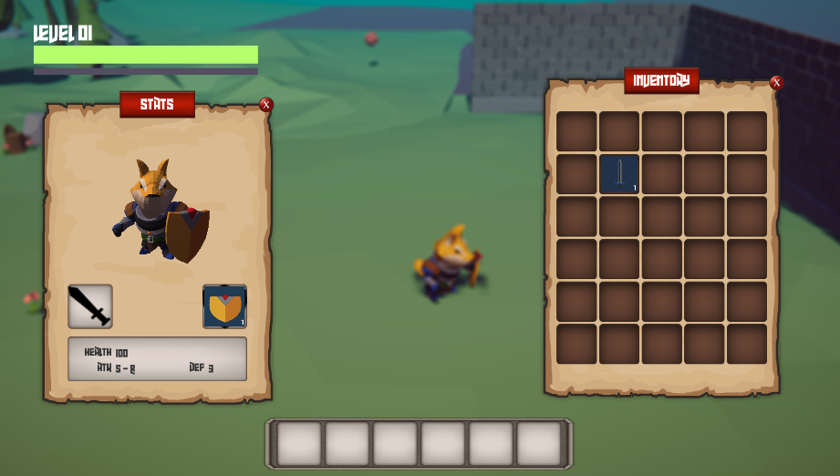

fix problems:

-  原来视频里的`attackData`与`baseAttackData`的逻辑有点问题,会导致模板的数据被修改：

  - 修改，改名，并把character部分对应的prefab的attack Data的内容改为给templateAttackData赋值，删掉对attackData的赋值

      public **AttackData_SO** templateAttackData; *// 攻击template数据*

      public **AttackData_SO** attackData; *// 攻击数据*


#### 15.Item Tooltip 物品信息显示栏

- 创建 UI
- 学习 Content size fitter 的用法实现自动拉伸缩放
- 添加代码脚本 ItemTooltip 
- 利用 IPointEnterHandler 接口实现鼠标悬停显示 Tooltip
- RectTransform.GetWorldCorners 概念说明及使用方法


#### 16.Loot Items 掉落物品

- 创建 LootItem 类 记录要掉落的物品和权重
- 使用 [Range] 控制掉落权重的百分比
- 实现多物品比较权重掉落


#### 17.Complete Inventory 完成背包

- 添加背包的保存和读取方法
- 添加 DragPanel 实现拖拽背包面板
- 利用调整 Hierarchy 排序的方法改变渲染前后层级


fix problems:

- 从游戏回到主菜单，快捷栏，装备栏等仍是开着的：

  - 问题原因：`DontDestroyOnLoad(gameObject);` 不是在所有Singleton里面都不要删除的，否则快捷栏的显示状态没有在切换场景时被重置，它会保持之前的状态（例如打开状态）。

  - 解决方案：

    - 删除Singleton里的`DontDestroyOnLoad(gameObject);`

    - 在下述**使用Singleton的部分Awake()**中进行override

      - 1、**单例管理器类**（管理全局状态或数据的单例类）：`GameManager.cs` , `MouseManager.cs` , `SaveManager.cs` , `SceneController.cs`。
      - 2、**玩家数据或状态**（玩家数据（如生命值、经验值、装备等）需要在场景切换时保持一致）。

      ```C#
      protected override void Awake()
          {
              base.Awake();
              DontDestroyOnLoad(gameObject);
          }
      ```

- 如果不进入下一场景直接esc后，使用continue会发现数据都没了：

  - SaveManager.cs里esc时要加入人物数据与背包数据的保存，使得continue时能够加载得到。

    ```c#
    if (Input.GetKeyDown(KeyCode.Escape))
            {
                // Exit the game when 'Escape' is pressed
    
                SaveManager.Instance.SavePlayerData();  // 保存玩家数据
                InventoryManager.Instance.SaveData();   // 保存背包和装备栏数据
    
                SceneController.Instance.TransitionToMainMenu();
            }
    ```


#### 18.制作3D武器 及 在游戏中的使用

- ProBuilder 建模介绍
- UV Editor 编辑器使用


​			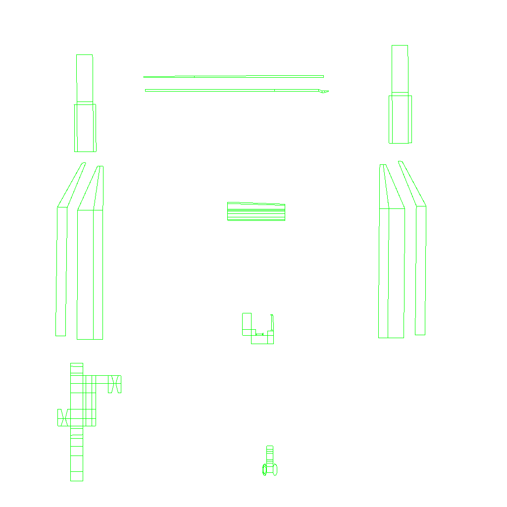

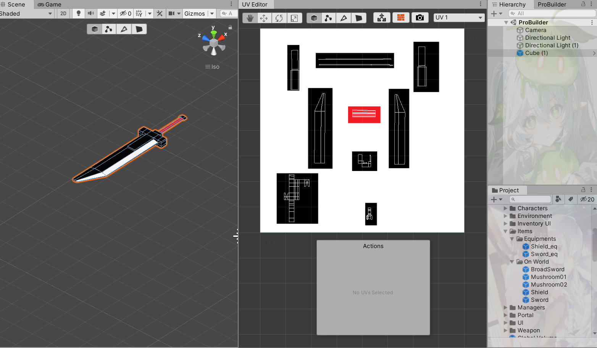

- 将BroadSword这把剑以类似sword的方式对它添加各种属性与文件


- 尝试制作自己的双手武器动画——我这里做的还是单手模型
- 测试你的人物模型是否有问题再做调整
- 反复调整坐标及旋转并且配合动画检查

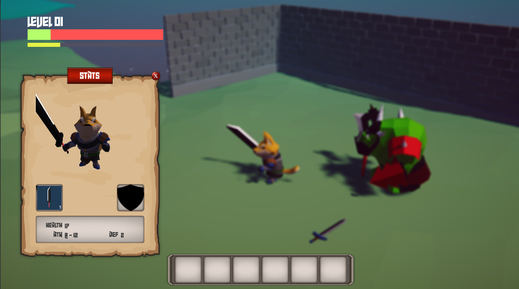

fix problems:

- 修改蘑菇漂浮在空中的问题：调整mushroom的prefab中capsule collider与box collider的大小

  


### 章节2 对话系统

#### 1.项目介绍

对话系统的逻辑、数据、UI相关制作。


#### 2.Dialogue Logic 对话系统的逻辑

- 逻辑讲解
- 创建代码 DialogueData_SO / Dialogue Piece / Dialogue Option
- 创建第一个对话实现预期的逻辑


#### 3.Dialogue Canvas 对话的UI面板设置

- 创建对话窗口的 UI 布局
- 继续熟悉各种 Layout Group 的用法
- 利用 Layout Element 设置最小高度
- 自己多动手尝试制作自己喜欢的样式


#### 4.创建对话&任务的 NPC

- 在 Assets Store 中添加rpg-hero-pbr-hp-polyart素材：[点击跳转](https://assetstore.unity.com/packages/3d/characters/humanoids/fantasy/rpg-hero-pbr-hp-polyart-121480)
- 导入素材后，要将你的场景素材升级到URP
- 拖拽素材包中的 Prefab 文件夹中的人物放在场景中
- 添加基本的必要组件

- 自己单独创建 Animator Controller 只添加一个 Idle 动画即可
- 修改 Tag 及 Layer
- 将这个人物保存成 Original Prefab 在你的文件夹中


#### 5.Update Main Dialogue 显示主对话窗口的内容

- NPC 添加 DialogueController 脚本 出发启动对话
- 创建 DialogueUI 作为整个对话的控制
- DOTween 中 DOText 的用法
- DialogueData_SO 优化 Text 的显示 [TextArea]

Assets Store 商城 DOTween 插件：[点击跳转](https://assetstore.unity.com/packages/tools/animation/dotween-hotween-v2-27676)

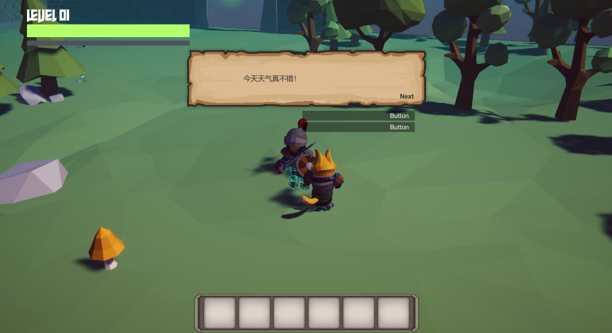


#### 6.OptionUI 创建选项内容

- OptionUI 控制每一个选项的显示内容
- DialogueData_SO 添加字典保存每一条 DialoguePiece 和 本身的 ID 用来查找
- 实现点按 Option Button 跳转对应对话


### 章节3 对话系统

任务数据、逻辑、UI的制作，包括接受奖励。

#### 1.Quest Data 创建任务数据

- 创建任务基本变量
- 创建 QuestRequire 用来追踪我们要完成的任务目标
- 在 DialoguePiece 中加入 Quest 并设置一个新对话可以接受任务


小Tips:  

- “手”图标点击隐藏可以防止在scene窗口中选中该内容。

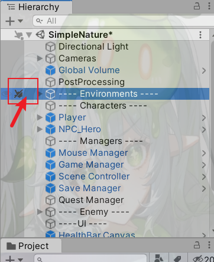

- **DontDestroyOnLoad 要求其上没有父物体**，所以Managers类别不能放在“---- Managers ----”里去。


#### 2.TakeQuest 接受任务

- 创建 QuestManager 管理 Player 接到的任务
- 创建 class QuestTask 保管接到的新任务
- 使用 System.Linq 来查找和返回 tasks 列表里我们指定条件的数据
- 实现对话选择指定的选项后接受任务

参考内容：

- System.Linq 微软手册：[跳转链接](https://docs.microsoft.com/zh-cn/dotnet/csharp/programming-guide/concepts/linq/basic-linq-query-operations)

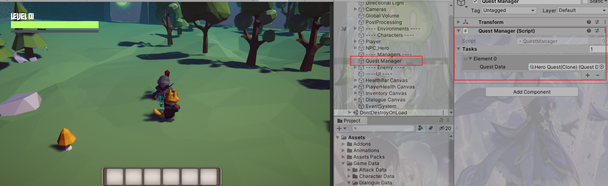


#### 3.Quest UI 创建任务 UI 面板

- 创建 Quest Canvas 使用之前学习过的组件创建任务信息面板
- QuestData_SO 中添加奖励列表 rewards

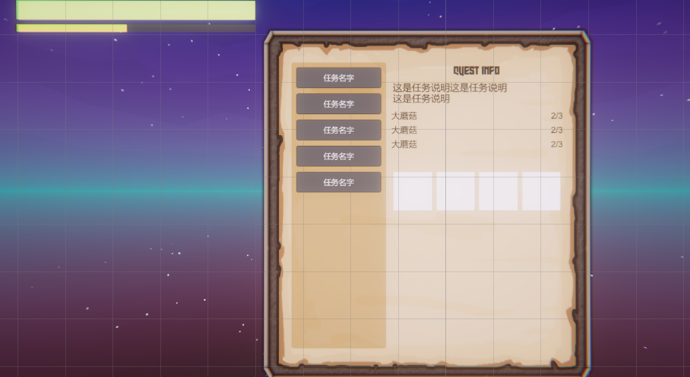


#### 4.Setup Variables 创建所需要的变量

- 创建 QuestNameButton 添加在 任务名字按钮 上
- 创建 QuestRequirement 添加在 Requirement 上
- 设置好以上两个类的变量并且拿到赋值
- QuestUI 中创建所有的需要控制的变量 / 坐标 / Prefab


#### 5.QuestNameButton 实现点按任务显示信息

- 按照逻辑去写每一个需要的函数方法
- 设置任务按钮显示对应任务名字
- 实现点击名字按钮能显示任务详情以及任务需求
- 调整 UI 布局

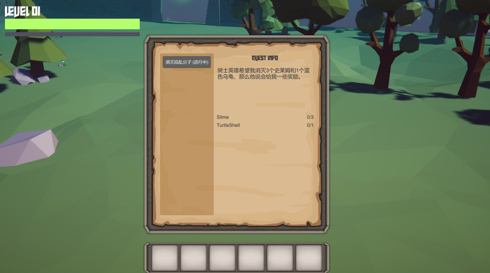

Fix a problem : 之前挂载的不是父物体，挂错了


#### 6.RewardList 奖励物品的显示

- SetupRewardList的 方法实现
- 创建 ShowTooltip 实现鼠标滑入显示信息
- 创建多个任务并修复重复显示任务奖励的问题


#### 7.UpdateQuestProgress 更新任务进度

- 创建函数在 敌人死亡 和 拾取物品时 更新任务进度
- 使用 Linq 语句中的 Where 找到匹配的任务需求并检查是否满足
- 修改特殊情况使用任务物品消耗后更新进度


#### 8.CheckQuestItem 接受任务时检查任务物品

- 考虑可能存在的情况在接受任务的时候检查背包是否有任务物品
- 在 QuestData_SO 中创建 RequireTargetName 拿到需求的名字列表
- 循环列表中每一项在 Inventory 中检查是否存在并更新数据

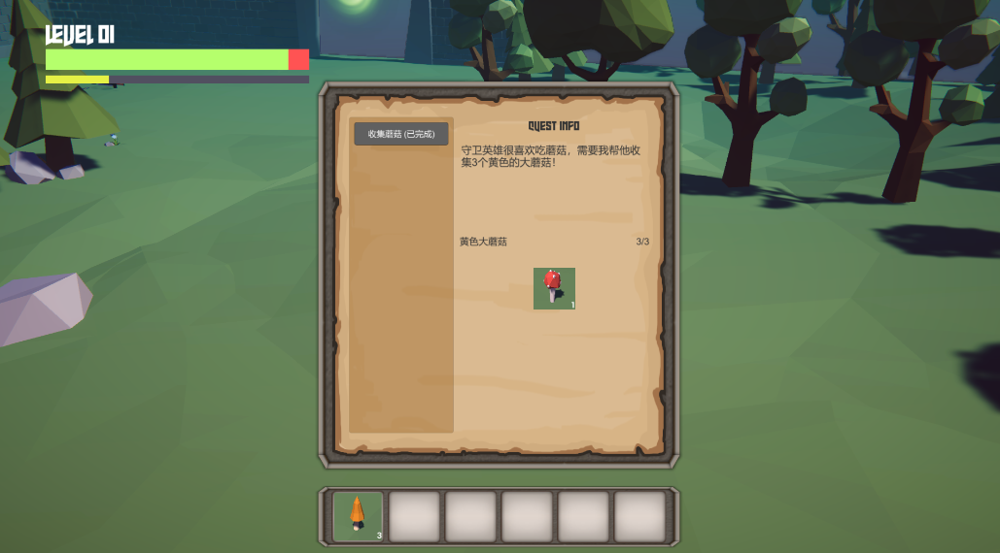


#### 9.QuestGiver 控制任务对话显示

- 创建 QuestGiver 实现根据任务状态切换NPC对话信息
- 创建多个 Dialogue Data 编写整个任务流程对话
- Dialogue Controller 中添加 OnTriggerExit 人物脱离范围关闭对话框

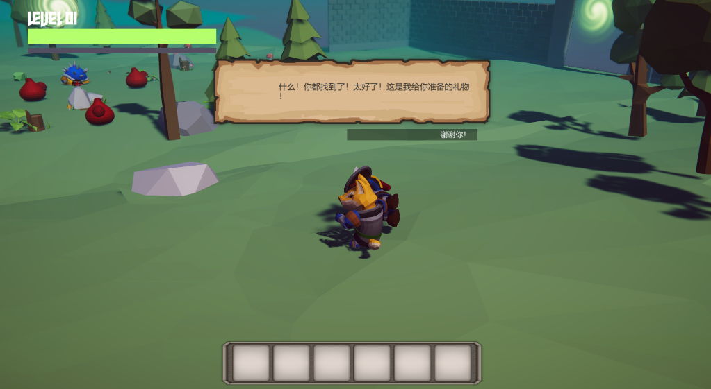


#### 10.GiveRewards 拿到任务奖励

- InventoryManager 中添加检查任务物品数量
- 考虑可能出现的所有情况实现上交任务物品完成任务
- ItemUI 调整对任务面板的负数物品现实问题
- 实现任务 Finish 之后任务面板需求的文字改变

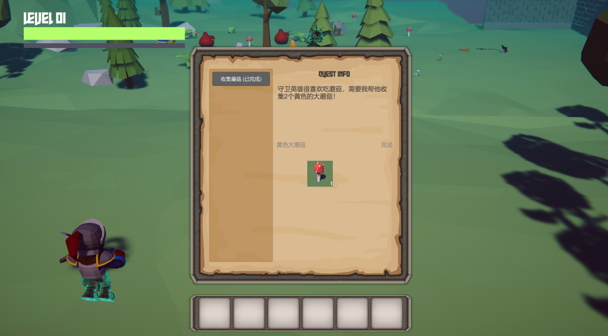

- 添加一个新的 NPC
- 设置新的对话信息和新的任务
- 也为对话添加图片 头像 / 任务物品 等
- 发挥创意设置任务并完成测试游戏


P.S.

- 我这里使用了Battle Wizard Poly Art：[跳转链接](https://assetstore.unity.com/packages/3d/characters/humanoids/fantasy/battle-wizard-poly-art-128097)  &  RPG Tiny Hero Duo PBR Polyart： [跳转链接](https://assetstore.unity.com/packages/3d/characters/humanoids/rpg-tiny-hero-duo-pbr-polyart-225148)

  ​				

- 同时补上了之前NPC_Hero里的idle动画，之前没挂载动画。

- 增加任务的人物图标。

- 加入新的武器并将对应player prefab骨骼位置Weapon修改（之前似乎没有改）。

  - 这里使用的素材是FREE - Low Poly Swords - RPG Weapons：[跳转链接](https://assetstore.unity.com/packages/3d/props/weapons/free-low-poly-swords-rpg-weapons-198166)

  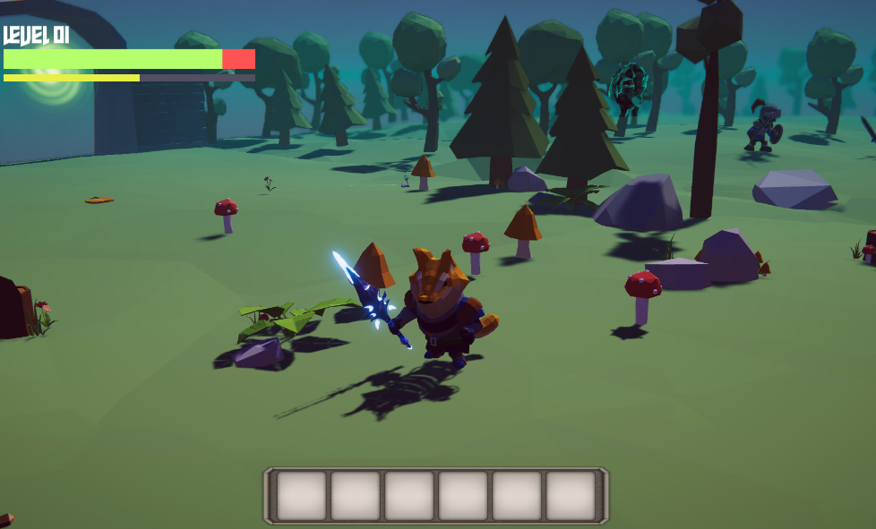


#### 11.SaveQuestManager 保存任务数据

- 循环每一个 QuestTask 保存 QuestData
- MouseManager 中做一些小调整让鼠标指针在 UI 面板里保持不变
- 测试游戏保存数据和加载数据

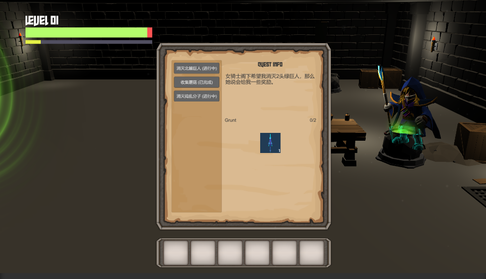


### 章节4 编辑器扩展

#### 1.Editor Script 自己写一个插件出来

- 实现生成窗口
- 实现 Inspector 窗口绘制按钮点击打开窗口
- 实现双击对话文件打开窗口

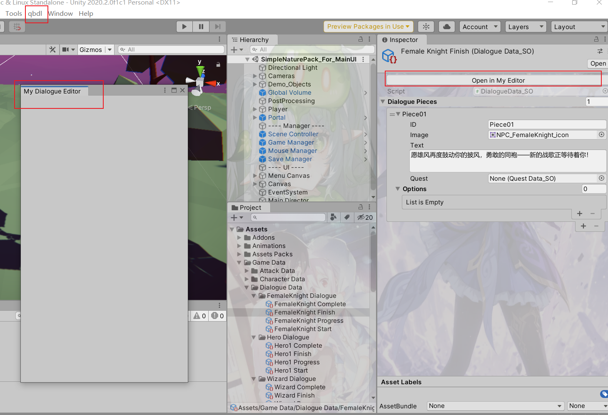

- 了解基本的 GUILayout 用法
- 尝试创建 ReorderableList 列表
- 了解熟悉 Rect 的用法绘制一些变量

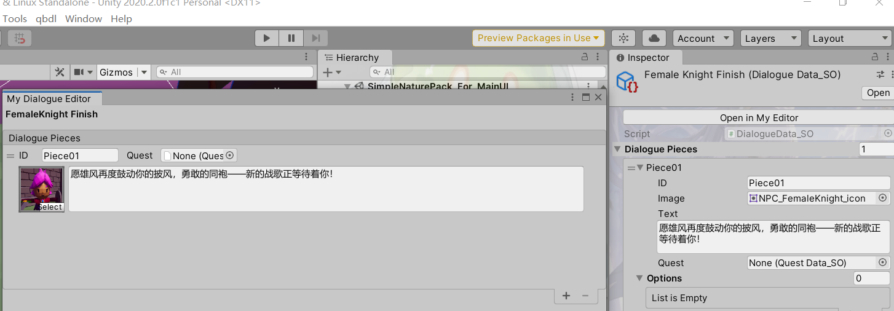

- 尝试画出 OptionList

- 使用字典记录绑定每一条对话中的选项列表

- 调整自适应高度

  

- 绘制 ScrollView 实现滑动条

- 了解 OnSelectionChanged 的用法切换数据显示

- 使用 EditorUtility.SetDirty 实现保存编辑器中的数据更改

  


## 一些优化

### 1、场景元素丰富

#### 1.1 增加更多的传送门


​	同时调整了景深与雾化效果。

​	升级了部分传送门

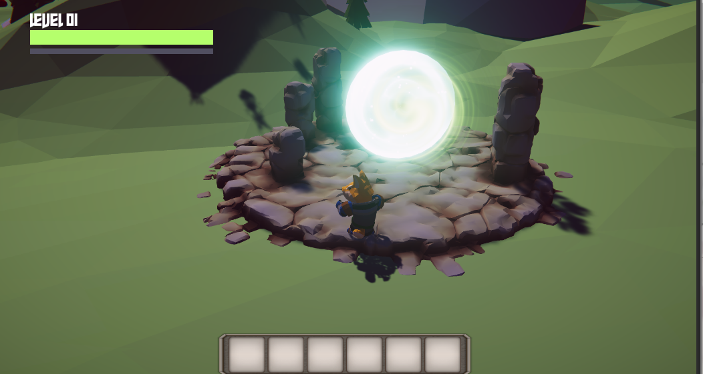


#### 1.2 增加竞技场部分


#### 1.3 增加剑阵部分


### 2、加入更多NPC(对话，动画，本身携带的属性)

新的动画

人物加上box 等基础属性——可以考虑不加入rigidbody，这样人物不会被撞飞

人物加入对话等脚本并挂载

修改tag等（对比已经设置好的角色NPC面板）


- **2.1 增加山底守卫**：提醒不要往前


- **2.2 增加边界守卫**：提醒不要掉落


- **2.3 增加竞技场NPC**：提醒可以进入挑战


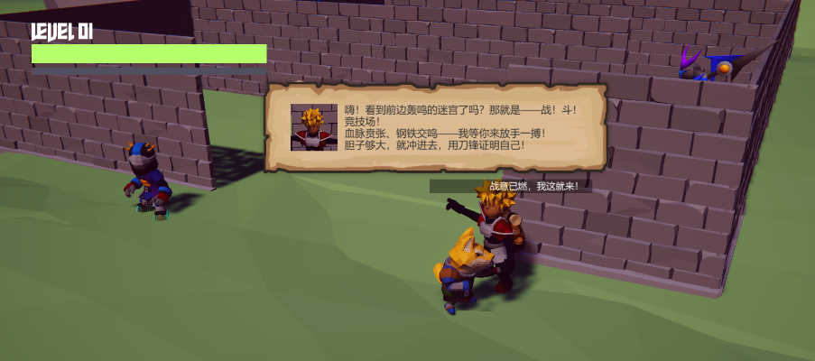

- **2.4 增加竞技场内部NPC：** 与玩家竞技对话


- **2.5 增加飞龙NPC**：提醒可以挑战另一只飞龙

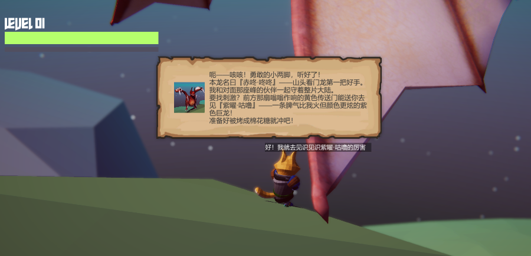

- **2.6 增加女战士NPC**：与巫师贤者具有羁绊，会有关联对话


### 3、加入更多敌人(动画帧中加入函数，本身携带的属性，修改动画播放逻辑)

**Key : 参考之前敌人的动画设计**

​	p.s. 

​	1、敌人身上单独的脚本（若有）是用于击飞等新的攻击方式的，而不是伤害计算的（这在基础EnemyController里就有）；

​	2、如果无击飞等特殊效果，就直接在两个不同攻击方式的Animations里插入关键帧（需要复制出来一份），加入getHit()即可。


- **3.1 骨头怪**

  与史莱姆类似，仅正常与暴击，无远程攻击。

  - 继承slime（仅近战与暴击），仅加入关键帧的getHit()

  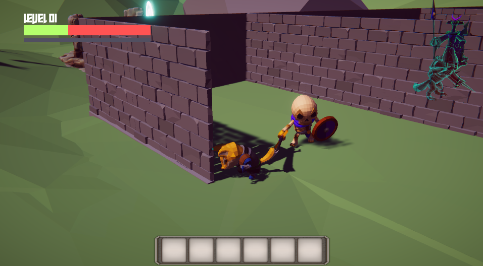

- **3.2 狼人**

  有近战与远程攻击，有击飞。

  - 继承grunt(含远程与近战），加入关键帧的getHit()
  - 挂载的代码将EnemyController.cs换成Grunt.cs

  - 根据动画修改skill range为对应的攻击范围

    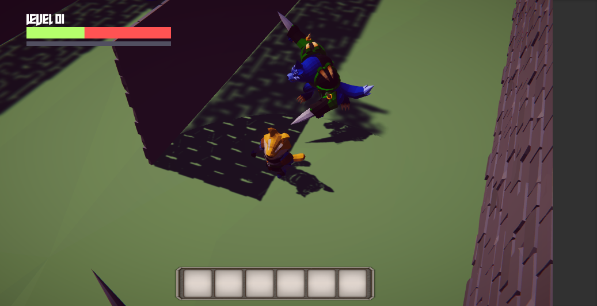

- **3.3 雪人**

  与石头怪类似，将扔出的东向换成雪球？


- **3.4 黑牛将军**

  会有冲刺，需要重新设置

- **3.5 飞龙**

​	会有俯冲，需要重新设置


### 4、人物移动速度随等级变化

对NavMeshAgent 的speed参数进行动态设置。


### 5、数值部分调整

**Key : gpt+试玩来调整数值**

- 希望正常玩家应该是接完”收集蘑菇“（可以路上捡普通剑）->"史莱姆"（黑曜巨刃）->”绿巨人”（冰魄剑）->"石头人"（盾牌，高防）->"飞行兽" （高级玩家可以略微跳一两步）


- 竞技场贯穿始终：骨头怪（≈绿巨人）——狼人（≈石头人）——雪人——黑牛将军


#### 4.1 移动速度 参数

- **Speed** 体现直线移动快慢（m/s）。

- **Angular Speed** 体现转向灵活度（deg/s）。

- **Acceleration** 决定起步 / 转弯时爬升到目标速度的“爆发感”。

- **Stopping Distance** 在进入此距离时开始停下并切换攻击状态。

- **Auto Braking** 全部保持 **关闭**（勾选会让追人时突然减速，显得生硬）。

| 怪物                 | **Speed** | **Angular** | **Accel.** | **StopDist** | 调整说明（一句话）         |
| -------------------- | --------- | ----------- | ---------- | ------------ | -------------------------- |
| 史莱姆               | **2.4**   | 500         | 30         | 1.0          | 保持慢吞吞，方便新手风筝   |
| 乌龟壳 (Turtleshell) | **2.2**   | 400         | 40         | 1.0          | 甲壳厚重，整体再慢 0.8     |
| 绿巨人 (Grunt)       | **3.4**   | 520         | 85         | 1.0          | 中速、起步猛               |
| 石头人 (Golem)       | **2.2**   | 420         | 38         | 1.2          | 重型；转向稍钝，接近后蓄力 |
| **飞行兽**           | **4.6**   | 620         | 110        | 2.0          | 最高速俯冲，拉大接触半径   |
| **骨头怪**           | **3.2**   | 560         | 60         | 0.8          | 脆皮快跑，骚扰型           |
| **狼人**             | **4.3**   | 720         | 120        | 0.8          | 全场机动王，需翻滚躲扑     |
| **雪人**             | **3.0**   | 520         | 60         | 1.5          | 远程冰弹，保持中距停       |
| **黑牛将军**         | **3.8**   | 480         | 150        | 1.0          | 直线冲锋爆发高、转弯慢     |


##### 试玩调优Tips

1. **转弯甩不甩得掉？** 如果发现玩家很难甩开“狼人”或“黑牛”，先下调它们的 *Angular* 而不是 *Speed*。
2. **冲锋怪需留准备时间**：把它们的 *Stopping Distance* 设得稍大（≥1.0），让 AI 有一段“压枪”动作，看起来更自然。
3. **远程冰弹 & 飞行兽俯冲**：对应 Animation / Skill 里记得用 StoppingDistance 去触发，否则会无限贴脸。


#### 4.2 敌人 & 武器 / 盾牌数值

##### 设计思路（浓缩版）

| 环节            | 玩家常用装备              | 目标体验                       | 数值抓手                                                     |
| --------------- | ------------------------- | ------------------------------ | ------------------------------------------------------------ |
| 新手 → 史莱姆   | 普通剑（DPS≈7 / s）       | 2~3 下解决，几乎无压力         | 史莱姆血量 20、防 1，攻击低                                  |
| 史莱姆 → 绿巨人 | 黑曜巨刃（DPS≈9 / s）     | 8~10 秒击杀；若技术好可“跳本”  | 绿巨人血量 80、防 4，伤害中等                                |
| 绿巨人 → 石头人 | 冰魄剑（DPS≈11 / s）      | 12~15 秒的硬仗，掉盾牌显著减伤 | 石头人高防 8，高血 120，攻高冷却长                           |
| 石头人 → 飞行兽 | 冰魄剑 + 盾牌（玩家防≈7） | 飞行兽机动、爆发高，考验滚闪   | 飞行兽伤害高、冷却短、防御中等                               |
| 竞技场          | 和主线同装备              | 难度对应“≈”注解                | 依各怪特性调优：骨头怪偏脆，狼人攻速快，雪人远程冰弹，黑牛将军终极考验 |


##### 主线 数值

| 名称                     | Max Health | Base Defence | Kill Point | Attack Range | Skill Range | CoolDown | Min Dmg | Max Dmg | Crit Mult | Crit Chance |
| ------------------------ | ---------- | ------------ | ---------- | ------------ | ----------- | -------- | ------- | ------- | --------- | ----------- |
| **Player(初始)**         | **100**    | **2**        | **—**      | **2.4**      | **0**       | **1**    | **5**   | **8**   | **2.0**   | **0.2**     |
| **史莱姆**               | **20**     | **1**        | **5**      | 1.0          | 0           | 1.2      | 2       | 4       | 1.5       | 0.05        |
| **乌龟壳**               | 30         | 3            | 10         | 1.2          | 0           | 1.5      | 3       | 5       | 1.5       | 0.1         |
| **绿巨人 (Grunt)**       | 80         | 4            | 20         | 2.3          | 1.6         | 1.8      | 6       | 8       | 2.0       | 0.15        |
| **石头人 (Golem)**       | 120        | 8            | 35         | 2.0          | 10.0        | 2.5      | 10      | 14      | 2.0       | 0.10        |
| **飞行兽**               | 90         | 3            | 40         | 1.5          | 4.0         | 1.0      | 12      | 18      | 2.2       | 0.25        |
| **普通剑(Sword)**        | —          | —            | —          | **2.6**      | 0           | **1.0**  | **6**   | **9**   | 2.0       | 0.15        |
| **黑曜巨刃(BroadSword)** | —          | —            | —          | **2.8**      | 0           | **1.25** | **10**  | **14**  | 2.2       | 0.20        |
| **冰魄剑(IceSword)**     | —          | —            | —          | **2.5**      | 0           | **0.8**  | **8**   | **11**  | 1.8       | 0.50        |
| **盾牌(Shield)**         | —          | **7**        | —          | —            | —           | —        | —       | —       | —         | —           |

- **等级成长**：按你的 `LevelMultiplier = 0.1`，玩家到打石头人时通常 3~4 级，自身 `Base Defence`≈3；装备盾牌后整体跳到 7，能明显降低飞行兽及竞技场高阶怪的单击伤害，但仍需依赖走位。

- **高级玩家跳本**：依靠走位可直接挑战更高阶段，因为血量/伤害呈 1.3~1.5 倍梯度递增，容错仍在可控范围。

- **黑曜巨刃**拉高了最小/最大伤害，仍保持偏慢手感；**冰魄剑**则以高暴击+短 CD 带来 DPT（Damage Per Time）最高输出，利于越级。

  

##### 竞技场敌人数值

| 名称         | Max Health | Base Defence | Kill Point | Attack Range | Skill Range | CoolDown | Min Dmg | Max Dmg | Crit Mult | Crit Chance | 特点备注                  |
| ------------ | ---------- | ------------ | ---------- | ------------ | ----------- | -------- | ------- | ------- | --------- | ----------- | ------------------------- |
| **骨头怪**   | 75         | 3            | 20         | 2.3          | 0           | 1.8      | 6       | 9       | 2.0       | 0.15        | 近战脆皮，移速略快        |
| **狼人**     | 100        | 6            | 30         | 1.8          | 3.0         | 1.2      | 10      | 15      | 2.0       | 0.20        | 高攻速+跳扑技能           |
| **雪人**     | 110        | 5            | 45         | 1.7          | 4.5         | 2.0      | 8       | 12      | 1.8       | 0.25        | 远程冰弹减速效果          |
| **黑牛将军** | 250        | 10           | 100        | 2.8          | 3.5         | 1.5      | 15      | 25      | 2.5       | 0.30        | 终极 Boss，冲锋技能附晕眩 |


##### 数值校验

| 武器     | ⌀ 单击伤害                               | CD   | **理论 DPS** |
| -------- | ---------------------------------------- | ---- | ------------ |
| 普通剑   | 7.5 × (1-0.2) + 7.5 × 2 × 0.2 = **9**    | 1.0  | **9/s**      |
| 黑曜巨刃 | 12 × (0.8) + 12 × 2.2 × 0.2 = **14.9**   | 1.25 | **11.9/s**   |
| 冰魄剑   | 9.5 × (0.5) + 9.5 × 1.8 × 0.5 = **13.3** | 0.8  | **16.6/s**   |

⌀单击伤害 = ⌀基础伤 × [(1 - 暴击率) × 1 + 暴击率 × 暴击倍数]

- **史莱姆** 体力 20 → 2-3 下被普通剑秒杀
- **绿巨人** 体力 80、防 4 → 黑曜巨刃约 7-8 秒解决
- **石头人** 体力 120、防 8 → 冰魄剑 + 盾牌（防 7）约 12-15 秒
- **飞行兽** 体力 90、防 3 → 同装备约 10 秒，但高输出、短 CD，逼玩家闪避


##### 试玩调优Tips

1. **伤害公式**如果包含防御减免系数，可把各敌人的 Min/Max 伤害 ±12 微调，以维持 6~~12 次被击倒容忍度。
2. **玩家等级曲线**：现 Kill Point 与 `BaseExp=50` 对应刚好 10 只史莱姆升 1 级，约 3 只绿巨人升 1 级；若觉得慢，可把 `LevelMultiplier` 改成 0.08。
3. **BOSS 特效**（冲锋、冰弹减速）仅写在注释中，方便后期在 Animator 或技能系统里补充。


#### 4.3  Player升级相关

| 分类         | 字段名（脚本变量） | **等级 1 初始值** | **升级增幅 / 公式**                                          | 限制 / 备注                       |
| ------------ | ------------------ | ----------------- | ------------------------------------------------------------ | --------------------------------- |
| **经验**     | `baseExp`          | **50**            | `baseExp += baseExp * 0.1`  → 每级 +10 %                     | 可改系数 `0.1`                    |
| **生命**     | `maxHealth`        | **100**           | `maxHealth *= 1.1`  → 每级 +10 %                             | 同上                              |
| **防御**     | `baseDefence`      | **2**             | `baseDefence *= 1.1`  → 每级 +10 %                           | 同上                              |
| **移动**     | `baseMoveSpeed`    | **3.5 m/s**       | `newSpeed = baseMoveSpeed * (1 + 0.03 × (level−1))`  → 每级 +3 % | `Mathf.Min(newSpeed, 6.0f)` 上限  |
|              | `angularSpeed`     | **800 deg/s**     | `Mathf.Lerp(800, 900, (speed−3.5)/(6.0−3.5))`                | 随直线速度微提，最多 900          |
|              | `acceleration`     | **80**            | **保持不变**（如需同步增长可与速度同倍率）                   | —                                 |
| **成长系数** | `LevelMultiplier`  | **0.1**           | 统一控制 **经验 / 生命 / 防御** 三项的 10 % 增幅             | Inspector中的 **Level Buff** 字段 |

- 移动部分升到 **10 级 ≈ 4.6 m/s**；升到 **20 级 ≈ 5.6 m/s**；**30 级及以上恒 6 m/s**。 玩家在主线打完飞行兽一般 6~7 级（≈4.2 m/s），与之前4.1表敌人速度梯度刚好咬合。


##### 试玩调优Tips

1. **想让玩家更肉**：只改 `LevelMultiplier`，一处生效多处。
2. **想加快升级节奏**：把 `baseExp` 初值调低，或把 `LevelMultiplier` 从 `0.1` 改成 `0.08`。
3. **速度太快不好控**：降低 `speedGrowthRate` 或把 `6.0f` 上限往下调。
4. **需要更灵活转向**：直接把 `angularSpeed` 固定为 `agent.angularSpeed = 800 + 20 * (currentLevel-1)`，简单直观。

