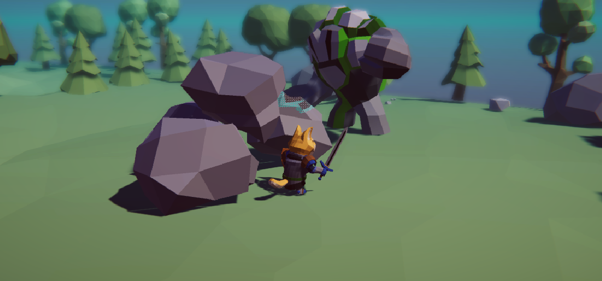
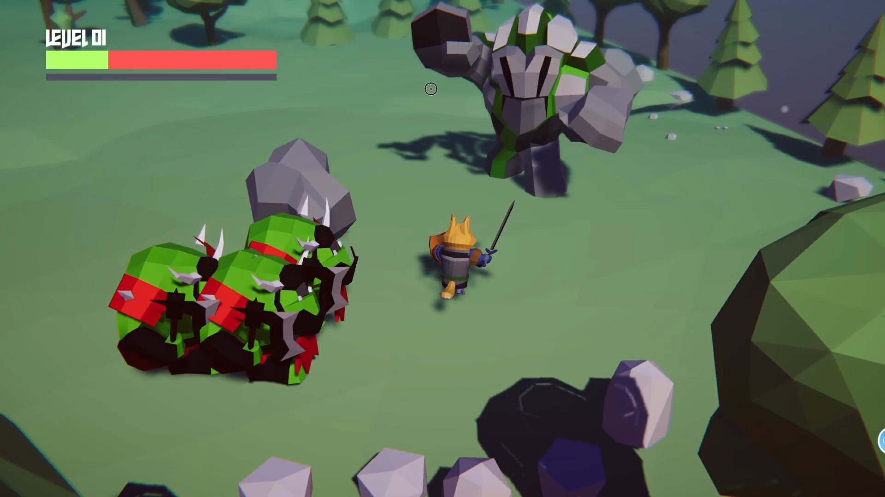

# 学习过程记录

https://github.com/qbdl/3D_RPG_learning.git 仓库的开发学习记录~.

[TOC]

## 3D RPG Course | Core 核心功能

### 01: Create Project 创建项目导入素材

安装 Universal RP 并将整个项目升级到URP


### 02: Build Level 尝试熟悉基本工具

**自动吸附顶点**：按住V键不松手，右键点击物体的想要位置并移动方块，来自动吸附顶点。

- q/w/e/r/t的快捷键来快捷操作

**切换相机视角**：选中对应的camera,右击并按住对应视角不松手，按住ctrl+shift+F来自动设置相机为当前视角。


### 03: PolyBrush 发挥创意构建场景

PolyBrush使用：

- 第1个：改变地形（这里我这里一般是改变竖直方向，所以选择Brush Mirroring的Y轴），点击物体，然后选择第一个图标，按住是上升，按住ctrl再按住是下降
- 第2个：羽化，用于柔和边缘
- 第3个：将物体刷上不同颜色，用于分区（需要创建material导入到对应物体）
- 第4个：将prefab预制体刷到场景中
- 第5个：刷材质


### 04: Navigation 智能导航地图烘焙


### 05: MouseManager 鼠标控制人物移动

已经可以控制人物进行移动了.


### 06: SetCursor 设置鼠标指针

- 实现 MouseManager 单例模式
- event Action 的用法
- PlayerController 函数方法
- 订阅 MouseManager 的事件
- 修改鼠标指针


### 07: Cinemachine & Post Processing 摄像机跟踪和后处理

- 添加虚拟相机实现跟踪人物移动
- 添加 Fog 迷雾效果
- 添加 Post Processing 后处理让场景看起来更好看


### 08: Animator 动画控制器

- 浏览动画片段 (idle,walk,run)
- 创建 Player 的 Animator Controller
- 创建变量以及 Blend Tree 混合树动画
- 通过代码实现移动配合动画切换


### 09: Shader Graph 遮挡剔除

- Unity 2020.2 版本 Shader Graph 介绍
- 创建新的材质作为遮挡剔除显示的材质
- URP Asset 当中添加 Render Feature 实现前后遮挡选择


### 10: Enemy Set States 设置敌人的基本属性和状态

- 导入敌人素材
- 创建 EnemyController 脚本并通过脚本添加 Agent
- 设置 Agent 参数
- 枚举变量设置敌人状态
- 修改鼠标指针到攻击图标


### 11: Player Attack 实现攻击动画

- 通过协程实现移动到敌人面前并采取攻击
- agent 是否停止的切换控制
- 打断攻击停止协程方法
- Attack 动画设置
- 修改鼠标指针到攻击图标


### 12: FoundPlayer 找到Player追击

- 使用 Physics.OverLapSphere 检测周围是否有 Player
- 函数判断切换到追击模式
- 添加 FreeLook 的 Cinemachine 实现自由移动的第三人称镜头


小Tips:如果滚轮操作没有明显反应，调大滚轮里的Speed即可。


​		似乎unity系统在这一步会自动提示API update, 选择更新即可。


### 13: Enemy Animator设置敌人的动画控制器

- 设定一些列参数配合代码切换动画
- 创建多个 Animator Layer 管理动画的状态
- 实现追击玩家切换动画 / 脱战返回 idle


### 14: Patrol Randomly 随机巡逻点

- 设置参数生成随机巡逻点
- 利用 OnDrawGizmosSelected 画出可视范围
- 使用 NavMesh.SamplePosition 获得一个可行的随机点
- 实现到巡逻点等候时间
- 脱战后返回上一个状态


### 15: CharacterStats 人物基本属性和数值

- 介绍了解 ScriptableObject 的功能
- 创建 CharacterData_SO 和 CharacterStats 代码脚本
- 设置基本的人物属性
- Properties 属性的用法 get set 实现读取数据


### 16: AttackData 攻击属性

- 创建 AttackData_SO 添加基本攻击属性
- CharacterStats 中读取数据
- EnemyController 中加入攻击范围判定 / CD时间判定 / 暴击率计算
- 添加 Slime Animator 中的两种动画 


### 17: Execute Attack 实现攻击数值计算

- 为 Player 添加攻击和暴击的动画和参数

- CharacterStats 代码添加 TakeDamage 函数计算伤害

- 添加 Animation Event 在攻击的时候执行函数方法 Hit

- 解决FBX导入动画无法编辑的问题

  

p.s. 注意每次试玩后，Script Object里的数据需要恢复到原有内容。


### 18: Guard & Dead 守卫状态和死亡状态

- 添加 Enemy 和 Player 的受伤动画和死亡动画
- 设置守卫的角度实现脱离战斗归为后缓慢转回初始角度
- 添加暴击伤害触发防御者的受伤动画
- 实现敌人死亡后销毁


### 19: 泛型单例模式 Singleton

- 泛型类的写法
- GameManager 获得 PlayerStats 的注册
- 修改 MouseManager 继承泛型单例基类


### 20: Observer Pattern 接口实现观察者模式的订阅和广播

- 创建 IEndGameObserver 接口
- 在 GameManager 中用来管理所有订阅者并且广播
- 实现 Player 死亡敌人集体欢呼胜利


### 21: More Enemies 制作更多的敌人

- 解决复制出来的敌人公用同一个数据的问题
- 解决 Player 死亡后仍然可以移动的问题
- 解决编辑器窗口的报错问题
- 使用 Animator override controller 制作 乌龟 敌人
- 添加 兽人 和 石头人 的素材简单摆放


### 22: Setup Grunt 设置兽人士兵

- 添加独立的 Animator
- 编写 Animator Behavior 控制动画播放期间的 Agent
- 创建单独的脚本继承 EnemyController
- 设置单独的击飞函数
- Player 添加击晕动画


### 23: Extension Method 扩展方法

- 创建 Transform 的扩展方法判断攻击目标是否在面前
- Vector3.Dot 的用法说明


Tips:VSCode中界面“OUTLINE“来快速查找函数。


### 24: Setup Golem 设置石头人Boss

- 设置 Animator override controller 调整动画片段
- 创建单独的脚本继承 EnemyController
- 设置单独的击飞函数在 Animation Event 中调用


### 25: Throw Rocks 设置可以扔出的石头

- Player 添加 StopingDistance 的切换控制
- 创建 Rock 并编辑代码可以飞向 Player
- 设置为 Prefab 让石头人可以在动画里生成并投掷这个 Rock




### 26: Kick it Back 反击石头人

- 实现击飞 Player 并产生伤害
- 设置 Rock 的不同状态，既能攻击 Player 也可以用来反击石头人
- 创建 Particle System 实现石头碎裂效果


### 27: Health Bar 设置血条显示

- 创建 UI 制作血条 Prefab
- 创建 HealthBarUI 代码挂载每一个敌人身上
- 获得血条显示的 HealthBarPoint 坐标
- 使用 Event Action 的方法在每次攻击的时候更新血量


p.s. 之前乌龟的攻击Hit动画没有加在animation中，我在这里发现并补上了。


### 28: Player LevelUp 玩家升级系统

- 修改 CharacterData 添加等级相关变量
- 创建升级函数方法
- 杀怪获得经验升级属性


### 29: Player UI 添加玩家信息显示

- 制作 PlayerHealth UI
- Canvas 渲染模式设置
- 实时更新血量和经验值


小Tips: Ctrl+D 用于复制


### 30: Create Portal 创建传送门

- 利用 Shader Graph 创建传送门
- 创建 TransitionPoint 和 TransitionDestination 脚本控制传送和终点


### 31: Transition 实现同场景内传送

- 创建协程实现同场景传送点传送


### 32: Different Scene 跨场景传送

- 所有的控制类单例代码添加 DontDestroyOnLoad
- 实现跨场景异步加载并生成 Player
- 设置 Game Manager 为 FreeLook 摄像机添加 Follow 和 LookAt 的目标
- PlayerController 添加 OnDisable 取消订阅


小Tips : 创建arch的时候使用Probuilder的时候可以使用这个Face Selection然后拖动进行生成完整Arch。


使用下一个场景的Wall，使用后在Navigation中设置Wall&Arch成Navigation Static,并设置成“Not Walkable",再进行Bake。


新场景如果使用demo，Ground等内容进行Navigation的设置，Bake。

​				


### 33: Save Data 保存数据

- 了解 JsonUtility 的用法
- 了解 PlayerPrefs 的用法
- 创建 SaveManager 实现保存玩家数据


### 34: Main Menu 制作主菜单

- 制作 Main 场景
- 添加 Canvas 熟悉 Render Mode
- 创建 MainMenu 实现按钮 AddListener 添加对应函数方法
- SceneController 添加新的协程配合场景转换


小Tips : 

- 进入游戏 再退出游戏返回主菜单界面 主菜单的场景就会变得十分暗
  - 打开Auto Generate Lighting(切换后场景不会自动烘培灯光，所以会很暗)。

- NullReferenceException: Object reference not set to an instance of an object
  - 这个是该版本Unity自带的bug，重启unity即可。

- 解决标题很糊的问题

  - 这个是因为portal摆放在了“The Knight"与”New Game"的中间，将portal移到它们的同一侧即可。

    

- Copyright部分如果想要跟button一样消失

  - 同样设置screen space-camera,调整plane距离至可见位置，然后再设置成world space即可。

  

  


Fix a Problem : 

- 怪物的死亡和destroy都很正常，但是玩家却在怪物死亡之后继续攻击，随后unity就会报错`MissingReferenceException: The object of type 'GameObject' has been destroyed but you are still trying to access it.`——解决方法：攻击动画的animation里有一个自动循环的选项，关闭就好了。

  


### 35: SceneFader 场景转换的渐入渐出

- 添加 Timeline 了解基本用法

- 利用 Canvas Group 制作 SceneFader

- 协程套协程的用法

- 实现 Player 死亡返回主菜单

  

  

小Tips : 

- player死亡一次后，再开始游戏，再次死亡就不会自动返回主菜单
  - 原因是再次开始游戏后，fadeFinished这个布尔值还是false。在LoadLevel()这个协程里加上`yield return fadeFinished = true;`这样再次进入游戏时，fadeFinished变成了true，玩家死亡时就可以执行LoadMain()了。
- player第一次死亡重新回到主菜单，但是点击按钮不会进入新游戏
  - 把CanvasGroup里的blockRaycast关掉即可。


### 36: Build & Run打包及运行

- Build Settings 的相关设置
- Player Settings 的相关设置
- 如果添加各种平台的支持


### MileStone

#### 效果图片合集


​			

​			

​			


#### 可以改进的点

##### Bugs

- 目前的光晕还是有点问题，可以调整一下参数
- 石头的攻击力要能破掉石头人的防御

##### Improvements

- 攻击以及防御值随升级改变


- 加入敏捷值，移动速度调整


- 怪在身前也经常打不到，卡自己的模型


- 拉怪拉到传送门那，会卡攻击，因为很容易误触到传送门


- 人物移动wasd,鼠标控制视角


- 经验值要与攻击数值等对应


- 设置第二个场景的相机跟随人物移动


- 其他颜色的传送门传送到不同位置（同个颜色进行相互传送）


- 新场景修改拓宽
- 加入音效


#### 目前总用时

46h 45min 37s.


## 3D RPG Course ｜高级教程

### 章节1 背包系统

#### 1.项目介绍

背包系统简单来说就是 UI 和 逻辑代码 的组合。**这就意味着 2D 和 3D 游戏都是完全通用的**。


#### 2.Inventory UI 制作背包的基本UI

- 导入素材设置画布布局
- 使用 Grid Layout Group 进行网格化控制
- 保存 Slot Holder 为 Prefab


#### 3.Item OnWorld 创建世界地图上的物品

- 制作世界地图物品的 prefab
- 创建 ItemPickUp 脚本判断碰撞
- 创建 ItemData_SO 制作物品信息的模版
- 在 MouseManager 中添加对物品互动的指针切换和移动


#### 4.Equip Weapon 装备武器

- 在世界地图上创建武器 添加必要对 Component 
- 创建武器本身的 Attack Data 攻击属性
- 调整世界物品的碰撞器和触发器
- 调整生成物品的 Prefab 的坐标，特别是武器和装备
- CharacterStats 代码中加入 EquipWeapon 实现装备武器
- 添加武器的 Attack Data
- AttackData_SO 里添加更新属性的函数


#### 5.Inventory Data 创建背包的数据库

- 创建 InventoryData_SO 作为不同背包的数据库
- 创建单独的 class InventoryItem 用来记录背包里的物品和现有数量
- 添加 AddItem 方法将物品信息传递到 List 列表当中
- 修改 ItemPickUp 实现碰撞物体 拾取到背包里


#### 6.Inventory UI 让背包显示物品

- 梳理逻辑并创建代码 ContainerUI / SlotHolder / ItemUI
- 修改 SlotHolder 的 Prefab 添加空物体 ItemSlot
- 逐层完成代码实现背包里正确显示物品图片和数量


#### 7.Action Bar / Stats 设置快捷栏和信息面板的UI

- 创建快捷栏 Action Bar 的按钮 UI
- 创建人物信息面板 UI


#### 8.Begin Drag 实现拖拽物品

- 创建 DragItem 实现拖拽功能
- 介绍 EventSystems 里的接口
- 实现拖拽跟随鼠标指针
- 创建 DragData 用来记录每一个 UI 物品原始数据


p.s. 同样类型里列表越后面的东西渲染的越迟，结果就是呈现在更前面，覆盖掉前面的。


#### 9.Swap Item 交换物品

- 使用 EventSystem 判断指针位置
- 利用 RectTransformUtility.RectangleContainsScreenPoint 判断鼠标位置是否包含在每一个格子范围内
- 交换图片的同时要交换真是的数据列表排序
- 调整 RectTransform 的 offset 确保图片在正确位置显示


#### 10.Change Weapon 实现切换武器

- 在 MouseManager 添加函数方法 避免 UI 互动时影响人物控制
- 在 CharacterStats 中加入 ChangeWeapon 的方法
- 在 SlotHolder 中切换所属背包的数据库
- DragItem 中添加物品属性和 SlotType 的匹配


- 增加shield相关的内容


P.S. 

- 注意，这部分开始玩的时候最好从主菜单进入，否则会报错：`NullReferenceException: Object reference not set to an instance of an object DragItem.SwapItem () (at Assets/Scripts/Inventory/UI/DragItem.cs:89)`

  - 原因：直接从当前场景进入，由于没有初始化背包会报错（所以要从主菜单进入游戏），可以通过图示代码里的Debug部分定位该问题。

    ```c#
    public void SwapItem()
        {
            //如果直接从当前场景进入，由于没有初始化背包会报错（所以要从主菜单进入游戏）
            // if (targetSlotHolder.itemUI.Bag == null || currentSlotHolder.itemUI.Bag == null)
            // {
            //     Debug.LogError("My Debug SwapItem: Bag is null in targetSlotHolder or currentSlotHolder!");
            //     return;
            // }
    
            //改变数据库
            var targetItem = targetSlotHolder.itemUI.Bag.items[targetSlotHolder.itemUI.Index];
            var tempItem = currentSlotHolder.itemUI.Bag.items[currentSlotHolder.itemUI.Index];
    
            bool isSameItem = (tempItem.itemData == targetItem.itemData);
            if (isSameItem && targetItem.itemData.itemStackable)//叠加
            {
                targetItem.itemAmount += tempItem.itemAmount;
                tempItem.itemData = null;
                tempItem.itemAmount = 0;
            }
            else//交换物品数据
            {
                currentSlotHolder.itemUI.Bag.items[currentSlotHolder.itemUI.Index] = targetItem;
                targetSlotHolder.itemUI.Bag.items[targetSlotHolder.itemUI.Index] = tempItem;
            }
        }
    ```

    

- 注意当剑/盾牌从装备栏移回到背包里原有盾牌/剑的格子时候会发生报错（原来代码）: 

  - 会导致的结果：将两者交换位置，使得武器装备到了盔甲的格子里。

    

  - 原因：当把物品换到背包时会无条件地调用`SwapItem()`，而如果目标槽位中已有物品（如剑或盾牌），`SwapItem()`后在 `SlotHolder.UpdateItem` 会调用 `ChangeArmor`，导致非盔甲类型的物品被错误地传递给 `EquipArmor` 方法。

    ```c#
    switch (targetSlotHolder.slotType)
                    {
                        case SlotType.BAG:
                            SwapItem();
                            break;
                        case SlotType.WEAPON:
                            if (currentItemUI.Bag.items[currentItemUI.Index].itemData.itemType == ItemType.Weapon)
                                SwapItem();
                            break;
                        case SlotType.ARMOR:
                            if (currentItemUI.Bag.items[currentItemUI.Index].itemData.itemType == ItemType.Armor)
                                SwapItem();
                            break;
                        case SlotType.ACTION:
                            if (currentItemUI.Bag.items[currentItemUI.Index].itemData.itemType == ItemType.Useable)
                                SwapItem();
                            break;
                    }
    ```

  - 解决方法：在`case SlotType.BAG:`中加入条件( 目标槽位为空 或者 目标槽位与当前槽位物品类型相同 )。

    ```c#
    case SlotType.BAG:
                            // 检查目标槽位是否已有物品
                            var targetItem = targetSlotHolder.itemUI.Bag.items[targetSlotHolder.itemUI.Index];
                            bool canSwap = targetItem.itemData == null || //目标槽位为空
                                           targetItem.itemData.itemType == currentItemUI.Bag.items[currentItemUI.Index].itemData.itemType;//目标槽位与当前槽位物品类型相同
                            if (canSwap)
                                SwapItem();
                            break;
    ```


#### 11.Useable Item 可使用的物品

- 创建大蘑菇 并添加必要的组件
- 创建 UseableItemData_SO 制作可使用物品的属性模版
- 利用 IPointerClickHandler 接口实现双击使用物品
- 在 CharacterStats 中添加 ApplyHealth（我这里面是ApplyUseableEffect） 实现血量变化


#### 12.Action Button 快捷栏按键

- 添加实现 CloseBtn 关闭当前 UI 面板
- 添加按键控制打开关闭 UI 面板
- 创建 ActionButton 脚本设置独立按键使用快捷栏物品
- 修正双击空 SlotHolder 的报错


#### 13.Stats Info 显示 Player 相关信息

- 创建 RawImage 和 独立 Camera 实现映射 Player 的模型
- 获得 Text 的面板信息
- 创建函数方法实时更新面板信息


小Tips

- 加入camera用于生成raw image后，游戏时可能画面变得很模糊

  

  - 原因：还在寻找解决方案ing，目前先关了那个camera
  - 解决方法：


#### 14.Change Animator 切换动画控制器

- 使用更多动画来创建 Animator override controller
- ItemData_SO 中添加武器配套动画控制器
- 在 EquipWeapon 和 UnEquipment 中添加代码切换武器伴随动画

参考素材：

- RPG Character Animation Pack Free ：[点击跳转](https://assetstore.unity.com/packages/3d/animations/rpg-character-mecanim-animation-pack-free-65284)


fix problems:

-  原来视频里的`attackData`与`baseAttackData`的逻辑有点问题,会导致模板的数据被修改：

  - 修改，改名，并把character部分对应的prefab的attack Data的内容改为给templateAttackData赋值，删掉对attackData的赋值

      public **AttackData_SO** templateAttackData; *// 攻击template数据*

      public **AttackData_SO** attackData; *// 攻击数据*


#### 15.Item Tooltip 物品信息显示栏

- 创建 UI
- 学习 Content size fitter 的用法实现自动拉伸缩放
- 添加代码脚本 ItemTooltip 
- 利用 IPointEnterHandler 接口实现鼠标悬停显示 Tooltip
- RectTransform.GetWorldCorners 概念说明及使用方法
