# 学习过程记录

https://github.com/qbdl/3D_RPG_learning 仓库的开å‘学习记录.

[TOC]

## 3D RPG Course | Core 核心功能

### 01: Create Project 创建项目导入素æ

安装 Universal RP 并将整个项目å‡çº§åˆ°URP


### 02: Build Level å°è¯•ç†Ÿæ‚‰åŸºæœ¬å·¥å…·

**自动å¸é™„顶点**：按ä½Vé”®ä¸æ¾æ‰‹ï¼Œå³é”®ç‚¹å‡»ç‰©ä½“的想è¦ä½ç½®å¹¶ç§»åŠ¨æ–¹å—，æ¥è‡ªåŠ¨å¸é™„顶点。

- q/w/e/r/tçš„å¿«æ·é”®æ¥å¿«æ·æ“作

**切æ¢ç›¸æœºè§†è§’**：选中对应的camera,å³å‡»å¹¶æŒ‰ä½å¯¹åº”视角ä¸æ¾æ‰‹ï¼ŒæŒ‰ä½ctrl+shift+Fæ¥è‡ªåŠ¨è®¾ç½®ç›¸æœºä¸ºå½“å‰è§†è§’。

**移动视角**：按ä½é¼ æ ‡å³é”®ï¼Œç‚¹å‡»â€œQ"/â€E"进行上下移动，“Aâ€/"D"进行左å³ç§»åŠ¨ï¼Œâ€œWâ€"S"进行å‰å（远近）移动。


视角出ç°ç±»ä¼¼é•‚空的情况：将å³ä¾§"iso"点击一下，修改为“perspectiveâ€å³å¯ã€‚

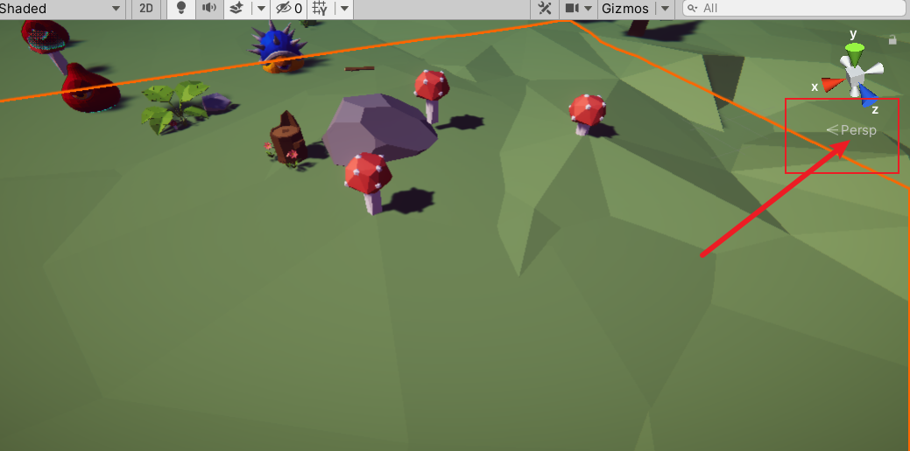


### 03: PolyBrush å‘挥创æ„æ„建场景

PolyBrush使用：

- 第1个：改å˜åœ°å½¢ï¼ˆè¿™é‡Œæˆ‘这里一般是改å˜ç«–ç›´æ–¹å‘，所以选择Brush Mirroringçš„Y轴），点击物体，然å选择第一个图标，按ä½æ˜¯ä¸Šå‡ï¼ŒæŒ‰ä½ctrlå†æŒ‰ä½æ˜¯ä¸‹é™
- 第2个：羽化，用äºæŸ”和边缘
- 第3个：将物体刷上ä¸åŒé¢œè‰²ï¼Œç”¨äºåˆ†åŒºï¼ˆéœ€è¦åˆ›å»ºmaterial导入到对应物体）
- 第4个：将prefab预制体刷到场景中
- 第5个：刷æè´¨


### 04: Navigation 智能导航地图烘焙


### 05: MouseManager é¼ æ ‡æ§åˆ¶äººç‰©ç§»åŠ¨

å·²ç»å¯ä»¥æ§åˆ¶äººç‰©è¿›è¡Œç§»åŠ¨äº†.


### 06: SetCursor 设置鼠标指针

- å®ç° MouseManager å•ä¾‹æ¨¡å¼
- event Action 的用法
- PlayerController 函数方法
- 订阅 MouseManager 的事件
- 修改鼠标指针


### 07: Cinemachine & Post Processing æ‘„åƒæœºè·Ÿè¸ªå’Œå处ç†

- 添加虚拟相机å®ç°è·Ÿè¸ªäººç‰©ç§»åŠ¨
- 添加 Fog 迷雾效æœ
- 添加 Post Processing å处ç†è®©åœºæ™¯çœ‹èµ·æ¥æ›´å¥½çœ‹


### 08: Animator 动画æ§åˆ¶å™¨

- æµè§ˆåŠ¨ç”»ç‰‡æ®µ (idle,walk,run)
- 创建 Player 的 Animator Controller
- 创建å˜é‡ä»¥åŠ Blend Tree æ··åˆæ ‘动画
- 通过代ç å®ç°ç§»åŠ¨é…åˆåŠ¨ç”»åˆ‡æ¢


### 09: Shader Graph é®æŒ¡å‰”除

- Unity 2020.2 版本 Shader Graph 介ç»
- 创建新的æ质作为é®æŒ¡å‰”除显示的æè´¨
- URP Asset 当中添加 Render Feature å®ç°å‰åé®æŒ¡é€‰æ‹©


### 10: Enemy Set States 设置敌人的基本å±æ€§å’ŒçŠ¶æ€

- 导入敌人素æ
- 创建 EnemyController 脚本并通过脚本添加 Agent
- 设置 Agent å‚æ•°
- æšä¸¾å˜é‡è®¾ç½®æ•ŒäººçŠ¶æ€
- 修改鼠标指针到攻击图标


### 11: Player Attack å®ç°æ”»å‡»åŠ¨ç”»

- 通过å程å®ç°ç§»åŠ¨åˆ°æ•Œäººé¢å‰å¹¶é‡‡å–攻击
- agent 是å¦åœæ­¢çš„切æ¢æ§åˆ¶
- 打断攻击åœæ­¢å程方法
- Attack 动画设置
- 修改鼠标指针到攻击图标


### 12: FoundPlayer 找到Player追击

- 使用 Physics.OverLapSphere 检测周围是å¦æœ‰ Player
- 函数判断切æ¢åˆ°è¿½å‡»æ¨¡å¼
- 添加 FreeLook çš„ Cinemachine å®ç°è‡ªç”±ç§»åŠ¨çš„第三人称镜头


å°Tips:如æœæ»šè½®æ“作没有æ˜æ˜¾å应，调大滚轮里的Speedå³å¯ã€‚


​		ä¼¼ä¹unity系统在这一步会自动æ示API update, 选择更新å³å¯ã€‚


### 13: Enemy Animator设置敌人的动画æ§åˆ¶å™¨

- 设定一些列å‚æ•°é…åˆä»£ç åˆ‡æ¢åŠ¨ç”»
- 创建多个 Animator Layer 管ç†åŠ¨ç”»çš„状æ€
- å®ç°è¿½å‡»ç©å®¶åˆ‡æ¢åŠ¨ç”» / è„±æˆ˜è¿”å› idle


### 14: Patrol Randomly éšæœºå·¡é€»ç‚¹

- 设置å‚数生æˆéšæœºå·¡é€»ç‚¹
- 利用 OnDrawGizmosSelected 画出å¯è§†èŒƒå›´
- 使用 NavMesh.SamplePosition è·å¾—一个å¯è¡Œçš„éšæœºç‚¹
- å®ç°åˆ°å·¡é€»ç‚¹ç­‰å€™æ—¶é—´
- 脱战åè¿”å›ä¸Šä¸€ä¸ªçŠ¶æ€


### 15: CharacterStats 人物基本å±æ€§å’Œæ•°å€¼

- 介ç»äº†è§£ ScriptableObject 的功能
- 创建 CharacterData_SO å’Œ CharacterStats 代ç è„šæœ¬
- 设置基本的人物å±æ€§
- Properties å±æ€§çš„用法 get set å®ç°è¯»å–æ•°æ®


### 16: AttackData 攻击å±æ€§

- 创建 AttackData_SO 添加基本攻击å±æ€§
- CharacterStats 中读å–æ•°æ®
- EnemyController 中加入攻击范围判定 / CD时间判定 / 暴击ç‡è®¡ç®—
- 添加 Slime Animator 中的两ç§åŠ¨ç”» 


### 17: Execute Attack å®ç°æ”»å‡»æ•°å€¼è®¡ç®—

- 为 Player 添加攻击和暴击的动画和å‚æ•°

- CharacterStats 代ç æ·»åŠ  TakeDamage 函数计算伤害

- 添加 Animation Event 在攻击的时候执行函数方法 Hit

- 解决FBX导入动画无法编辑的问题

  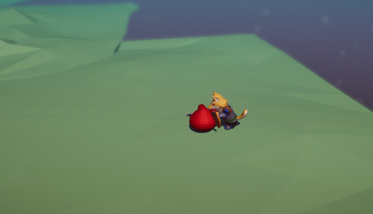

p.s. 注æ„æ¯æ¬¡è¯•ç©å，Script Object里的数æ®éœ€è¦æ¢å¤åˆ°åŸæœ‰å†…容。


### 18: Guard & Dead 守å«çŠ¶æ€å’Œæ­»äº¡çŠ¶æ€

- 添加 Enemy å’Œ Player çš„å—伤动画和死亡动画
- 设置守å«çš„角度å®ç°è„±ç¦»æˆ˜æ–—归为å缓慢转å›åˆå§‹è§’度
- 添加暴击伤害触å‘防御者的å—伤动画
- å®ç°æ•Œäººæ­»äº¡å销æ¯


### 19: æ³›å‹å•ä¾‹æ¨¡å¼ Singleton

- æ³›å‹ç±»çš„写法
- GameManager è·å¾— PlayerStats 的注册
- 修改 MouseManager 继承泛å‹å•ä¾‹åŸºç±»


### 20: Observer Pattern æ¥å£å®ç°è§‚察者模å¼çš„订阅和广播

- 创建 IEndGameObserver æ¥å£
- 在 GameManager 中用æ¥ç®¡ç†æ‰€æœ‰è®¢é˜…者并且广播
- å®ç° Player 死亡敌人集体欢呼胜利


### 21: More Enemies 制作更多的敌人

- 解决å¤åˆ¶å‡ºæ¥çš„敌人公用åŒä¸€ä¸ªæ•°æ®çš„问题
- 解决 Player 死亡åä»ç„¶å¯ä»¥ç§»åŠ¨çš„问题
- 解决编辑器窗å£çš„报错问题
- 使用 Animator override controller 制作 乌龟 敌人
- 添加 兽人 å’Œ 石头人 çš„ç´ æ简å•æ‘†æ”¾


### 22: Setup Grunt 设置兽人士兵

- 添加独立的 Animator
- 编写 Animator Behavior æ§åˆ¶åŠ¨ç”»æ’­æ”¾æœŸé—´çš„ Agent
- 创建å•ç‹¬çš„脚本继承 EnemyController
- 设置å•ç‹¬çš„击é£å‡½æ•°
- Player 添加击晕动画


### 23: Extension Method 扩展方法

- 创建 Transform 的扩展方法判断攻击目标是å¦åœ¨é¢å‰
- Vector3.Dot 的用法说æ˜


Tips:VSCode中界é¢â€œOUTLINE“æ¥å¿«é€ŸæŸ¥æ‰¾å‡½æ•°ã€‚


### 24: Setup Golem 设置石头人Boss

- 设置 Animator override controller 调整动画片段
- 创建å•ç‹¬çš„脚本继承 EnemyController
- 设置å•ç‹¬çš„击é£å‡½æ•°åœ¨ Animation Event 中调用


### 25: Throw Rocks 设置å¯ä»¥æ‰”出的石头

- Player 添加 StopingDistance 的切æ¢æ§åˆ¶
- 创建 Rock 并编辑代ç å¯ä»¥é£å‘ Player
- 设置为 Prefab 让石头人å¯ä»¥åœ¨åŠ¨ç”»é‡Œç”Ÿæˆå¹¶æŠ•æ·è¿™ä¸ª Rock


### 26: Kick it Back å击石头人

- å®ç°å‡»é£ Player 并产生伤害
- 设置 Rock çš„ä¸åŒçŠ¶æ€ï¼Œæ—¢èƒ½æ”»å‡» Player 也å¯ä»¥ç”¨æ¥å击石头人
- 创建 Particle System å®ç°çŸ³å¤´ç¢è£‚效æœ


### 27: Health Bar 设置血æ¡æ˜¾ç¤º

- 创建 UI åˆ¶ä½œè¡€æ¡ Prefab
- 创建 HealthBarUI 代ç æŒ‚è½½æ¯ä¸€ä¸ªæ•Œäººèº«ä¸Š
- è·å¾—è¡€æ¡æ˜¾ç¤ºçš„ HealthBarPoint åæ ‡
- 使用 Event Action 的方法在æ¯æ¬¡æ”»å‡»çš„时候更新血é‡


p.s. 之å‰ä¹Œé¾Ÿçš„攻击Hit动画没有加在animation中，我在这里å‘ç°å¹¶è¡¥ä¸Šäº†ã€‚


### 28: Player LevelUp ç©å®¶å‡çº§ç³»ç»Ÿ

- 修改 CharacterData 添加等级相关å˜é‡
- 创建å‡çº§å‡½æ•°æ–¹æ³•
- æ€æ€ªè·å¾—ç»éªŒå‡çº§å±æ€§


### 29: Player UI 添加ç©å®¶ä¿¡æ¯æ˜¾ç¤º

- 制作 PlayerHealth UI
- Canvas 渲染模å¼è®¾ç½®
- å®æ—¶æ›´æ–°è¡€é‡å’Œç»éªŒå€¼


å°Tips: Ctrl+D 用äºå¤åˆ¶


### 30: Create Portal 创建传é€é—¨

- 利用 Shader Graph 创建传é€é—¨
- 创建 TransitionPoint å’Œ TransitionDestination 脚本æ§åˆ¶ä¼ é€å’Œç»ˆç‚¹

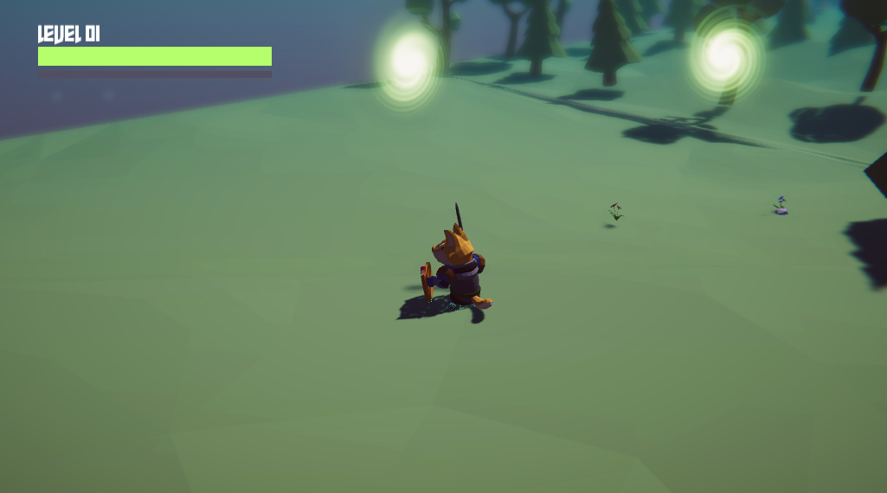


### 31: Transition å®ç°åŒåœºæ™¯å†…ä¼ é€

- 创建å程å®ç°åŒåœºæ™¯ä¼ é€ç‚¹ä¼ é€


### 32: Different Scene 跨场景传é€

- 所有的æ§åˆ¶ç±»å•ä¾‹ä»£ç æ·»åŠ  DontDestroyOnLoad
- å®ç°è·¨åœºæ™¯å¼‚æ­¥åŠ è½½å¹¶ç”Ÿæˆ Player
- 设置 Game Manager 为 FreeLook æ‘„åƒæœºæ·»åŠ  Follow å’Œ LookAt 的目标
- PlayerController 添加 OnDisable å–消订阅


å°Tips : 创建arch的时候使用Probuilder的时候å¯ä»¥ä½¿ç”¨è¿™ä¸ªFace Selection然å拖动进行生æˆå®Œæ•´Arch。


使用下一个场景的Wall，使用å在Navigation中设置Wall&ArchæˆNavigation Static,并设置æˆâ€œNot Walkable",å†è¿›è¡ŒBake。


新场景如æœä½¿ç”¨demo，Ground等内容进行Navigation的设置，Bake。

​				

p.s. 之å‰ç›´æ¥ç”¨ç¬¬ä¸€åœºæ™¯çš„freelook camera生æˆprefab拖到第二场景——这样似ä¹æ— æ³•èµ·åˆ°æ•ˆæœï¼Œäºæ˜¯é‡æ–°åˆ›å»ºfreelook cameraåå³å¯ã€‚

扩建场景：

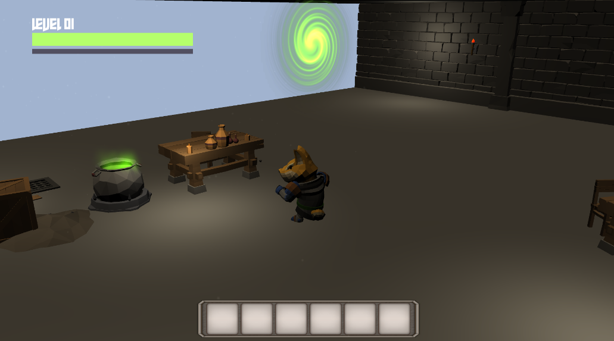


### 33: Save Data ä¿å­˜æ•°æ®

- 了解 JsonUtility 的用法
- 了解 PlayerPrefs 的用法
- 创建 SaveManager å®ç°ä¿å­˜ç©å®¶æ•°æ®


### 34: Main Menu 制作主èœå•

- 制作 Main 场景
- 添加 Canvas 熟悉 Render Mode
- 创建 MainMenu å®ç°æŒ‰é’® AddListener 添加对应函数方法
- SceneController 添加新的å程é…åˆåœºæ™¯è½¬æ¢


å°Tips : 

- è¿›å…¥æ¸¸æˆ å†é€€å‡ºæ¸¸æˆè¿”å›ä¸»èœå•ç•Œé¢ 主èœå•çš„场景就会å˜å¾—å分暗
  - 打开Auto Generate Lighting(切æ¢å场景ä¸ä¼šè‡ªåŠ¨çƒ˜åŸ¹ç¯å…‰ï¼Œæ‰€ä»¥ä¼šå¾ˆæš—)。

- NullReferenceException: Object reference not set to an instance of an object
  - 这个是该版本Unity自带的bug，é‡å¯unityå³å¯ã€‚

- 解决标题很糊的问题

  - 这个是因为portal摆放在了“The Knight"ä¸â€New Game"的中间，将portal移到它们的åŒä¸€ä¾§å³å¯ã€‚

    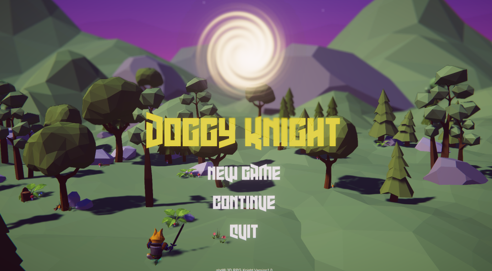

- Copyright部分如æœæƒ³è¦è·Ÿbutton一样消失

  - åŒæ ·è®¾ç½®screen space-camera,调整planeè·ç¦»è‡³å¯è§ä½ç½®ï¼Œç„¶åå†è®¾ç½®æˆworld spaceå³å¯ã€‚

  

  


Fix a Problem : 

- 怪物的死亡和destroy都很正常，但是ç©å®¶å´åœ¨æ€ªç‰©æ­»äº¡ä¹‹å继续攻击，éšåunity就会报错`MissingReferenceException: The object of type 'GameObject' has been destroyed but you are still trying to access it.`——解决方法：攻击动画的animation里有一个自动循ç¯çš„选项，关闭就好了。

  


### 35: SceneFader 场景转æ¢çš„æ¸å…¥æ¸å‡º

- 添加 Timeline 了解基本用法

- 利用 Canvas Group 制作 SceneFader

- å程套å程的用法

- å®ç° Player 死亡返å›ä¸»èœå•

  

  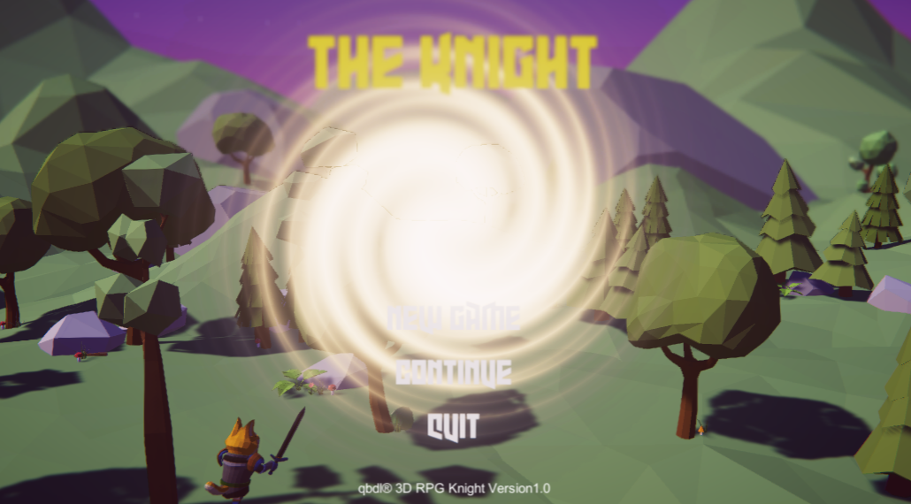

å°Tips : 

- player死亡一次å，å†å¼€å§‹æ¸¸æˆï¼Œå†æ¬¡æ­»äº¡å°±ä¸ä¼šè‡ªåŠ¨è¿”å›ä¸»èœå•
  - åŸå› æ˜¯å†æ¬¡å¼€å§‹æ¸¸æˆå，fadeFinished这个布尔值还是false。在LoadLevel()这个å程里加上`yield return fadeFinished = true;`这样å†æ¬¡è¿›å…¥æ¸¸æˆæ—¶ï¼ŒfadeFinishedå˜æˆäº†true，ç©å®¶æ­»äº¡æ—¶å°±å¯ä»¥æ‰§è¡ŒLoadMain()了。
- player第一次死亡é‡æ–°å›åˆ°ä¸»èœå•ï¼Œä½†æ˜¯ç‚¹å‡»æŒ‰é’®ä¸ä¼šè¿›å…¥æ–°æ¸¸æˆ
  - 把CanvasGroup里的blockRaycastå…³æ‰å³å¯ã€‚


### 36: Build & Run打包åŠè¿è¡Œ

- Build Settings 的相关设置
- Player Settings 的相关设置
- 如æœæ·»åŠ å„ç§å¹³å°çš„支æŒ


## MileStone 1

### 效æœå›¾ç‰‡åˆé›†


​			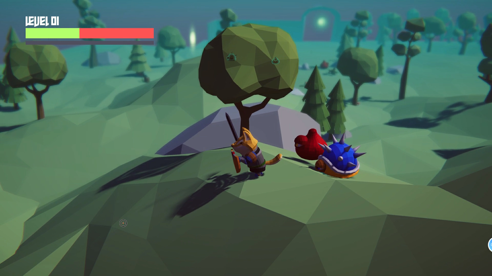

​			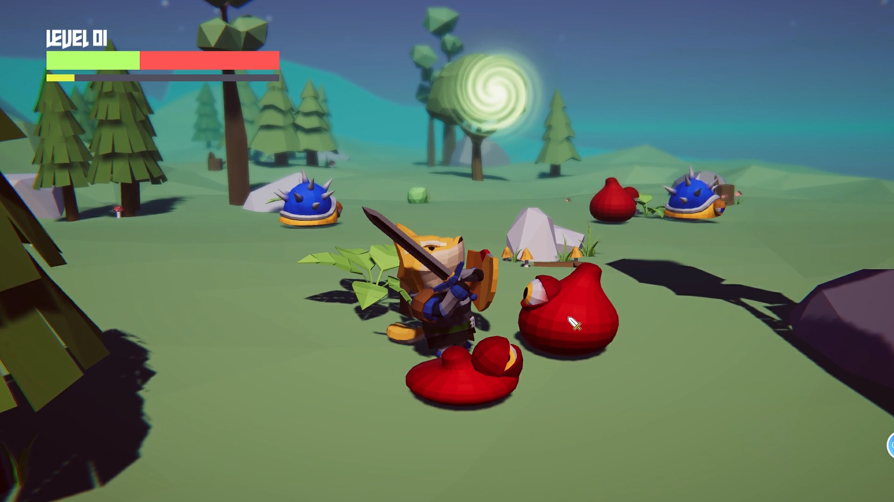

​			


### Improvements


- 人物移动wasd,é¼ æ ‡æ§åˆ¶è§†è§’


- 加入音效


### Core核心功能开å‘&学习总用时

46h 45min 37s.


## 3D RPG Course ｜高级教程

### 章节1 背包系统

#### 1.项目介ç»

背包系统简å•æ¥è¯´å°±æ˜¯ UI å’Œ é€»è¾‘ä»£ç  çš„ç»„åˆã€‚**这就æ„å‘³ç€ 2D å’Œ 3D 游æˆéƒ½æ˜¯å®Œå…¨é€šç”¨çš„**。


#### 2.Inventory UI 制作背包的基本UI

- 导入素æ设置画布布局
- 使用 Grid Layout Group 进行网格化æ§åˆ¶
- ä¿å­˜ Slot Holder 为 Prefab


#### 3.Item OnWorld 创建世界地图上的物å“

- 制作世界地图物å“çš„ prefab
- 创建 ItemPickUp 脚本判断碰æ’
- 创建 ItemData_SO 制作物å“ä¿¡æ¯çš„模版
- 在 MouseManager 中添加对物å“互动的指针切æ¢å’Œç§»åŠ¨


#### 4.Equip Weapon 装备武器

- 在世界地图上创建武器 添加必è¦å¯¹ Component 
- 创建武器本身的 Attack Data 攻击å±æ€§
- 调整世界物å“的碰æ’器和触å‘器
- 调整生æˆç‰©å“çš„ Prefab çš„å标，特别是武器和装备
- CharacterStats 代ç ä¸­åŠ å…¥ EquipWeapon å®ç°è£…备武器
- 添加武器的 Attack Data
- AttackData_SO 里添加更新å±æ€§çš„函数

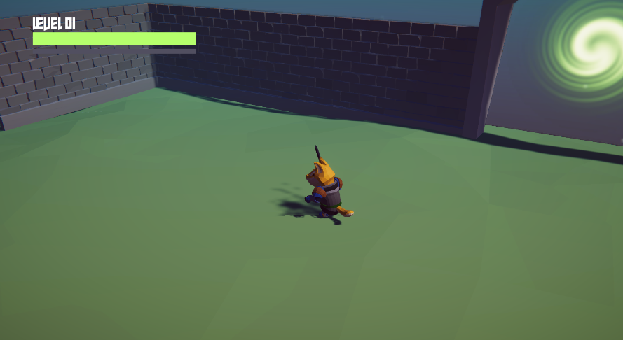


#### 5.Inventory Data 创建背包的数æ®åº“

- 创建 InventoryData_SO 作为ä¸åŒèƒŒåŒ…çš„æ•°æ®åº“
- 创建å•ç‹¬çš„ class InventoryItem 用æ¥è®°å½•èƒŒåŒ…里的物å“å’Œç°æœ‰æ•°é‡
- 添加 AddItem 方法将物å“ä¿¡æ¯ä¼ é€’到 List 列表当中
- 修改 ItemPickUp å®ç°ç¢°æ’物体 拾å–到背包里


#### 6.Inventory UI 让背包显示物å“

- 梳ç†é€»è¾‘å¹¶åˆ›å»ºä»£ç  ContainerUI / SlotHolder / ItemUI
- 修改 SlotHolder 的 Prefab 添加空物体 ItemSlot
- é€å±‚完æˆä»£ç å®ç°èƒŒåŒ…里正确显示物å“图片和数é‡


p.s. 关闭prefab中的网格Tips：


#### 7.Action Bar / Stats 设置快æ·æ å’Œä¿¡æ¯é¢æ¿çš„UI

- 创建快æ·æ  Action Bar 的按钮 UI
- 创建人物信æ¯é¢æ¿ UI


#### 8.Begin Drag å®ç°æ‹–拽物å“

- 创建 DragItem å®ç°æ‹–拽功能
- ä»‹ç» EventSystems 里的æ¥å£
- å®ç°æ‹–拽跟éšé¼ æ ‡æŒ‡é’ˆ
- 创建 DragData 用æ¥è®°å½•æ¯ä¸€ä¸ª UI 物å“åŸå§‹æ•°æ®


p.s. åŒæ ·ç±»å‹é‡Œåˆ—表越åé¢çš„东西渲染的越迟，结æœå°±æ˜¯å‘ˆç°åœ¨æ›´å‰é¢ï¼Œè¦†ç›–æ‰å‰é¢çš„。


#### 9.Swap Item 交æ¢ç‰©å“

- 使用 EventSystem 判断指针ä½ç½®
- 利用 RectTransformUtility.RectangleContainsScreenPoint 判断鼠标ä½ç½®æ˜¯å¦åŒ…å«åœ¨æ¯ä¸€ä¸ªæ ¼å­èŒƒå›´å†…
- 交æ¢å›¾ç‰‡çš„åŒæ—¶è¦äº¤æ¢çœŸæ˜¯çš„æ•°æ®åˆ—表æ’åº
- 调整 RectTransform çš„ offset ç¡®ä¿å›¾ç‰‡åœ¨æ­£ç¡®ä½ç½®æ˜¾ç¤º

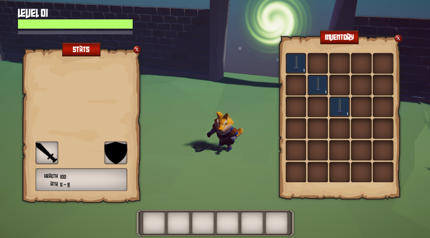


#### 10.Change Weapon å®ç°åˆ‡æ¢æ­¦å™¨

- 在 MouseManager 添加函数方法 é¿å… UI 互动时影å“人物æ§åˆ¶
- 在 CharacterStats 中加入 ChangeWeapon 的方法
- 在 SlotHolder 中切æ¢æ‰€å±èƒŒåŒ…çš„æ•°æ®åº“
- DragItem 中添加物å“å±æ€§å’Œ SlotType 的匹é…

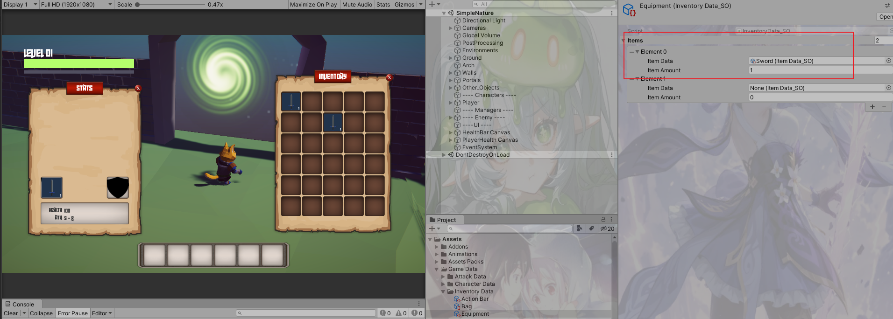

- å¢åŠ shield相关的内容


P.S. 

- 注æ„，这部分开始ç©çš„时候最好ä»ä¸»èœå•è¿›å…¥ï¼Œå¦åˆ™ä¼šæŠ¥é”™ï¼š`NullReferenceException: Object reference not set to an instance of an object DragItem.SwapItem () (at Assets/Scripts/Inventory/UI/DragItem.cs:89)`

  - åŸå› ï¼šç›´æ¥ä»å½“å‰åœºæ™¯è¿›å…¥ï¼Œç”±äºæ²¡æœ‰åˆå§‹åŒ–背包会报错（所以è¦ä»ä¸»èœå•è¿›å…¥æ¸¸æˆï¼‰ï¼Œå¯ä»¥é€šè¿‡å›¾ç¤ºä»£ç é‡Œçš„Debug部分定ä½è¯¥é—®é¢˜ã€‚

    ```c#
    public void SwapItem()
        {
            //如æœç›´æ¥ä»å½“å‰åœºæ™¯è¿›å…¥ï¼Œç”±äºæ²¡æœ‰åˆå§‹åŒ–背包会报错（所以è¦ä»ä¸»èœå•è¿›å…¥æ¸¸æˆï¼‰
            // if (targetSlotHolder.itemUI.Bag == null || currentSlotHolder.itemUI.Bag == null)
            // {
            //     Debug.LogError("My Debug SwapItem: Bag is null in targetSlotHolder or currentSlotHolder!");
            //     return;
            // }
    
            //改å˜æ•°æ®åº“
            var targetItem = targetSlotHolder.itemUI.Bag.items[targetSlotHolder.itemUI.Index];
            var tempItem = currentSlotHolder.itemUI.Bag.items[currentSlotHolder.itemUI.Index];
    
            bool isSameItem = (tempItem.itemData == targetItem.itemData);
            if (isSameItem && targetItem.itemData.itemStackable)//å åŠ 
            {
                targetItem.itemAmount += tempItem.itemAmount;
                tempItem.itemData = null;
                tempItem.itemAmount = 0;
            }
            else//交æ¢ç‰©å“æ•°æ®
            {
                currentSlotHolder.itemUI.Bag.items[currentSlotHolder.itemUI.Index] = targetItem;
                targetSlotHolder.itemUI.Bag.items[targetSlotHolder.itemUI.Index] = tempItem;
            }
        }
    ```

    

- 注æ„当剑/盾牌ä»è£…备æ ç§»å›åˆ°èƒŒåŒ…里åŸæœ‰ç›¾ç‰Œ/剑的格å­æ—¶å€™ä¼šå‘生报错（åŸæ¥ä»£ç ï¼‰: 

  - 会导致的结æœï¼šå°†ä¸¤è€…交æ¢ä½ç½®ï¼Œä½¿å¾—武器装备到了盔甲的格å­é‡Œã€‚

    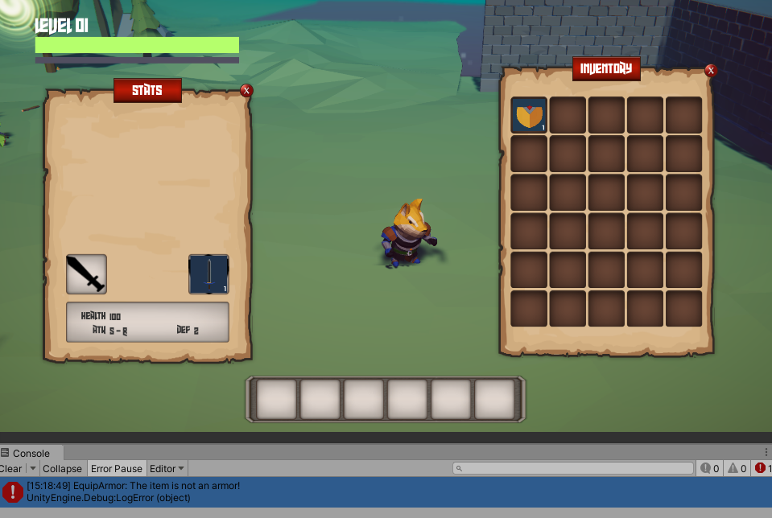

  - åŸå› ï¼šå½“把物å“æ¢åˆ°èƒŒåŒ…时会无æ¡ä»¶åœ°è°ƒç”¨`SwapItem()`，而如æœç›®æ ‡æ§½ä½ä¸­å·²æœ‰ç‰©å“（如剑或盾牌），`SwapItem()`å在 `SlotHolder.UpdateItem` 会调用 `ChangeArmor`，导致é盔甲类å‹çš„物å“被错误地传递给 `EquipArmor` 方法。

    ```c#
    switch (targetSlotHolder.slotType)
                    {
                        case SlotType.BAG:
                            SwapItem();
                            break;
                        case SlotType.WEAPON:
                            if (currentItemUI.Bag.items[currentItemUI.Index].itemData.itemType == ItemType.Weapon)
                                SwapItem();
                            break;
                        case SlotType.ARMOR:
                            if (currentItemUI.Bag.items[currentItemUI.Index].itemData.itemType == ItemType.Armor)
                                SwapItem();
                            break;
                        case SlotType.ACTION:
                            if (currentItemUI.Bag.items[currentItemUI.Index].itemData.itemType == ItemType.Useable)
                                SwapItem();
                            break;
                    }
    ```

  - 解决方法：在`case SlotType.BAG:`中加入æ¡ä»¶( 目标槽ä½ä¸ºç©º 或者 目标槽ä½ä¸å½“å‰æ§½ä½ç‰©å“ç±»å‹ç›¸åŒ )。

    ```c#
    case SlotType.BAG:
                            // 检查目标槽ä½æ˜¯å¦å·²æœ‰ç‰©å“
                            var targetItem = targetSlotHolder.itemUI.Bag.items[targetSlotHolder.itemUI.Index];
                            bool canSwap = targetItem.itemData == null || //目标槽ä½ä¸ºç©º
                                           targetItem.itemData.itemType == currentItemUI.Bag.items[currentItemUI.Index].itemData.itemType;//目标槽ä½ä¸å½“å‰æ§½ä½ç‰©å“ç±»å‹ç›¸åŒ
                            if (canSwap)
                                SwapItem();
                            break;
    ```


#### 11.Useable Item å¯ä½¿ç”¨çš„物å“

- åˆ›å»ºå¤§è˜‘è‡ å¹¶æ·»åŠ å¿…è¦çš„组件
- 创建 UseableItemData_SO 制作å¯ä½¿ç”¨ç‰©å“çš„å±æ€§æ¨¡ç‰ˆ
- 利用 IPointerClickHandler æ¥å£å®ç°åŒå‡»ä½¿ç”¨ç‰©å“
- 在 CharacterStats 中添加 ApplyHealth（我这里é¢æ˜¯ApplyUseableEffect） å®ç°è¡€é‡å˜åŒ–


#### 12.Action Button å¿«æ·æ æŒ‰é”®

- 添加å®ç° CloseBtn å…³é—­å½“å‰ UI é¢æ¿
- 添加按键æ§åˆ¶æ‰“开关闭 UI é¢æ¿
- 创建 ActionButton 脚本设置独立按键使用快æ·æ ç‰©å“
- 修正åŒå‡»ç©º SlotHolder 的报错


#### 13.Stats Info 显示 Player 相关信æ¯

- 创建 RawImage å’Œ 独立 Camera å®ç°æ˜ å°„ Player 的模å‹
- è·å¾— Text çš„é¢æ¿ä¿¡æ¯
- 创建函数方法å®æ—¶æ›´æ–°é¢æ¿ä¿¡æ¯

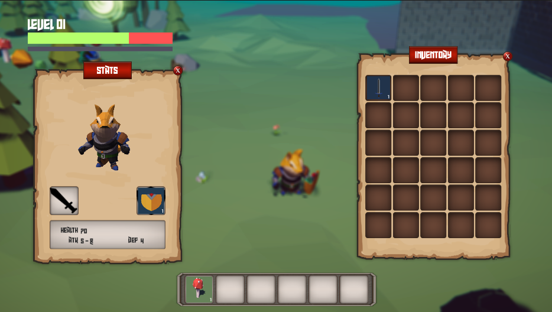

å°Tips

- 加入camera用äºç”Ÿæˆraw imageå，游æˆæ—¶å¯èƒ½ç”»é¢å˜å¾—很模糊

  

  - åŸå› ï¼šä¸ç¡®å®šæ˜¯ä»€ä¹ˆé—®é¢˜ã€‚
  
  - 解决方法：就在人物é¢æ¿æ‰“开时å¯ç”¨camera，关闭时关闭camera。
  
    ```c#
    //InventoryManager.cs中
    void Update()
        {
            if (Input.GetKeyDown(KeyCode.B)) // 按下B键打开或关闭背包æ 
            {
                isOpen = !isOpen;
                inventoryPanel.SetActive(isOpen); // 切æ¢èƒŒåŒ…æ UIé¢æ¿çš„显示状æ€
                statsPanel.SetActive(isOpen); // 切æ¢è£…备æ UIé¢æ¿çš„显示状æ€
            }
    
            // æ§åˆ¶äººç‰©é¢æ¿çš„相机开关
            if (GameManager.Instance.characterPanelCamera != null)
                GameManager.Instance.characterPanelCamera.gameObject.SetActive(isOpen);
            else
                Debug.LogWarning("My_Debug : Character panel camera is not assigned in GameManager.");
    
    
            // 更新角色人物æ å±æ€§æ–‡æœ¬
            UpdateStatsText(
                GameManager.Instance.playerStats.CurrentHealth,
                GameManager.Instance.playerStats.attackData.minDamage,
                GameManager.Instance.playerStats.attackData.maxDamage,
                GameManager.Instance.playerStats.CurrentDefence
            );
        }
    ```
  
    ```c#
    //GameManager.cs中
    public Camera characterPanelCamera; // 用äºäººç‰©é¢æ¿çš„相机
    
        List<IEndGameObserver> endGameObservers = new List<IEndGameObserver>();
    
        protected override void Awake()
        {
            base.Awake();
            DontDestroyOnLoad(gameObject); // ç¡®ä¿GameManager在场景切æ¢æ—¶ä¸ä¼šè¢«é”€æ¯
        }
    
        public void RigisterPlayer(CharacterStats player)
        {
            playerStats = player;
            characterPanelCamera = playerStats.transform.Find("Camera").GetComponent<Camera>(); // è·å–角色的Camera组件
    ```
  
    
  
    

#### 14.Change Animator 切æ¢åŠ¨ç”»æ§åˆ¶å™¨

- 使用更多动画æ¥åˆ›å»º Animator override controller
- ItemData_SO 中添加武器é…套动画æ§åˆ¶å™¨
- 在 EquipWeapon å’Œ UnEquipment 中添加代ç åˆ‡æ¢æ­¦å™¨ä¼´éšåŠ¨ç”»

å‚考素æ：

- RPG Character Animation Pack Free ：[点击跳转](https://assetstore.unity.com/packages/3d/animations/rpg-character-mecanim-animation-pack-free-65284)

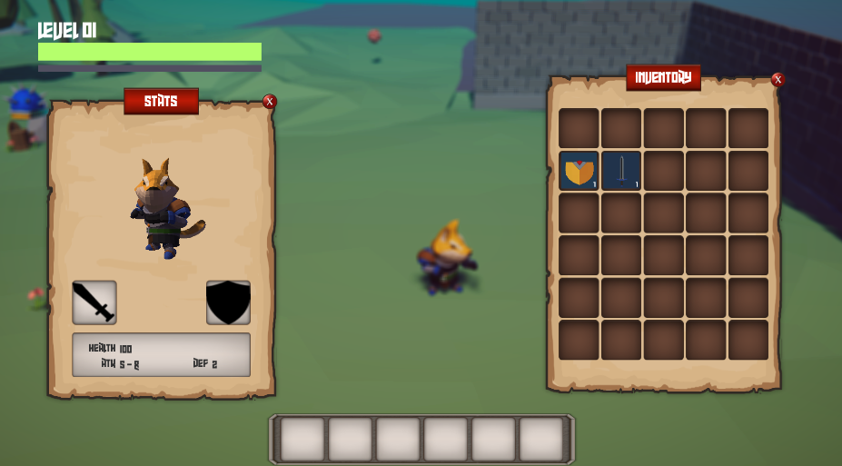

fix problems:

-  åŸæ¥è§†é¢‘里的`attackData`ä¸`baseAttackData`的逻辑有点问题,会导致模æ¿çš„æ•°æ®è¢«ä¿®æ”¹ï¼š

  - 修改，改å，并把character部分对应的prefabçš„attack Data的内容改为给templateAttackData赋值，删æ‰å¯¹attackData的赋值

      public **AttackData_SO** templateAttackData; *// 攻击templateæ•°æ®*

      public **AttackData_SO** attackData; *// 攻击数æ®*


#### 15.Item Tooltip 物å“ä¿¡æ¯æ˜¾ç¤ºæ 

- 创建 UI
- 学习 Content size fitter 的用法å®ç°è‡ªåŠ¨æ‹‰ä¼¸ç¼©æ”¾
- 添加代ç è„šæœ¬ ItemTooltip 
- 利用 IPointEnterHandler æ¥å£å®ç°é¼ æ ‡æ‚¬åœæ˜¾ç¤º Tooltip
- RectTransform.GetWorldCorners 概念说æ˜åŠä½¿ç”¨æ–¹æ³•

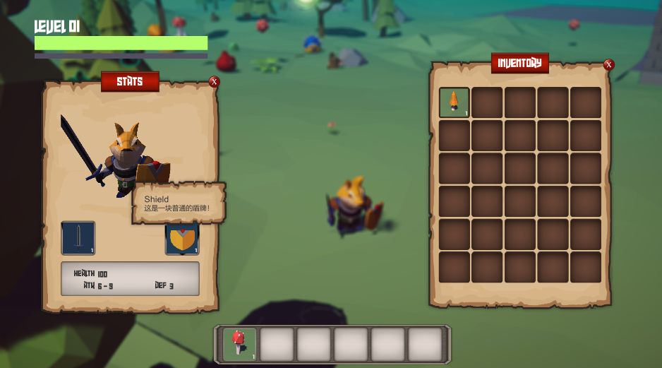


#### 16.Loot Items æ‰è½ç‰©å“

- 创建 LootItem ç±» 记录è¦æ‰è½çš„物å“å’Œæƒé‡
- 使用 [Range] æ§åˆ¶æ‰è½æƒé‡çš„百分比
- å®ç°å¤šç‰©å“比较æƒé‡æ‰è½


#### 17.Complete Inventory 完æˆèƒŒåŒ…

- 添加背包的ä¿å­˜å’Œè¯»å–方法
- 添加 DragPanel å®ç°æ‹–拽背包é¢æ¿
- 利用调整 Hierarchy æ’åºçš„方法改å˜æ¸²æŸ“å‰å层级

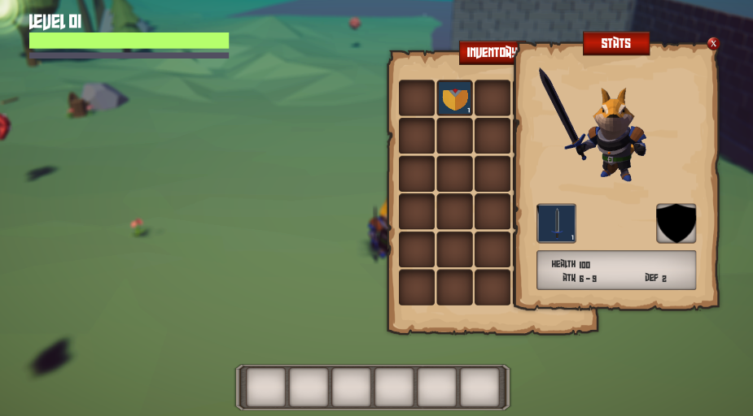


fix problems:

- ä»æ¸¸æˆå›åˆ°ä¸»èœå•ï¼Œå¿«æ·æ ï¼Œè£…备æ ç­‰ä»æ˜¯å¼€ç€çš„：

  - 问题åŸå› ï¼š`DontDestroyOnLoad(gameObject);` ä¸æ˜¯åœ¨æ‰€æœ‰Singleton里é¢éƒ½ä¸è¦åˆ é™¤çš„，å¦åˆ™å¿«æ·æ çš„显示状æ€æ²¡æœ‰åœ¨åˆ‡æ¢åœºæ™¯æ—¶è¢«é‡ç½®ï¼Œå®ƒä¼šä¿æŒä¹‹å‰çš„状æ€ï¼ˆä¾‹å¦‚打开状æ€ï¼‰ã€‚

  - 解决方案：

    - 删除Singleton里的`DontDestroyOnLoad(gameObject);`

    - 在下述**使用Singleton的部分Awake()**中进行override

      - 1ã€**å•ä¾‹ç®¡ç†å™¨ç±»**（管ç†å…¨å±€çŠ¶æ€æˆ–æ•°æ®çš„å•ä¾‹ç±»ï¼‰ï¼š`GameManager.cs` , `MouseManager.cs` , `SaveManager.cs` , `SceneController.cs`。
      - 2ã€**ç©å®¶æ•°æ®æˆ–状æ€**（ç©å®¶æ•°æ®ï¼ˆå¦‚生命值ã€ç»éªŒå€¼ã€è£…备等）需è¦åœ¨åœºæ™¯åˆ‡æ¢æ—¶ä¿æŒä¸€è‡´ï¼‰ã€‚

      ```C#
      protected override void Awake()
          {
              base.Awake();
              DontDestroyOnLoad(gameObject);
          }
      ```

- 如æœä¸è¿›å…¥ä¸‹ä¸€åœºæ™¯ç›´æ¥escå，使用continue会å‘ç°æ•°æ®éƒ½æ²¡äº†ï¼š

  - SaveManager.cs里escæ—¶è¦åŠ å…¥äººç‰©æ•°æ®ä¸èƒŒåŒ…æ•°æ®çš„ä¿å­˜ï¼Œä½¿å¾—continue时能够加载得到。

    ```c#
    if (Input.GetKeyDown(KeyCode.Escape))
            {
                // Exit the game when 'Escape' is pressed
    
                SaveManager.Instance.SavePlayerData();  // ä¿å­˜ç©å®¶æ•°æ®
                InventoryManager.Instance.SaveData();   // ä¿å­˜èƒŒåŒ…和装备æ æ•°æ®
    
                SceneController.Instance.TransitionToMainMenu();
            }
    ```


#### 18.制作3D武器 åŠ åœ¨æ¸¸æˆä¸­çš„使用

- ProBuilder 建模介ç»
- UV Editor 编辑器使用

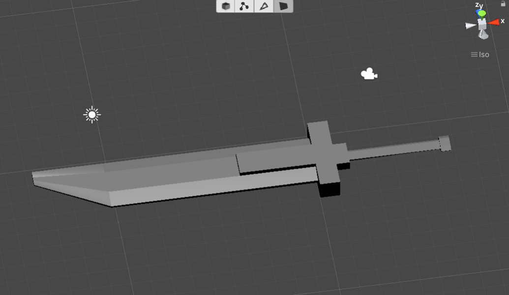

​			


- å°†BroadSword这把剑以类似swordçš„æ–¹å¼å¯¹å®ƒæ·»åŠ å„ç§å±æ€§ä¸æ–‡ä»¶


- å°è¯•åˆ¶ä½œè‡ªå·±çš„åŒæ‰‹æ­¦å™¨åŠ¨ç”»â€”—我这里åšçš„还是å•æ‰‹æ¨¡å‹
- 测试你的人物模å‹æ˜¯å¦æœ‰é—®é¢˜å†åšè°ƒæ•´
- åå¤è°ƒæ•´åæ ‡åŠæ—‹è½¬å¹¶ä¸”é…åˆåŠ¨ç”»æ£€æŸ¥


fix problems:

- 修改蘑è‡æ¼‚浮在空中的问题：调整mushroomçš„prefab中capsule colliderä¸box collider的大å°

  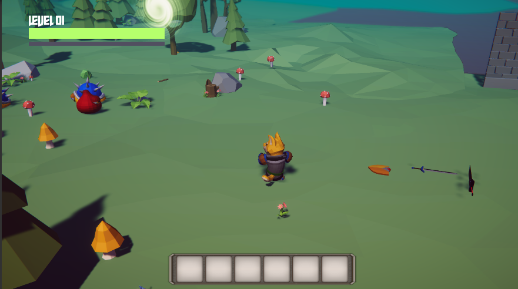


### 章节2 对è¯ç³»ç»Ÿ

#### 1.项目介ç»

对è¯ç³»ç»Ÿçš„逻辑ã€æ•°æ®ã€UI相关制作。


#### 2.Dialogue Logic 对è¯ç³»ç»Ÿçš„逻辑

- 逻辑讲解
- åˆ›å»ºä»£ç  DialogueData_SO / Dialogue Piece / Dialogue Option
- 创建第一个对è¯å®ç°é¢„期的逻辑


#### 3.Dialogue Canvas 对è¯çš„UIé¢æ¿è®¾ç½®

- 创建对è¯çª—å£çš„ UI 布局
- 继续熟悉å„ç§ Layout Group 的用法
- 利用 Layout Element 设置最å°é«˜åº¦
- 自己多动手å°è¯•åˆ¶ä½œè‡ªå·±å–œæ¬¢çš„æ ·å¼

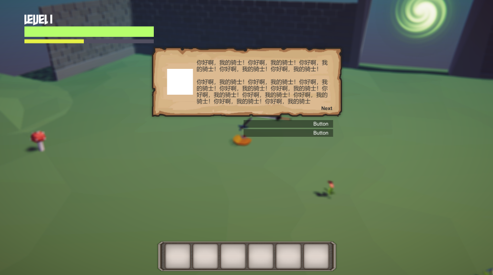


#### 4.创建对è¯&任务的 NPC

- 在 Assets Store 中添加rpg-hero-pbr-hp-polyartç´ æ：[点击跳转](https://assetstore.unity.com/packages/3d/characters/humanoids/fantasy/rpg-hero-pbr-hp-polyart-121480)
- 导入素æå，è¦å°†ä½ çš„场景素æå‡çº§åˆ°URP
- 拖拽素æ包中的 Prefab 文件夹中的人物放在场景中
- 添加基本的必è¦ç»„件

- 自己å•ç‹¬åˆ›å»º Animator Controller åªæ·»åŠ ä¸€ä¸ª Idle 动画å³å¯
- 修改 Tag åŠ Layer
- 将这个人物ä¿å­˜æˆ Original Prefab 在你的文件夹中

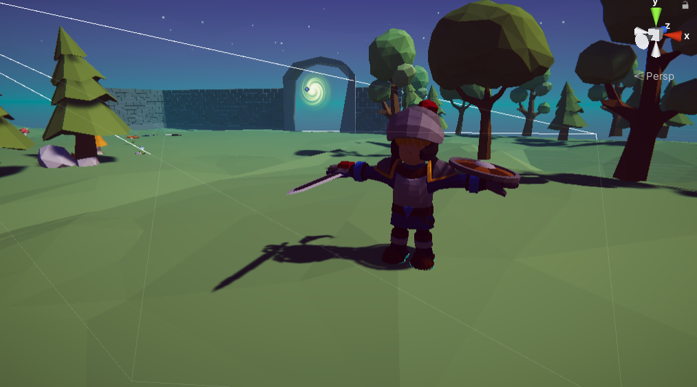


#### 5.Update Main Dialogue 显示主对è¯çª—å£çš„内容

- NPC 添加 DialogueController 脚本 出å‘å¯åŠ¨å¯¹è¯
- 创建 DialogueUI 作为整个对è¯çš„æ§åˆ¶
- DOTween 中 DOText 的用法
- DialogueData_SO 优化 Text 的显示 [TextArea]

Assets Store å•†åŸ DOTween æ’件：[点击跳转](https://assetstore.unity.com/packages/tools/animation/dotween-hotween-v2-27676)


#### 6.OptionUI 创建选项内容

- OptionUI æ§åˆ¶æ¯ä¸€ä¸ªé€‰é¡¹çš„显示内容
- DialogueData_SO 添加字典ä¿å­˜æ¯ä¸€æ¡ DialoguePiece å’Œ 本身的 ID 用æ¥æŸ¥æ‰¾
- å®ç°ç‚¹æŒ‰ Option Button 跳转对应对è¯

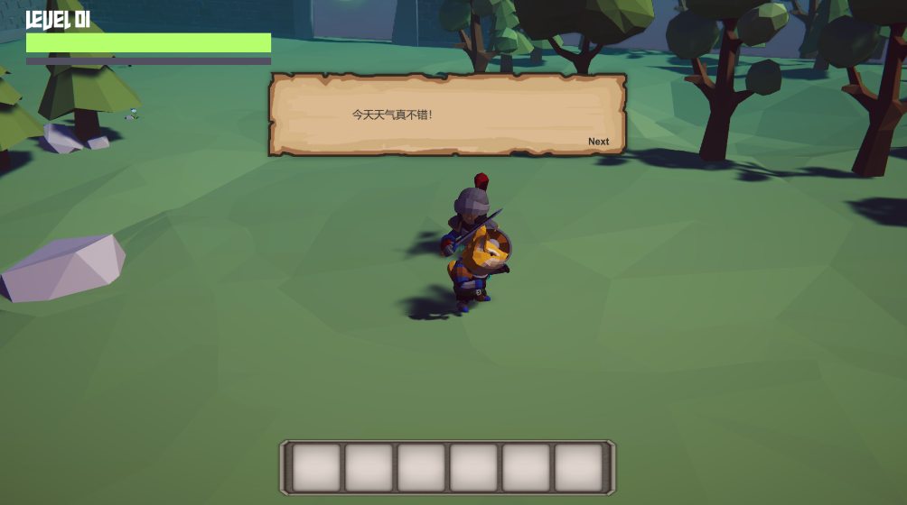


### 章节3 对è¯ç³»ç»Ÿ

任务数æ®ã€é€»è¾‘ã€UI的制作，包括æ¥å—奖励。

#### 1.Quest Data 创建任务数æ®

- 创建任务基本å˜é‡
- 创建 QuestRequire 用æ¥è¿½è¸ªæˆ‘们è¦å®Œæˆçš„任务目标
- 在 DialoguePiece 中加入 Quest 并设置一个新对è¯å¯ä»¥æ¥å—任务


å°Tips:  

- “手â€å›¾æ ‡ç‚¹å‡»éšè—å¯ä»¥é˜²æ­¢åœ¨scene窗å£ä¸­é€‰ä¸­è¯¥å†…容。


- **DontDestroyOnLoad è¦æ±‚其上没有父物体**，所以Managers类别ä¸èƒ½æ”¾åœ¨â€œ---- Managers ----â€é‡Œå»ã€‚


#### 2.TakeQuest æ¥å—任务

- 创建 QuestManager ç®¡ç† Player æ¥åˆ°çš„任务
- 创建 class QuestTask ä¿ç®¡æ¥åˆ°çš„新任务
- 使用 System.Linq æ¥æŸ¥æ‰¾å’Œè¿”å› tasks 列表里我们指定æ¡ä»¶çš„æ•°æ®
- å®ç°å¯¹è¯é€‰æ‹©æŒ‡å®šçš„选项åæ¥å—任务

å‚考内容：

- System.Linq 微软手册：[跳转链æ¥](https://docs.microsoft.com/zh-cn/dotnet/csharp/programming-guide/concepts/linq/basic-linq-query-operations)


#### 3.Quest UI 创建任务 UI é¢æ¿

- 创建 Quest Canvas 使用之å‰å­¦ä¹ è¿‡çš„组件创建任务信æ¯é¢æ¿
- QuestData_SO 中添加奖励列表 rewards


#### 4.Setup Variables 创建所需è¦çš„å˜é‡

- 创建 QuestNameButton 添加在 任务å字按钮 上
- 创建 QuestRequirement 添加在 Requirement 上
- 设置好以上两个类的å˜é‡å¹¶ä¸”拿到赋值
- QuestUI 中创建所有的需è¦æ§åˆ¶çš„å˜é‡ / åæ ‡ / Prefab


#### 5.QuestNameButton å®ç°ç‚¹æŒ‰ä»»åŠ¡æ˜¾ç¤ºä¿¡æ¯

- 按照逻辑å»å†™æ¯ä¸€ä¸ªéœ€è¦çš„函数方法
- 设置任务按钮显示对应任务åå­—
- å®ç°ç‚¹å‡»å字按钮能显示任务详情以åŠä»»åŠ¡éœ€æ±‚
- 调整 UI 布局


Fix a problem : 之å‰æŒ‚载的ä¸æ˜¯çˆ¶ç‰©ä½“，挂错了

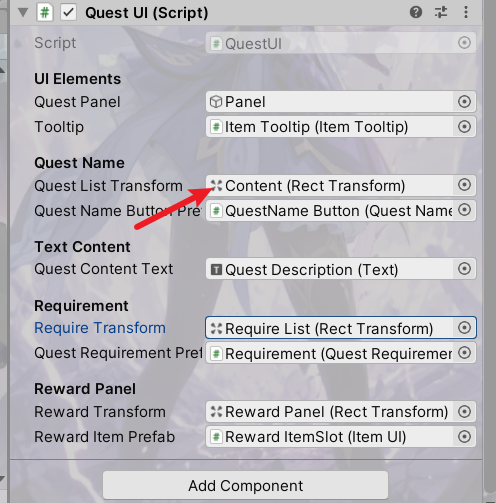


#### 6.RewardList 奖励物å“的显示

- SetupRewardListçš„ 方法å®ç°
- 创建 ShowTooltip å®ç°é¼ æ ‡æ»‘入显示信æ¯
- 创建多个任务并修å¤é‡å¤æ˜¾ç¤ºä»»åŠ¡å¥–励的问题

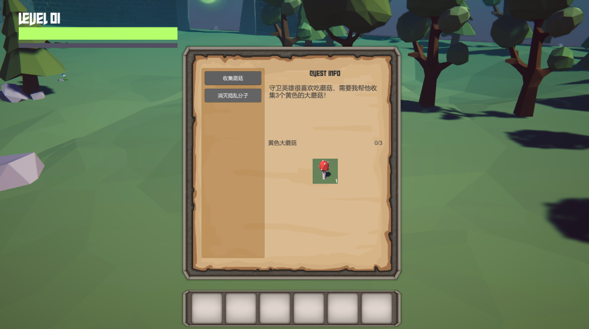


#### 7.UpdateQuestProgress 更新任务进度

- 创建函数在 敌人死亡 å’Œ 拾å–物å“æ—¶ 更新任务进度
- 使用 Linq 语å¥ä¸­çš„ Where 找到匹é…的任务需求并检查是å¦æ»¡è¶³
- 修改特殊情况使用任务物å“消耗å更新进度

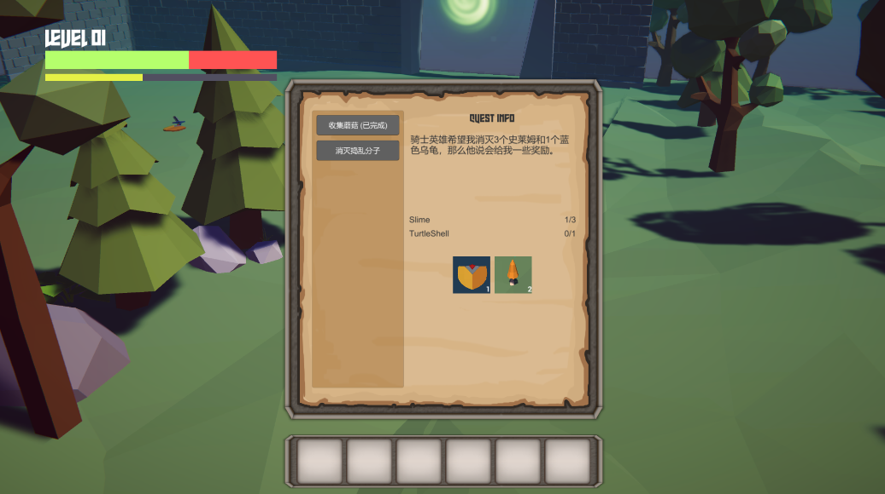


#### 8.CheckQuestItem æ¥å—任务时检查任务物å“

- 考虑å¯èƒ½å­˜åœ¨çš„情况在æ¥å—任务的时候检查背包是å¦æœ‰ä»»åŠ¡ç‰©å“
- 在 QuestData_SO 中创建 RequireTargetName 拿到需求的å字列表
- 循ç¯åˆ—表中æ¯ä¸€é¡¹åœ¨ Inventory 中检查是å¦å­˜åœ¨å¹¶æ›´æ–°æ•°æ®


#### 9.QuestGiver æ§åˆ¶ä»»åŠ¡å¯¹è¯æ˜¾ç¤º

- 创建 QuestGiver å®ç°æ ¹æ®ä»»åŠ¡çŠ¶æ€åˆ‡æ¢NPC对è¯ä¿¡æ¯
- 创建多个 Dialogue Data 编写整个任务æµç¨‹å¯¹è¯
- Dialogue Controller 中添加 OnTriggerExit 人物脱离范围关闭对è¯æ¡†


#### 10.GiveRewards 拿到任务奖励

- InventoryManager 中添加检查任务物å“æ•°é‡
- 考虑å¯èƒ½å‡ºç°çš„所有情况å®ç°ä¸Šäº¤ä»»åŠ¡ç‰©å“完æˆä»»åŠ¡
- ItemUI 调整对任务é¢æ¿çš„负数物å“ç°å®é—®é¢˜
- å®ç°ä»»åŠ¡ Finish 之å任务é¢æ¿éœ€æ±‚的文字改å˜


- 添加一个新的 NPC
- 设置新的对è¯ä¿¡æ¯å’Œæ–°çš„任务
- 也为对è¯æ·»åŠ å›¾ç‰‡ å¤´åƒ / ä»»åŠ¡ç‰©å“ ç­‰
- å‘挥创æ„设置任务并完æˆæµ‹è¯•æ¸¸æˆ

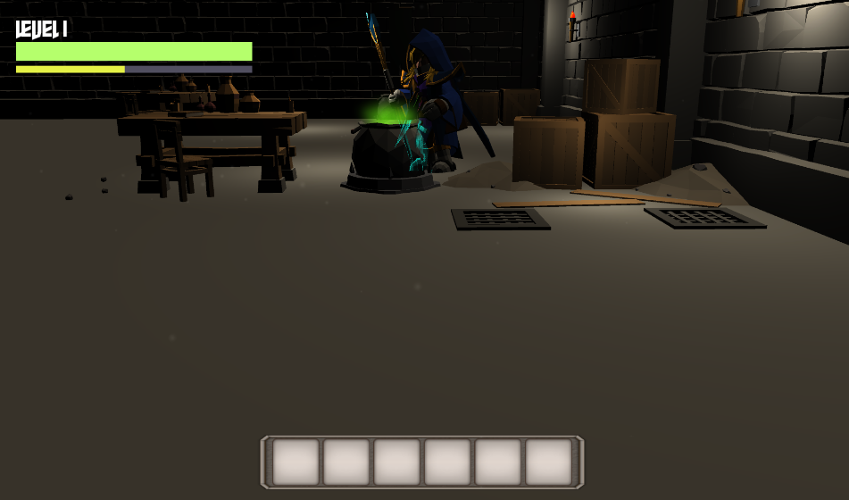

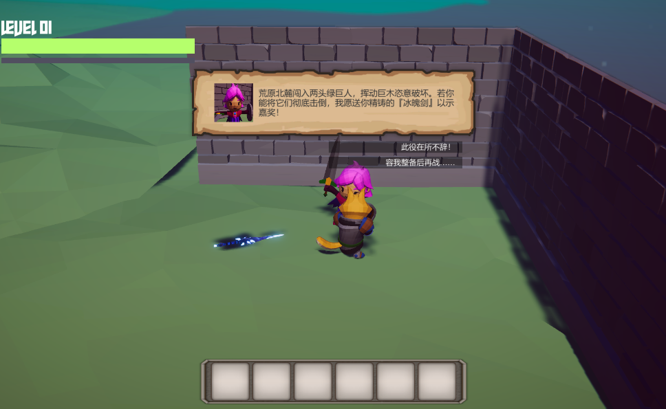


P.S.

- 我这里使用了Battle Wizard Poly Art：[跳转链æ¥](https://assetstore.unity.com/packages/3d/characters/humanoids/fantasy/battle-wizard-poly-art-128097)  &  RPG Tiny Hero Duo PBR Polyart： [跳转链æ¥](https://assetstore.unity.com/packages/3d/characters/humanoids/rpg-tiny-hero-duo-pbr-polyart-225148)

  ​				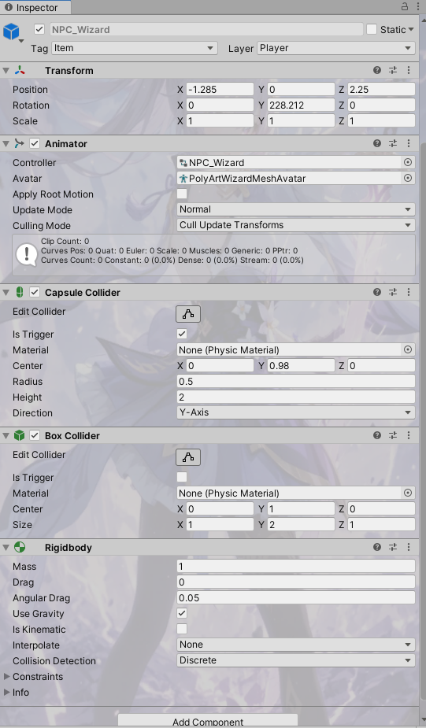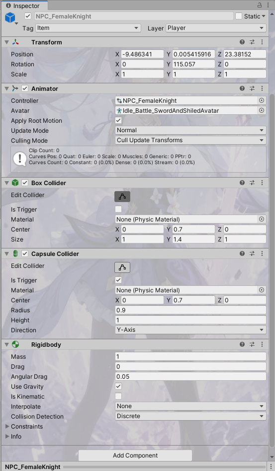

- åŒæ—¶è¡¥ä¸Šäº†ä¹‹å‰NPC_Hero里的idle动画，之å‰æ²¡æŒ‚载动画。

- å¢åŠ ä»»åŠ¡çš„人物图标。

- 加入新的武器并将对应player prefab骨骼ä½ç½®Weapon修改（之å‰ä¼¼ä¹æ²¡æœ‰æ”¹ï¼‰ã€‚

  - 这里使用的素æ是FREE - Low Poly Swords - RPG Weapons：[跳转链æ¥](https://assetstore.unity.com/packages/3d/props/weapons/free-low-poly-swords-rpg-weapons-198166)

  


#### 11.SaveQuestManager ä¿å­˜ä»»åŠ¡æ•°æ®

- 循ç¯æ¯ä¸€ä¸ª QuestTask ä¿å­˜ QuestData
- MouseManager 中åšä¸€äº›å°è°ƒæ•´è®©é¼ æ ‡æŒ‡é’ˆåœ¨ UI é¢æ¿é‡Œä¿æŒä¸å˜
- 测试游æˆä¿å­˜æ•°æ®å’ŒåŠ è½½æ•°æ®


### 章节4 编辑器扩展

#### 1.Editor Script 自己写一个æ’件出æ¥

- å®ç°ç”Ÿæˆçª—å£
- å®ç° Inspector 窗å£ç»˜åˆ¶æŒ‰é’®ç‚¹å‡»æ‰“开窗å£
- å®ç°åŒå‡»å¯¹è¯æ–‡ä»¶æ‰“开窗å£


- 了解基本的 GUILayout 用法
- å°è¯•åˆ›å»º ReorderableList 列表
- 了解熟悉 Rect 的用法绘制一些å˜é‡


- å°è¯•ç”»å‡º OptionList

- 使用字典记录绑定æ¯ä¸€æ¡å¯¹è¯ä¸­çš„选项列表

- 调整自适应高度

  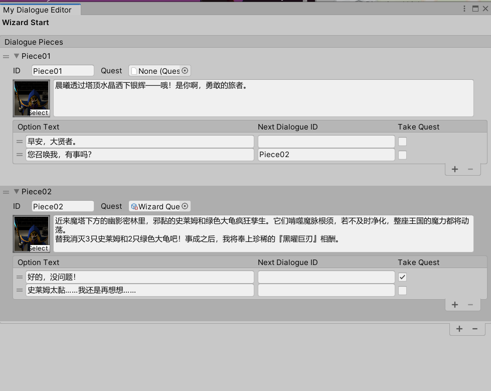

- 绘制 ScrollView å®ç°æ»‘动æ¡

- 了解 OnSelectionChanged 的用法切æ¢æ•°æ®æ˜¾ç¤º

- 使用 EditorUtility.SetDirty å®ç°ä¿å­˜ç¼–辑器中的数æ®æ›´æ”¹

  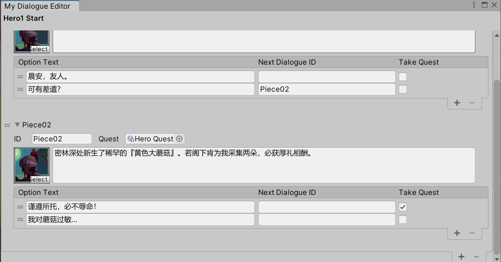


## 一些优化

### 1ã€åœºæ™¯å…ƒç´ ä¸°å¯Œ

#### 1.1 å¢åŠ æ›´å¤šçš„ä¼ é€é—¨

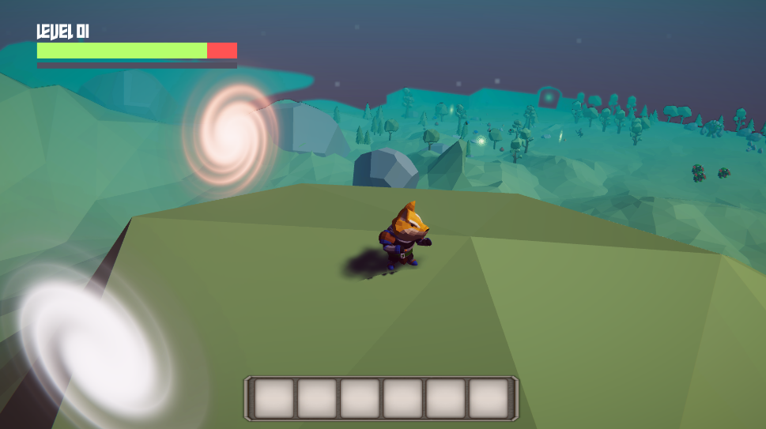

​	åŒæ—¶è°ƒæ•´äº†æ™¯æ·±ä¸é›¾åŒ–效æœã€‚

​	å‡çº§äº†éƒ¨åˆ†ä¼ é€é—¨


#### 1.2 å¢åŠ ç«æŠ€åœºéƒ¨åˆ†

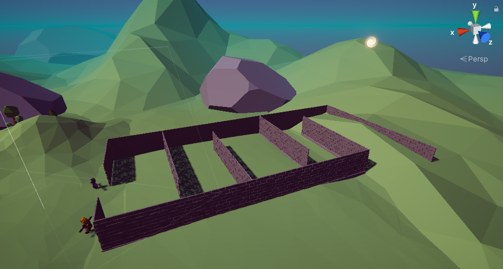

#### 1.3 å¢åŠ å‰‘阵部分

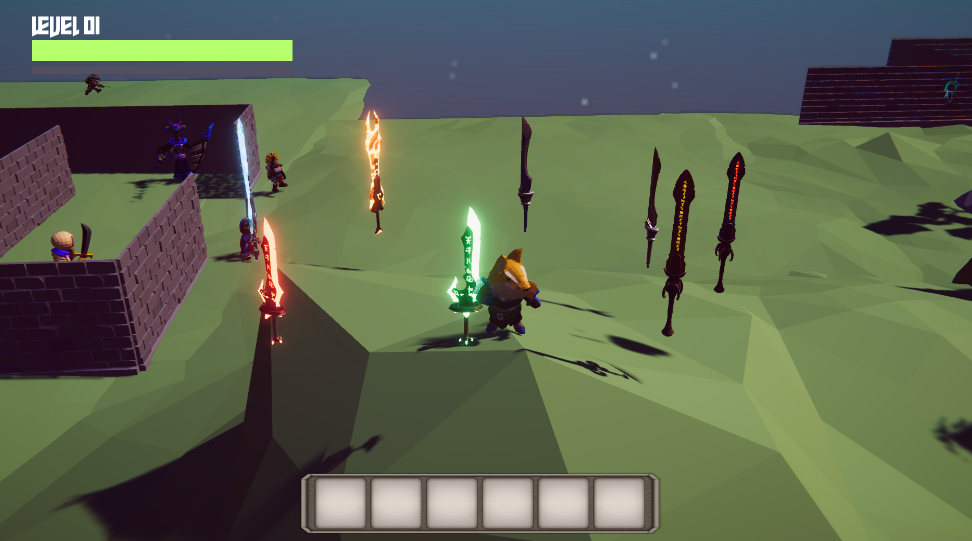

#### 1.4 å¢åŠ ç¯å¢ƒæ•ˆæœ

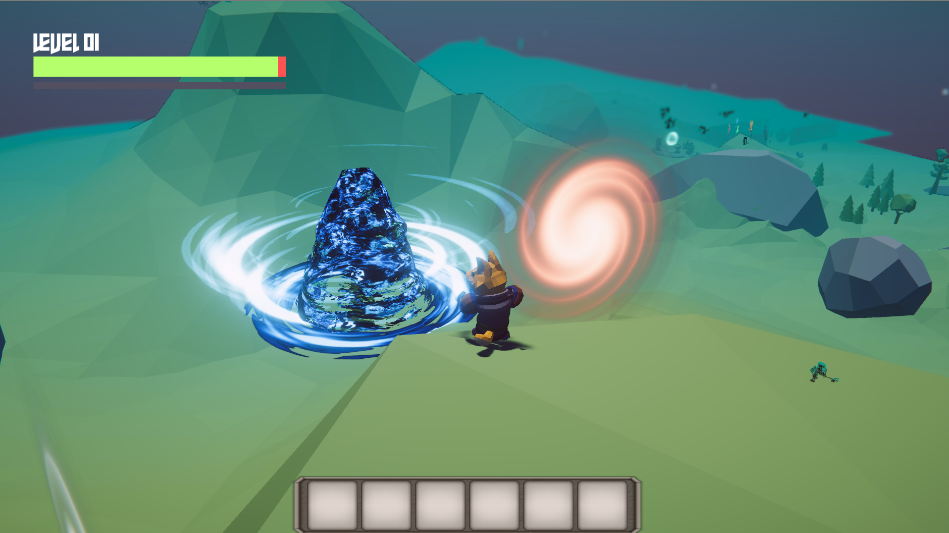

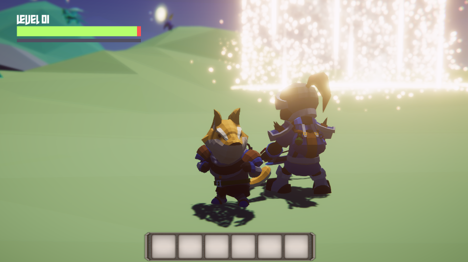


### 2ã€åŠ å…¥æ›´å¤šNPC(对è¯ï¼ŒåŠ¨ç”»ï¼Œæœ¬èº«æºå¸¦çš„å±æ€§)

新的动画

人物加上box 等基础å±æ€§â€”—å¯ä»¥è€ƒè™‘ä¸åŠ å…¥rigidbody，这样人物ä¸ä¼šè¢«æ’é£

人物加入对è¯ç­‰è„šæœ¬å¹¶æŒ‚è½½

修改tag等（对比已ç»è®¾ç½®å¥½çš„角色NPCé¢æ¿ï¼‰


- **2.1 å¢åŠ å±±åº•å®ˆå«**：æ醒ä¸è¦å¾€å‰


- **2.2 å¢åŠ è¾¹ç•Œå®ˆå«**：æ醒ä¸è¦æ‰è½

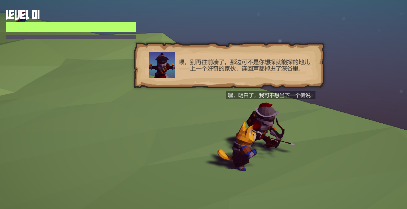

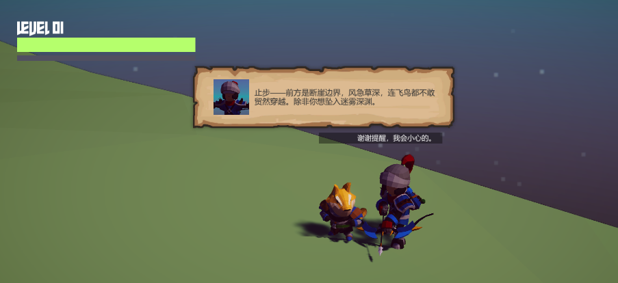

- **2.3 å¢åŠ ç«æŠ€åœºNPC**：æ醒å¯ä»¥è¿›å…¥æŒ‘战

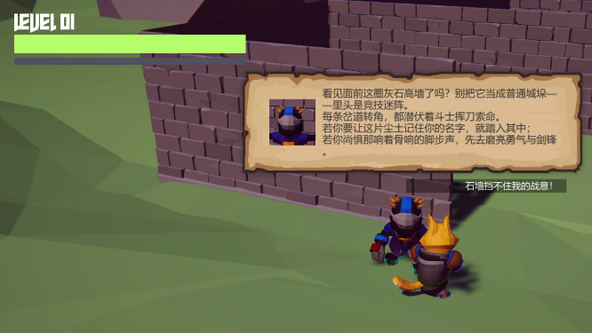


- **2.4 å¢åŠ ç«æŠ€åœºå†…部NPC：** ä¸ç©å®¶ç«æŠ€å¯¹è¯

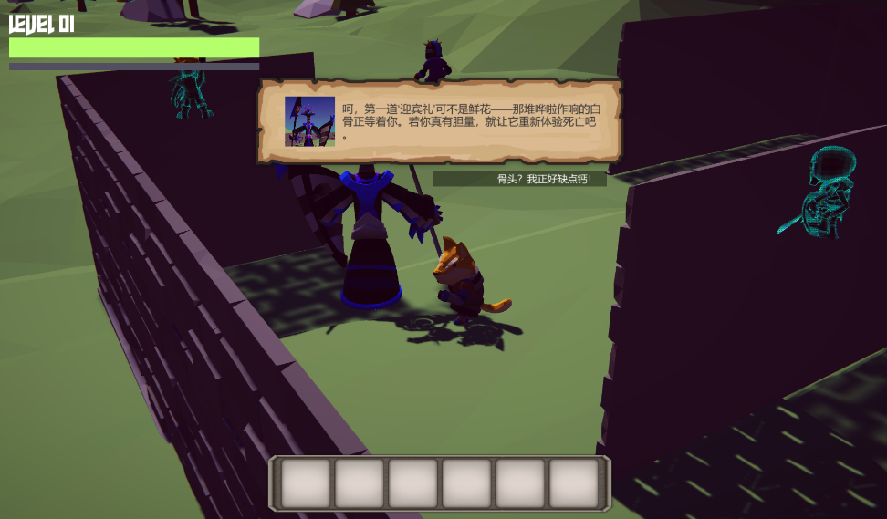

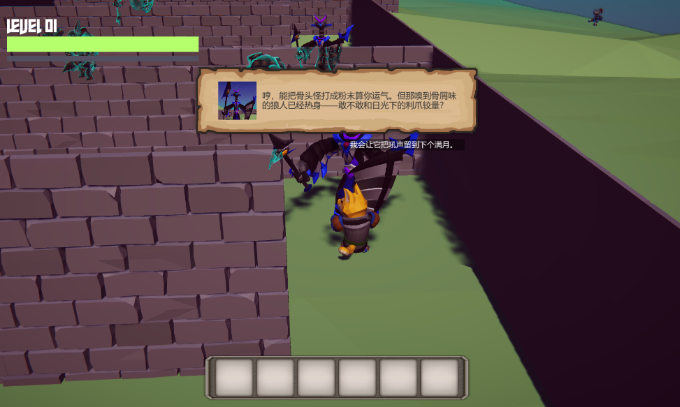

- **2.5 å¢åŠ é£é¾™NPC**：æ醒å¯ä»¥æŒ‘战å¦ä¸€åªé£é¾™


- **2.6 å¢åŠ å…¬ä¸»NPC &  四大护å«**：ä¸å·«å¸ˆè´¤è€…具有ç¾ç»Šï¼Œä¼šæœ‰å…³è”对è¯

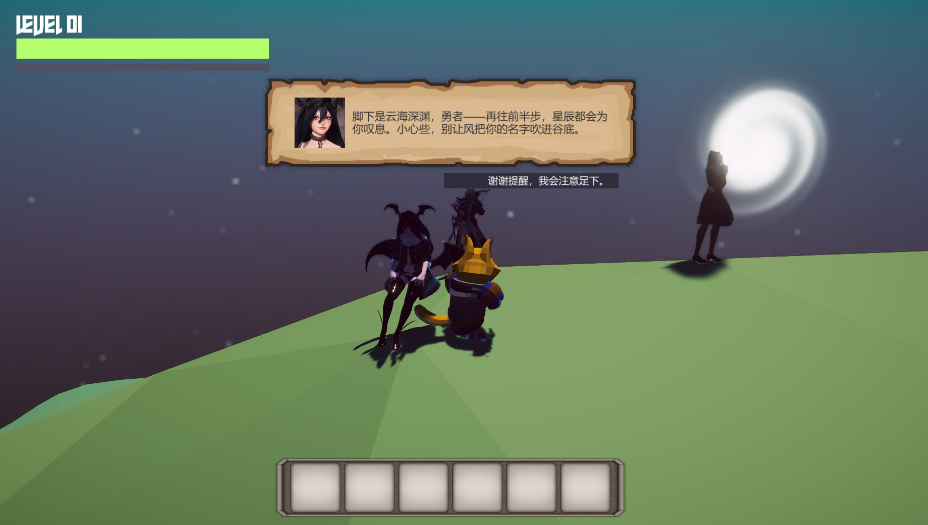


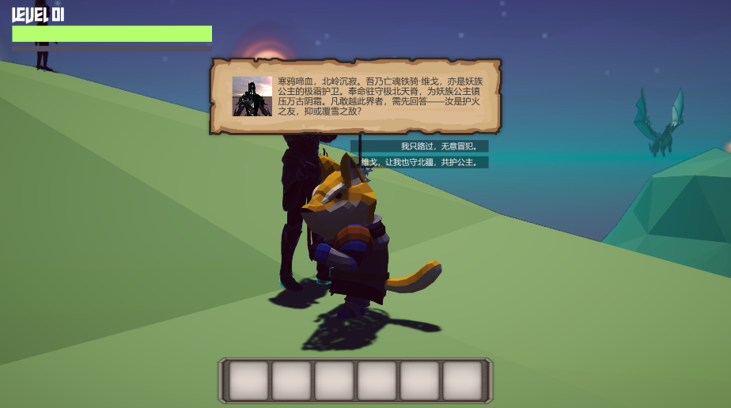

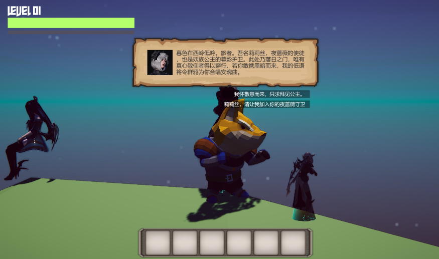

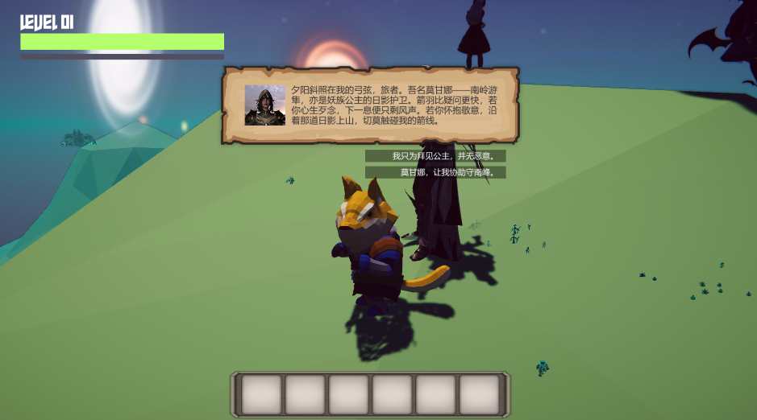

**Tips:**

- 如æœæƒ³è¦NPCä¸è¢«äººç‰©æ’é£ï¼Œå°±å¯ä»¥ä¸åŠ å…¥rigidbody,但如æœåˆæƒ³è¦èƒ½å¤Ÿä¸é™·è¿›åœ°é‡Œ
  - 解决方案：在人物prefab里é¢åˆ›å»ºä¸€ä¸ªç©ºç‰©ä½“，ä½ç½®å°±ç½®äºäººç‰©è„šåº•ï¼Œè¿™æ ·åœ¨é€‰ä¸­ç§»åŠ¨æ¨¡å¼å，移动时，按ä½V（按ä½å³é”®å»æ‰¾é‚£ä¸ªç‚¹ï¼‰å¯ä»¥ä»¤æ•´ä¸ªäººç‰©çš„该点å»å¸é™„顶点。

- .meta的用途：

  | **GUID 写在 .meta 里**     | Unity 的引用关系（Prefab → æè´¨ã€åœºæ™¯ → 预制体…）都存储的是 **GUID**。当你在 Project 视图里移动ã€é‡å‘½å文件时，Unity åªæ˜¯åœ¨æ•°æ®åº“里把 *路径 â†â†’ GUID* 的映射改了一下。GUID 本身没å˜ï¼Œå…¶ä»–资æºä¾æ—§èƒ½é€šè¿‡ GUID 找到它。 |
  | -------------------------- | ------------------------------------------------------------ |
  | **.meta å¿…é¡»éšæ–‡ä»¶ä¸€èµ·åŠ¨** | 如æœä½ ç§»åŠ¨çš„åªæ˜¯ *.prefab*，å´å¿˜äº†å®ƒæ—边的 *.prefab.meta*，Unity 会给新ä½ç½®çš„文件é‡æ–°ç”Ÿæˆä¸€ä¸ª **æ–°çš„ GUID**，**这时åŸæ¥çš„引用就“断线â€äº†ã€‚** |

  - **结论：**

    > *在åŒä¸€ä¸ªå·¥ç¨‹é‡Œï¼Œåªè¦ã€Œæ–‡ä»¶ + 对应 .metaã€ä¸€èµ·æ‹–/剪切，路径æ€ä¹ˆæ”¹éƒ½ä¸å½±å“引用。*

- å°½é‡é¿å…Unityä¸VSCodeåŒæ—¶ä¿®æ”¹ï¼Œæœ‰çš„时候会出ç°cache的错误，导致文件更改ä¸æƒ³è±¡ä¸ç¬¦ã€‚

- 当**åªæ˜¯ä½¿ç”¨ç´ æ包里的一部分时，è¦å»æ‰å…¶ä»–ä¸å¿…è¦çš„内容**å´ä¸çŸ¥é“哪些有用时：

  1. 在 **Project** 里多选需è¦çš„ Prefab → **å³é”® â–¸ Select Dependencies**
  2. 点击 *Project* å³ä¸Š **🔒 Padlock** é”定当å‰é«˜äº®é›†åˆ
  3. æœç´¢æ¡†é‡Œè¾“入： `t:texture ref:selection` 并敲 Enter /或者直æ¥çœ‹ä¹Ÿè¡Œï¼ˆåˆ å»æ²¡æœ‰è¢«é€‰ä¸­çš„内容å³å¯

  

### 3ã€åŠ å…¥æ›´å¤šæ•Œäºº(动画帧中加入函数，本身æºå¸¦çš„å±æ€§ï¼Œä¿®æ”¹åŠ¨ç”»æ’­æ”¾é€»è¾‘)

**Key : å‚考之å‰æ•Œäººçš„动画设计**

​	p.s. 

​	1ã€æ•Œäººèº«ä¸Šå•ç‹¬çš„脚本（若有）是用äºå‡»é£ç­‰æ–°çš„攻击方å¼çš„，而ä¸æ˜¯ä¼¤å®³è®¡ç®—的（这在基础EnemyController里就有）；

​	2ã€å¦‚æœæ— å‡»é£ç­‰ç‰¹æ®Šæ•ˆæœï¼Œå°±ç›´æ¥åœ¨ä¸¤ä¸ªä¸åŒæ”»å‡»æ–¹å¼çš„Animations里æ’入关键帧（需è¦å¤åˆ¶å‡ºæ¥ä¸€ä»½ï¼‰ï¼ŒåŠ å…¥getHit()å³å¯ã€‚


- **3.1 骨头怪**

  ä¸å²è±å§†ç±»ä¼¼ï¼Œä»…正常ä¸æš´å‡»ï¼Œæ— è¿œç¨‹æ”»å‡»ã€‚

  - 继承slime（仅近战ä¸æš´å‡»ï¼‰ï¼Œä»…加入关键帧的getHit()

  

- **3.2 狼人**

  有近战ä¸è¿œç¨‹æ”»å‡»ï¼Œæœ‰å‡»é£ã€‚

  - 继承grunt(å«è¿œç¨‹ä¸è¿‘战），加入关键帧的getHit()
  - 挂载的代ç å°†EnemyController.csæ¢æˆGrunt.cs——用äºä½¿ç”¨å‡»é£

  - æ ¹æ®åŠ¨ç”»ä¿®æ”¹skill range为对应的攻击范围

    

- **3.3 雪人**

  ä¸grunt类似，一个近战（ä¸å¸¦å‡»é£ï¼‰ï¼Œä¸€ä¸ªè¿œç¨‹

  - 继承grunt(å«è¿œç¨‹ä¸è¿‘战），加入关键帧的getHit()

  - æ ¹æ®åŠ¨ç”»ä¿®æ”¹skill range为对应的攻击范围

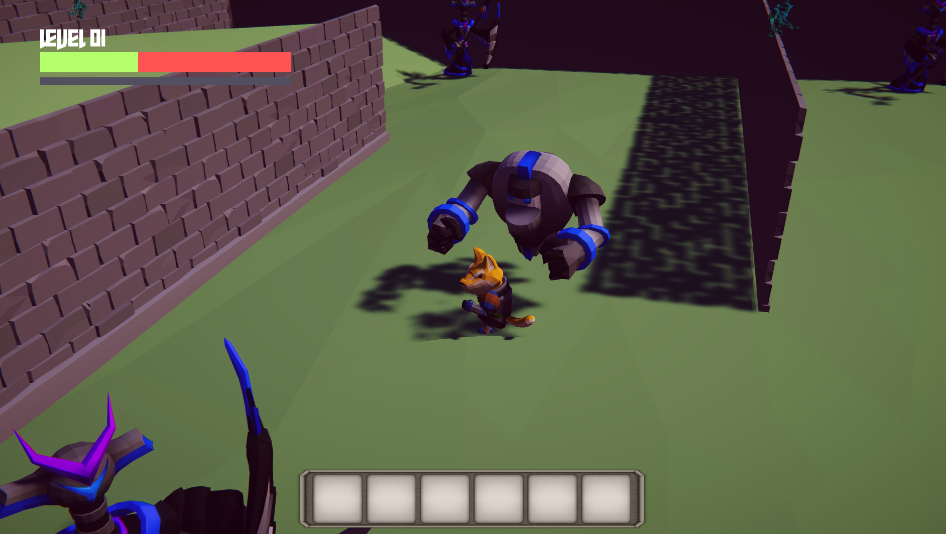

- **3.4 黑牛将军**

  会有更远è·ç¦»çš„远程（带击é£ï¼‰

  - 继承grunt(å«è¿œç¨‹ä¸è¿‘战），加入关键帧的getHit()
  - 挂载的代ç å°†EnemyController.csæ¢æˆGrunt.cs——用äºä½¿ç”¨å‡»é£

  - æ ¹æ®åŠ¨ç”»ä¿®æ”¹skill range为对应的攻击范围

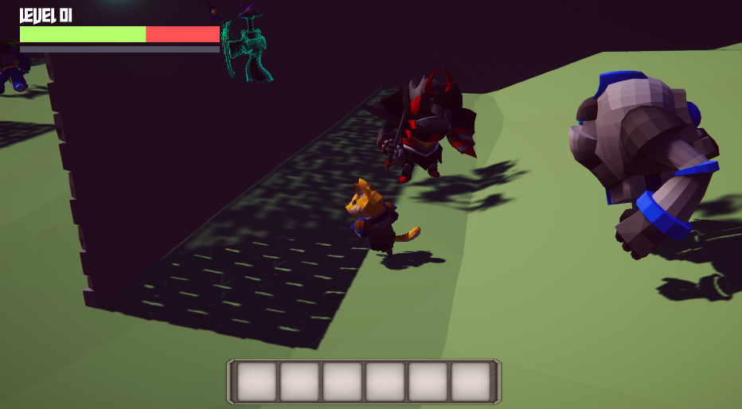

- **3.5 é£é¾™**

  近战（带击é£ï¼‰ï¼Œè¿œç¨‹

  - 继承grunt(å«è¿œç¨‹ä¸è¿‘战），加入关键帧的getHit()

  - 挂载的代ç å°†EnemyController.csæ¢æˆGrunt.cs——用äºä½¿ç”¨å‡»é£

  - æ ¹æ®åŠ¨ç”»ä¿®æ”¹skill range为对应的攻击范围

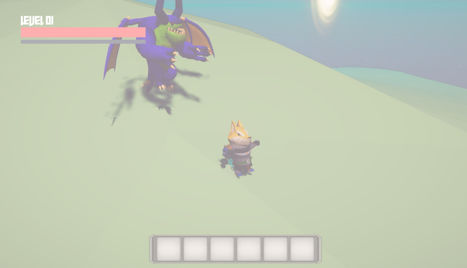


### 4ã€äººç‰©ç§»åŠ¨é€Ÿåº¦éšç­‰çº§å˜åŒ–

对NavMeshAgent çš„speedå‚数进行动æ€è®¾ç½®ã€‚


### 5ã€å¢åŠ ç›¾å

å®ç°æµç¨‹ï¼š**主è¦åŠ åœ¨TakeDamage里 & 动画触å‘**

1. ç©å®¶æŒ‰ä¸‹é˜²å¾¡é”®ï¼Œè¿›å…¥é˜²å¾¡çŠ¶æ€`isGuard`å’Œ `characterStats.isDefend`。
2. 当敌人攻击ç©å®¶æ—¶ï¼Œè°ƒç”¨`TakeDamage` 方法。
3. 如æœç©å®¶å¤„äºé˜²å¾¡çŠ¶æ€ï¼Œè¿›å…¥ç›¾å逻辑：
   - 计算å弹伤害并应用到攻击者。
   - 触å‘攻击者的å—击动画。
4. 动画系统åŒæ­¥é˜²å¾¡çŠ¶æ€ï¼Œç¡®ä¿è§†è§‰æ•ˆæœã€‚


- **CharacterStats.cs** 的 两个TakeDamage中的第一个

  ```c++
  public void TakeDamage(CharacterStats attacker, CharacterStats defender)
      {
          //New : 加入盾å逻辑
          // 判断是å¦ä¸ºç©å®¶ï¼Œå¹¶ä¸”是å¦å¤„äºç›¾å状æ€
          if (defender.GetComponent<PlayerController>() != null && defender.isDefend) //ç©å®¶ç›¾å逻辑
          {
              // Debug.Log("Player is defending, applying shield rebound logic.");
  
              //计算伤害
              int damage = Mathf.Max(attacker.CurrentDamage() - defender.CurrentDefence, 1); //盾å至少造æˆ1点伤害
              int damage_rebound = Mathf.Max(Mathf.CeilToInt(damage * 0.5f), 1); // å弹攻击者伤害的50%
              int damage_take = Mathf.Max(Mathf.CeilToInt(damage * 0.35f), 1); // å—到攻击者伤害的35%
  
              //伤害->生命
              attacker.CurrentHealth = Mathf.Max(attacker.CurrentHealth - damage_rebound, 0);
              CurrentHealth = Mathf.Max(CurrentHealth - damage_take, 0);
              //动画
              attacker.GetComponent<Animator>().SetTrigger("Hit");// 触å‘攻击者的 被盾å 动画
              //è¡€é‡UI
              attacker.UpdateHealthBarOnAttack?.Invoke(attacker.CurrentHealth, attacker.MaxHealth);// 更新攻击者血é‡UI
              UpdateHealthBarOnAttack?.Invoke(CurrentHealth, MaxHealth);// 更新防御者血é‡UI
              //ç»éªŒå€¼
              if (attacker.CurrentHealth <= 0)
                  characterData.UpdateExp(attacker.characterData.killPoint);// 更新防御者ç»éªŒå€¼
              if (CurrentHealth <= 0)
                  attacker.characterData.UpdateExp(characterData.killPoint);// 更新攻击者ç»éªŒå€¼
          }
          else // 普通伤害逻辑（é盾å）
          {
              // Debug.Log("Character is not defending, applying normal damage logic.");
  
              int damage = Mathf.Max(attacker.CurrentDamage() - defender.CurrentDefence, 0);
              CurrentHealth = Mathf.Max(CurrentHealth - damage, 0);
  
              if (attacker.isCritical)
                  defender.GetComponent<Animator>().SetTrigger("Hit"); //触å‘暴击动画
  
              //updateè¡€é‡UI
              UpdateHealthBarOnAttack?.Invoke(CurrentHealth, MaxHealth);
              //人物å±æ€§å‡çº§
              if (CurrentHealth <= 0)
                  attacker.characterData.UpdateExp(characterData.killPoint);// 更新击æ€è€…ç»éªŒå€¼
          }
      }
  ```

- **PlayereController.cs** 代ç ä¿®æ”¹ï¼Œå¢åŠ å¯¹åº”çš„å˜é‡ï¼Œä»¥åŠåŠ¨ç”»å¯¹åº”，åŒæ—¶è®¾ç½®é•¿æŒ‰Gé”®å¯åŠ¨ç›¾å

  ```c++
  bool isShielding; //是å¦æ­£åœ¨ç›¾å
  
  //....
  
  void Update()
  {
      isDead = characterStats.CurrentHealth <= 0;
      //盾å
      isShielding = Input.GetKey(KeyCode.G);//是å¦æŒ‰ä½G键进行盾å（æ¾å¼€å³å–消）
      characterStats.isDefend = isShielding; //æ›´æ–°characterStats的盾å状æ€
      // Debug.Log("Shielding status: " + isShielding);
  
      if (isDead)//进行广播
          GameManager.Instance.NotifyObservers(); //通知所有观察者
  
      SwitchAnimation(); //æ¯å¸§æ›´æ–°åŠ¨ç”»çŠ¶æ€
      lastAttackTime -= Time.deltaTime; // 攻击冷å´æ—¶é—´çš„è¡°å‡
  }
  
  private void SwitchAnimation()
  {
      anim.SetFloat("Speed", agent.velocity.sqrMagnitude); //设置å‰ç«¯çš„动画速度å‚æ•°
      anim.SetBool("Critical", characterStats.isCritical); //设置暴击状æ€
      anim.SetBool("Death", isDead); //设置死亡状æ€
      anim.SetBool("Defend", isShielding); //设置盾å状æ€
  }
  ```

- **player prefab里的动画**修改

  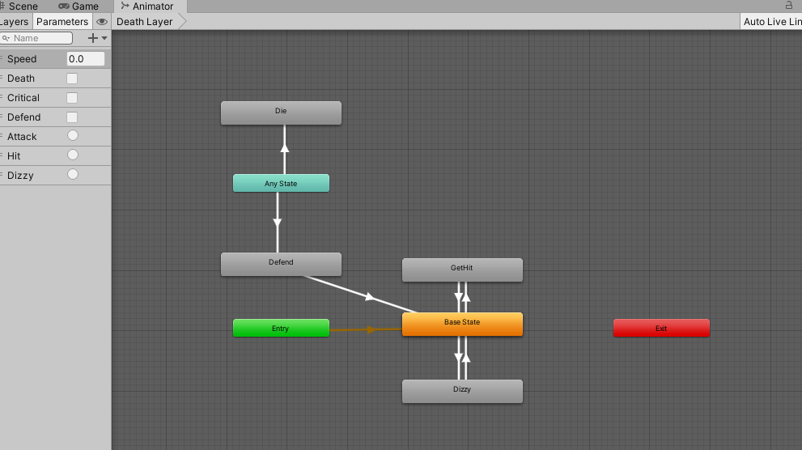

  

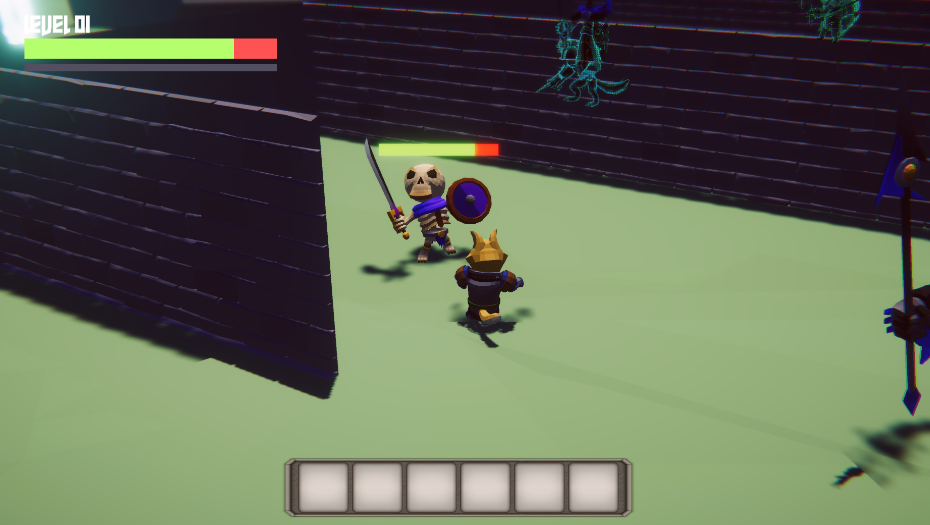


### 6ã€æ•°å€¼éƒ¨åˆ†è°ƒæ•´

**Key : gpt+试ç©æ¥è°ƒæ•´æ•°å€¼**

- 希望正常ç©å®¶åº”该是æ¥å®Œâ€æ”¶é›†è˜‘è‡â€œï¼ˆå¯ä»¥è·¯ä¸Šæ¡æ™®é€šå‰‘）->"å²è±å§†"（黑曜巨刃）->â€ç»¿å·¨äººâ€ï¼ˆå†°é­„剑）->"石头人"（盾牌，高防）->"é£è¡Œå…½" （高级ç©å®¶å¯ä»¥ç•¥å¾®è·³ä¸€ä¸¤æ­¥ï¼‰


- ç«æŠ€åœºè´¯ç©¿å§‹ç»ˆï¼šéª¨å¤´æ€ªï¼ˆâ‰ˆç»¿å·¨äººï¼‰â€”—狼人（≈石头人）——雪人——黑牛将军


#### 4.1 移动速度 å‚æ•°

- **Speed** 体ç°ç›´çº¿ç§»åŠ¨å¿«æ…¢ï¼ˆm/s）。

- **Angular Speed** 体ç°è½¬å‘çµæ´»åº¦ï¼ˆdeg/s）。

- **Acceleration** 决定起步 / 转弯时爬å‡åˆ°ç›®æ ‡é€Ÿåº¦çš„“爆å‘æ„Ÿâ€ã€‚

- **Stopping Distance** 在进入此è·ç¦»æ—¶å¼€å§‹åœä¸‹å¹¶åˆ‡æ¢æ”»å‡»çŠ¶æ€ã€‚

- **Auto Braking** 全部ä¿æŒ **关闭**（勾选会让追人时çªç„¶å‡é€Ÿï¼Œæ˜¾å¾—生硬）。

| 怪物                 | **Speed** | **Angular** | **Accel.** | **StopDist** | 调整说æ˜ï¼ˆä¸€å¥è¯ï¼‰         |
| -------------------- | --------- | ----------- | ---------- | ------------ | -------------------------- |
| å²è±å§†               | **2.4**   | 500         | 30         | 1.0          | ä¿æŒæ…¢åå，方便新手é£ç­   |
| 乌龟壳 (Turtleshell) | **2.2**   | 400         | 40         | 1.0          | 甲壳åšé‡ï¼Œæ•´ä½“å†æ…¢ 0.8     |
| 绿巨人 (Grunt)       | **3.4**   | 520         | 85         | 1.0          | 中速ã€èµ·æ­¥çŒ›               |
| 石头人 (Golem)       | **2.2**   | 420         | 38         | 1.2          | é‡å‹ï¼›è½¬å‘ç¨é’，æ¥è¿‘å蓄力 |
| **é£è¡Œå…½**           | **4.6**   | 620         | 110        | 2.0          | 最高速俯冲，拉大æ¥è§¦åŠå¾„   |
| **骨头怪**           | **3.2**   | 560         | 60         | 0.8          | è„†çš®å¿«è·‘ï¼Œéªšæ‰°å‹           |
| **狼人**             | **4.3**   | 720         | 120        | 0.8          | 全场机动ç‹ï¼Œéœ€ç¿»æ»šèº²æ‰‘     |
| **雪人**             | **3.0**   | 520         | 60         | 1.5          | è¿‘æˆ˜è‚‰æ                   |
| **黑牛将军**         | **3.8**   | 480         | 150        | 1.0          | 直线冲锋爆å‘高ã€è½¬å¼¯æ…¢     |


##### 试ç©è°ƒä¼˜Tips

1. **转弯甩ä¸ç”©å¾—æ‰ï¼Ÿ** 如æœå‘ç°ç©å®¶å¾ˆéš¾ç”©å¼€â€œç‹¼äººâ€æˆ–“黑牛â€ï¼Œå…ˆä¸‹è°ƒå®ƒä»¬çš„ *Angular* 而ä¸æ˜¯ *Speed*。
2. **冲锋怪需留准备时间**：把它们的 *Stopping Distance* 设得ç¨å¤§ï¼ˆâ‰¥1.0），让 AI 有一段“å‹æªâ€åŠ¨ä½œï¼Œçœ‹èµ·æ¥æ›´è‡ªç„¶ã€‚
3. **远程冰弹 & é£è¡Œå…½ä¿¯å†²**：对应 Animation / Skill 里记得用 StoppingDistance å»è§¦å‘，å¦åˆ™ä¼šæ— é™è´´è„¸ã€‚


#### 4.2 敌人 & 武器 / 盾牌数值

##### 设计æ€è·¯ï¼ˆæµ“缩版）

| ç¯èŠ‚            | ç©å®¶å¸¸ç”¨è£…备              | 目标体验                       | 数值抓手                                                     |
| --------------- | ------------------------- | ------------------------------ | ------------------------------------------------------------ |
| 新手 → å²è±å§†   | 普通剑（DPS≈7 / s）       | 2~3 下解决，几ä¹æ— å‹åŠ›         | å²è±å§†è¡€é‡ 20ã€é˜² 1ï¼Œæ”»å‡»ä½                                  |
| å²è±å§† → 绿巨人 | 黑曜巨刃（DPS≈9 / s）     | 8~10 秒击æ€ï¼›è‹¥æŠ€æœ¯å¥½å¯â€œè·³æœ¬â€  | ç»¿å·¨äººè¡€é‡ 80ã€é˜² 4，伤害中等                                |
| 绿巨人 → 石头人 | 冰魄剑（DPS≈11 / s）      | 12~15 秒的硬仗，æ‰ç›¾ç‰Œæ˜¾è‘—å‡ä¼¤ | 石头人高防 8，高血 120，攻高冷å´é•¿                           |
| 石头人 → é£è¡Œå…½ | 冰魄剑 + 盾牌（ç©å®¶é˜²â‰ˆ7） | é£è¡Œå…½æœºåŠ¨ã€çˆ†å‘高，考验滚闪   | é£è¡Œå…½ä¼¤å®³é«˜ã€å†·å´çŸ­ã€é˜²å¾¡ä¸­ç­‰                               |
| ç«æŠ€åœº          | 和主线åŒè£…备              | 难度对应“≈â€æ³¨è§£                | ä¾å„怪特性调优：骨头怪å脆，狼人攻速快，雪人近战肉æ，黑牛将军终æ考验 |


##### 主线 数值

| å称                     | Max Health | Base Defence | Kill Point | Attack Range | Skill Range | CoolDown | Min Dmg | Max Dmg | Crit Mult | Crit Chance |
| ------------------------ | ---------- | ------------ | ---------- | ------------ | ----------- | -------- | ------- | ------- | --------- | ----------- |
| **Player(åˆå§‹)**         | **100**    | **2**        | **—**      | **2.4**      | **0**       | **1**    | **5**   | **8**   | **2.0**   | **0.2**     |
| **å²è±å§†**               | **20**     | **1**        | **5**      | 1.0          | 0           | 1.2      | 2       | 4       | 1.5       | 0.05        |
| **乌龟壳**               | 30         | 3            | 10         | 1.2          | 0           | 1.5      | 3       | 5       | 1.5       | 0.1         |
| **绿巨人 (Grunt)**       | 80         | 4            | 20         | 2.3          | 1.6         | 1.8      | 6       | 8       | 2.0       | 0.15        |
| **石头人 (Golem)**       | 120        | 8            | 35         | 2.0          | 10.0        | 2.5      | 10      | 14      | 2.0       | 0.10        |
| **é£è¡Œå…½**               | 90         | 3            | 40         | 1.5          | 3.0         | 1.0      | 12      | 18      | 2.2       | 0.25        |
| **普通剑(Sword)**        | —          | —            | —          | **2.6**      | 0           | **1.0**  | **6**   | **9**   | 2.0       | 0.15        |
| **黑曜巨刃(BroadSword)** | —          | —            | —          | **2.8**      | 0           | **1.25** | **10**  | **14**  | 2.2       | 0.20        |
| **冰魄剑(IceSword)**     | —          | —            | —          | **2.5**      | 0           | **0.8**  | **8**   | **11**  | 1.8       | 0.50        |
| **盾牌(Shield)**         | —          | **7**        | —          | —            | —           | —        | —       | —       | —         | —           |

- **等级æˆé•¿**：按你的 `LevelMultiplier = 0.1`，ç©å®¶åˆ°æ‰“石头人时通常 3~4 级，自身 `Base Defence`≈3；装备盾牌å整体跳到 7，能æ˜æ˜¾é™ä½é£è¡Œå…½åŠç«æŠ€åœºé«˜é˜¶æ€ªçš„å•å‡»ä¼¤å®³ï¼Œä½†ä»éœ€ä¾èµ–èµ°ä½ã€‚

- **高级ç©å®¶è·³æœ¬**：ä¾é èµ°ä½å¯ç›´æ¥æŒ‘战更高阶段，因为血é‡/伤害呈 1.3~1.5 å€æ¢¯åº¦é€’å¢ï¼Œå®¹é”™ä»åœ¨å¯æ§èŒƒå›´ã€‚

- **黑曜巨刃**拉高了最å°/最大伤害，ä»ä¿æŒå慢手感；**冰魄剑**则以高暴击+短 CD å¸¦æ¥ DPT（Damage Per Time）最高输出，利äºè¶Šçº§ã€‚

  

##### ç«æŠ€åœºæ•Œäººæ•°å€¼

| å称         | Max Health | Base Defence | Kill Point | Attack Range | Skill Range | CoolDown | Min Dmg | Max Dmg | Crit Mult | Crit Chance | 特点备注                  |
| ------------ | ---------- | ------------ | ---------- | ------------ | ----------- | -------- | ------- | ------- | --------- | ----------- | ------------------------- |
| **骨头怪**   | 75         | 3            | 20         | 2.3          | 0           | 1.8      | 6       | 9       | 2.0       | 0.15        | 近战脆皮，移速略快        |
| **狼人**     | 100        | 6            | 30         | 1.8          | 3.0         | 1.2      | 10      | 15      | 2.0       | 0.20        | 高攻速+跳扑技能           |
| **雪人**     | 110        | 5            | 45         | 1.7          | 2.5         | 2.0      | 8       | 12      | 1.8       | 0.25        | 近战怪                    |
| **黑牛将军** | 250        | 10           | 100        | 2.8          | 3.8         | 1.5      | 15      | 25      | 2.5       | 0.30        | 终æ Boss，冲锋技能附晕眩 |


##### 数值校验

| 武器     | ⌀ å•å‡»ä¼¤å®³                               | CD   | **ç†è®º DPS** |
| -------- | ---------------------------------------- | ---- | ------------ |
| 普通剑   | 7.5 × (1-0.2) + 7.5 × 2 × 0.2 = **9**    | 1.0  | **9/s**      |
| 黑曜巨刃 | 12 × (0.8) + 12 × 2.2 × 0.2 = **14.9**   | 1.25 | **11.9/s**   |
| 冰魄剑   | 9.5 × (0.5) + 9.5 × 1.8 × 0.5 = **13.3** | 0.8  | **16.6/s**   |

⌀å•å‡»ä¼¤å®³ = ⌀基础伤 × [(1 - 暴击ç‡) × 1 + æš´å‡»ç‡ Ã— 暴击å€æ•°]

- **å²è±å§†** 体力 20 → 2-3 下被普通剑秒æ€
- **绿巨人** 体力 80ã€é˜² 4 → 黑曜巨刃约 7-8 秒解决
- **石头人** 体力 120ã€é˜² 8 → 冰魄剑 + 盾牌（防 7）约 12-15 秒
- **é£è¡Œå…½** 体力 90ã€é˜² 3 → åŒè£…备约 10 秒，但高输出ã€çŸ­ CD，逼ç©å®¶é—ªé¿


##### 试ç©è°ƒä¼˜Tips

1. **伤害公å¼**如æœåŒ…å«é˜²å¾¡å‡å…系数，å¯æŠŠå„敌人的 Min/Max 伤害 ±12 å¾®è°ƒï¼Œä»¥ç»´æŒ 6~~12 次被击倒容å¿åº¦ã€‚
2. **ç©å®¶ç­‰çº§æ›²çº¿**ï¼šç° Kill Point ä¸ `BaseExp=50` 对应刚好 10 åªå²è±å§†å‡ 1 级，约 3 åªç»¿å·¨äººå‡ 1 级；若觉得慢，å¯æŠŠ `LevelMultiplier` æ”¹æˆ 0.08。
3. **BOSS 特效**（冲锋ã€å†°å¼¹å‡é€Ÿï¼‰ä»…写在注释中，方便å期在 Animator 或技能系统里补充。


#### 4.3  Playerå‡çº§ç›¸å…³

| 分类         | 字段å（脚本å˜é‡ï¼‰ | **等级 1 åˆå§‹å€¼** | **å‡çº§å¢å¹… / å…¬å¼**                                          | é™åˆ¶ / 备注                       |
| ------------ | ------------------ | ----------------- | ------------------------------------------------------------ | --------------------------------- |
| **ç»éªŒ**     | `baseExp`          | **50**            | `baseExp += baseExp * 0.1`  → æ¯çº§ +10 %                     | å¯æ”¹ç³»æ•° `0.1`                    |
| **生命**     | `maxHealth`        | **100**           | `maxHealth *= 1.1`  → æ¯çº§ +10 %                             | åŒä¸Š                              |
| **防御**     | `baseDefence`      | **2**             | `baseDefence *= 1.1`  → æ¯çº§ +10 %                           | åŒä¸Š                              |
| **移动**     | `baseMoveSpeed`    | **3.5 m/s**       | `newSpeed = baseMoveSpeed * (1 + 0.03 × (level−1))`  → æ¯çº§ +3 % | `Mathf.Min(newSpeed, 6.0f)` ä¸Šé™  |
|              | `angularSpeed`     | **800 deg/s**     | `Mathf.Lerp(800, 900, (speed−3.5)/(6.0−3.5))`                | éšç›´çº¿é€Ÿåº¦å¾®æ，最多 900          |
|              | `acceleration`     | **80**            | **ä¿æŒä¸å˜**（如需åŒæ­¥å¢é•¿å¯ä¸é€Ÿåº¦åŒå€ç‡ï¼‰                   | —                                 |
| **æˆé•¿ç³»æ•°** | `LevelMultiplier`  | **0.1**           | 统一æ§åˆ¶ **ç»éªŒ / 生命 / 防御** 三项的 10 % å¢å¹…             | Inspector中的 **Level Buff** 字段 |

- 移动部分å‡åˆ° **10 级 ≈ 4.6 m/s**ï¼›å‡åˆ° **20 级 ≈ 5.6 m/s**ï¼›**30 级åŠä»¥ä¸Šæ’ 6 m/s**。 ç©å®¶åœ¨ä¸»çº¿æ‰“完é£è¡Œå…½ä¸€èˆ¬ 6~7 级（≈4.2 m/s），ä¸ä¹‹å‰4.1表敌人速度梯度刚好咬åˆã€‚


##### 试ç©è°ƒä¼˜Tips

1. **想让ç©å®¶æ›´è‚‰**：åªæ”¹ `LevelMultiplier`，一处生效多处。
2. **想加快å‡çº§èŠ‚å¥**：把 `baseExp` åˆå€¼è°ƒä½ï¼Œæˆ–把 `LevelMultiplier` ä» `0.1` æ”¹æˆ `0.08`。
3. **速度太快ä¸å¥½æ§**：é™ä½ `speedGrowthRate` 或把 `6.0f` 上é™å¾€ä¸‹è°ƒã€‚
4. **需è¦æ›´çµæ´»è½¬å‘**：直æ¥æŠŠ `angularSpeed` 固定为 `agent.angularSpeed = 800 + 20 * (currentLevel-1)`，简å•ç›´è§‚。


### 7ã€å¢åŠ æ­£å¸¸çŠ¶æ€çš„自动å›è¡€åŠŸèƒ½

在CharacterStats.cs里å¢åŠ å¯¹åº”å›è¡€å‚数，在它的Update里å®ç°å›è¡€ã€‚


### 8ã€å¢åŠ å†…测的无敌模å¼&å‡çº§æ¨¡å¼

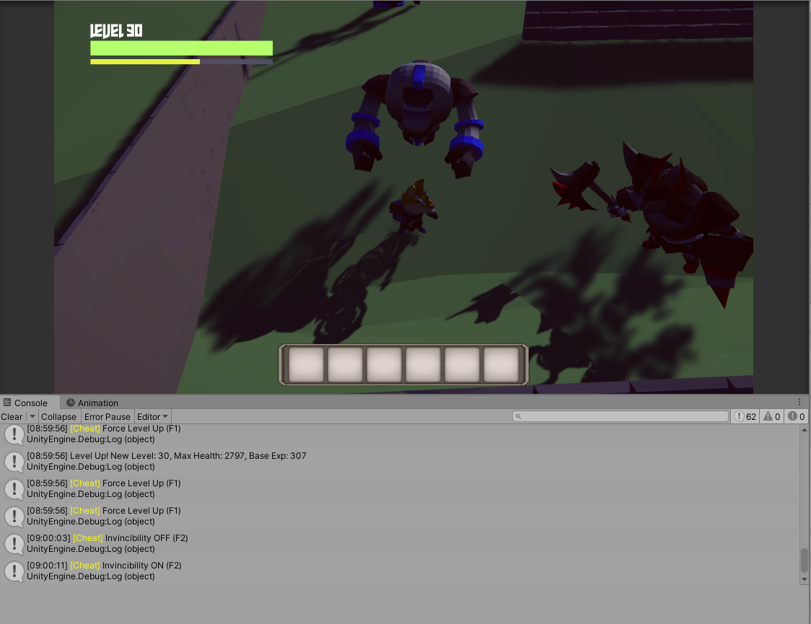


## MileStone 2

### æ–°å¢éƒ¨åˆ†æ•ˆæœå›¾ç‰‡åˆé›†

æ–°å¢æ•ˆæœè§README的效æœè§†é¢‘.

### 高级功能开å‘&学习总用时

90h 35min 52s.


## 致谢

æ„Ÿè°¢Michaelè€å¸ˆçš„课程，感谢å°ç¨ä¸è€ç‹çš„测试。
